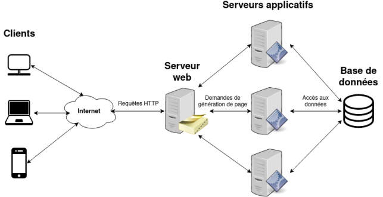

# **ARQUITECTURA 3 NIVELES**

 

## **_Objetivos:_**

- Entender la comunicación Cliente/Servidor

- Hablarle a una B-D-D (Base de Datos)

---

---

 

---

## **Contexto**

---

 

    El funcionamiento de un sitio web se basa en el uso de varios programas de software que se ejecutan en computadoras remotas, cada uno de los cuales cumple su función.

- **1º Nivel** El navegador se ejecuta en la máquina cliente (Nuestro pc).

  Envía una solicitud HTTP a un servidor web, que devuelve una página HTML.

     

- **2º Nivel** Pero en el caso de un sitio web dinámico, esta página HTML no existe como tal en el servidor web, es construida sobre la marcha por un servidor de aplicaciones (PHP).

  Este servidor de aplicaciones ejecuta un programa en un lenguaje como PHP!, para construir la página web en la que nos va a devolver el servidor en el momento en el que se solicite dicha página web.

     

- **3º Nivel** A menudo, este mismo servidor de aplicaciones (el php) recurre a otro servidor, el servidor de datos (b-d-d).
  Puede preguntarle el estado de los datos en un momento 't', como ¿cuál es el contenido de un catálogo?; o darle la orden de modificar estos datos del catálogo, por ejemplo reduciendo el stock disponible de un producto que acaba de ser vendido.

---

---

 
 

---

## **Modelo Cliente/Servidor**

---

 

Un usuario posee una máquina. Navega por la web a través de su navegador preferido: Mozilla Firefox, Google Chrome, Safari, etc.

Las páginas web que muestra el navegador se almacenan en máquinas remotas: servidores.

Así que tenemos al menos dos máquinas:

- el cliente, es decir, el navegador, que solicita una página web.

- el servidor, que aloja el software (programa) destinado a servir a los clientes.

Estas dos máquinas se comunican a través de un protocolo llamado HTTP.

 

 

---

## **Varios Servidores**

---

 

El término servidor web se usa de manera bastante amplia. Más rigurosamente, separamos un servidor web en varios componentes:

- El servidor web real. Es el interlocutor ó traductor directo del cliente con el que dialoga en HTTP.

  Este es responsable de devolver la página web final. **Apache y Nginx** son los principales servidores web.

- Servidores de aplicaciones: programas que crean páginas web sobre la marcha a partir de datos dinámicos, como resultados de búsqueda.

  El servidor web solicita a los servidores de aplicaciones que generen la página final.

  Están programados en lenguajes de programación como **PHP, Python, Java, Ruby, etc.**

- El servidor de base de datos(b-d-d): es el programa que almacena los datos que utiliza el servidor de aplicaciones (php).

  Los más conocidos son **MySQL, PostgreSQL, MariaDB.**

     

    

---

---

 
 

---

## **Front-end**

---

 

Todos los elementos de una página web visibles para el navegador forman el front-end. Esta es la capa de presentación de la página web.

 

Los elementos gráficos que componen el front-end son en realidad la traducción del navegador del contenido de la página web escrito en tres lenguajes (diseño CSS, HTML estructuración y JavaScript de programación): HTML, CSS y JavaScript.

 

---

---

 
 

---

## **Back-end**

---

 

Los programas que se ejecutan en el servidor, invisibles para el navegador, se agrupan bajo el término back-end: esta es la infraestructura que permite atender las solicitudes realizadas por el cliente y construir las páginas web.

 

---

---

 
 

---

## **Arquitectura de 3 Niveles**

---

 

La arquitectura típica de una aplicación web está en capas:

- La presentación es la capa del cliente (Front-end, cliente)

- El procesamiento es la capa de aplicación(Especialización servidor aplicativo, aplicación php)

- El acceso a datos(Back-end, base de datos)

 

---

### **Método de Comunicación**

---

 

El modelo de comunicación establece una jerarquía entre las capas:

1. El cliente envia una solicitud a la aplicación y espera su respuesta.

2. La capa de aplicación recibe la solicitud y realiza un procesamiento especial(Servidor aplicativo (php ejemplo)).

   A su vez, se comunica con la base de datos (B-D-D) para darle datos para almacenar o solicitar cierta información necesaria para su procesamiento.

3. Una vez recibidos los datos mediante la aplicación (programa php), se podrá continuar con el proceso y la aplicación(php) podrá dar respuesta a la solicitud realizada al comienzo inicial del cliente.

 

---

---

 
 

---

#### **_ATENCIÓN!:_ Intercambio de Niveles**

---

 

Cada capa sirve a la capa que esta directamente por encima.

Por tanto, el cliente y la base de datos no se comunican directamente entre sí porque estas capas no son vecinas.

 

---

---

 
 

---

## **Solicitud de autentificación**

---

 

Cuando un usuario quiere iniciar sesión en su cuenta, generalmente proporciona su correo electrónico y contraseña.

El formulario que completamos y le hacemos click enviar (el de inicio de sesión) envía las credenciales como solicitud al servidor aplicativo(que es dinámico el php por ejemplo).

El servidor aplicativo(el del ejemplo de php) recibe la solicitud de conexión de nuestra parte y ejecuta un proceso que consiste en verificar la existencia del usuario y la contraseña asociada.

Por lo tanto, llama a la base de datos(B-D-D, ejemplo MySQL) y, si la respuesta de la b-d-d nos confirma que esa es la contraseña, puede autenticar al cliente.

La aplicación (php ejemplo) acaba por responder la solicitud del cliente (osea nuestra solicitud que habíamos enviado el formulario), y nos redirige hacia la buena página web.

 

---

---

 
 

---

## **A Recordar**

---

 

- **Las aplicaciones web normalmente se dividen en tres niveles: cliente, aplicación, base de datos.**

- **El cliente es responsable de presentar la página y la aplicación genera la página usando datos de la base de datos.**

- **Cada capa solo se comunica con su vecino inmediato.**

 

---

---
