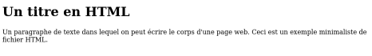

# **Lenguaje cliente HTML**

<br>

## **_Objetivos:_**

- Descubrir como se estructura el contenido de una página web.

---

---

<br>

---

## **Contexto**

---

<br>

Al visitar un sitio web, el navegador muestra un documento en forma de caracteres formateados, articulado con imágenes o incluso enlaces.

De hecho, el navegador recupera un archivo de texto que contiene código HTML.

Este código le dice al navegador cuáles son los elementos de contenido (una cadena de caracteres, una imagen), cuál es su tipo (un título, un párrafo) y cómo ordenarlos (este párrafo viene antes que ese).

Al interpretar este código HTML, el navegador construye una presentación legible por un ser humano.

<br>

---

---

<br>
<br>

---

## **HTML: el lenguaje de contenido de las páginas web**

---

<br>

El contenido de las páginas web está escrito en HTML, para HyperText Markup Language

HTML es un lenguaje de marcado: su función es estructurar el contenido de la página, mediante etiquetas.

Las etiquetas se utilizan para describir la función de los elementos y darles significado. Constan de tres partes:

- Una etiqueta de apertura : `<etiqueta>`,

- un contenido,

- Una etiqueta de cierre : `</etiqueta>`,

El contenido de las páginas web esta almacenado en archivos HTML y su debida extension es .html

**_EJEMPLO_**

```html
<!DOCTYPE html>

<html>
  <head>
    <meta charset="utf-8" />

    <title>Hello</title>
  </head>

  <body>
    <h1>Hello World</h1>
  </body>
</html>
```

👆 Esto es esto de aquí abajo 👇:


<br>

---

---

<br>

<br>

---

## **Etiquetas**

---

<br>

El código mínimo de un archivo HTML consta de:

1. Una etiqueta inicial, que indica el tipo de documento `<!DOCTYPE html>`.

2. Una etiqueta raíz `<html>`: engloba todo el resto del contenido.

   - La etiqueta `<head>`: contiene los metadatos de la página y su contenido no aparece en el renderizado final.

   - La etiqueta `<body>`: contiene todo el contenido visible de la página.

<br>

---

---

<br>
<br>

---

### **Ejemplos de etiquetas base**

---

<br>

- **Encabezados (de mayor a menor importancia):** `<h1> <h2> <h3> <h4> <h5> <h6>`

- **Bloques:** `<div> <section> <aside> <article> <form> <footer> <header> <nav>`

- **Elementos lineales:** `<span> <p>`

- **Campos:** `<input/> <textarea/> <button> <select>`

- **Énfasis:** `<em> <b> <i>`

- **Listas:** `<ul> <ol> <li>`

- **Imágenes:** ``

- **Enlaces:** `<a href="">`

- **Comentarios (no visibles en el renderizado final):** `<!-- Esto es un comentario -->`

<br>

---

---

<br>
<br>

---

## **HTML y el editor de texto**

---

<br>

Los editores de texto como LibreOffice Writer o Microsoft Word utilizan un lenguaje de marcas cercano al HTML para representar documentos.

Cuando se crea un título o se inserta una imagen, en realidad son etiquetas similares que se guardan en el archivo y que el editor procesa.

<br>

<br>

### **_Ejemplo_**

```html
<!DOCTYPE html>

<html>
  <head>
    <!-- Encodage du fichier, ici UTF-8 -->

    <meta charset="utf-8" />

    <!-- Titre de la page dans le navigateur -->

    <title>Un paragraphe</title>
  </head>

  <body>
    <h1>Un titre en HTML</h1>

    <p>
      Un paragraphe de texte dans lequel on peut écrire le corps d'une page web.
      Ceci est un exemple minimaliste de fichier HTML.
    </p>
  </body>
</html>
```

👆 Esto es esto!: 👇



<br>

---

### **2º*Ejemplo***

<br>

```html
<!DOCTYPE html>

<head>
  <meta charset="utf-8" />

  <title>Une image</title>
</head>

<html>
  <body>
    <h1>Vacances 2010</h1>

    <h2>À la mer</h2>

    <!-- Image dont l'emplacement sur le serveur se trouve dans le dossier images -->

    
  </body>
</html>
```

👆 Esto es esto!: 👇


<br>

---

---

<br>
<br>

---

## **HTML a traves de los años**

---

<br>

HTML se creó en 1992, pero cada navegador tenía su propia versión de HTML y su propia forma de interpretar las etiquetas.

Desde su estandarización por parte del W3C (World Wide Web Consortium) en 1995, la compatibilidad ha mejorado y hoy en día la mayoría de los sitios web tienen una representación idéntica para todos los navegadores estándar.

<br>

---

---

<br>

<br>

---

## **A Recordar**

---

<br>

- **HTML es un lenguaje de marcas para estructurar el contenido de los documentos.**

- **Un archivo HTML contiene encabezados (metadatos) y un cuerpo (contenido).**

- **La estructura de un documento se puede hacer semánticamente: título, párrafo, sección, imagen, enlace, etc.**

- **Los navegadores saben cómo mostrar estos diferentes elementos de forma estándar.**

<br>

---

---
