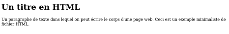

# **Lenguaje cliente CSS**

<br>

## **_Objetivos:_**

- Descubrir como se estilizan las páginas con CSS

---

---

<br>

---

## **Contexto**

---

<br>

Una página web no solo se compone de información estructurada, también está asociada a un diseño:

- fuentes, alineaciones, espaciado, colores, etc.

Esto 👆 se llama estilo.

El estilo de una página HTML se define mediante una hoja de estilo escrita en lenguaje CSS.

```
CSS es un lenguaje que permite por ejemplo decir:

```

- La fuente principal es 'Times'.

- Añadir un espaciado de 6 puntos ante todos los parágrafos.

- O todavía: Los títulos de nivel 1 son a mostrar en verde.

<br>

---

---

<br>
<br>

---

## **CSS: el lenguaje de estilos de las páginas web**

---

<br>

CSS (hojas de estilo en cascada) es el lenguaje que define las propiedades de estilo de los elementos de la página web.

Estos elementos de estilo son, por ejemplo:

- Colores,

- Fuentes de caracteres,

- Tamaño de caracteres,

- Alineamiento y margenes,

- etc.

**_EJEMPLO_ Hello World**

```html
<!DOCTYPE html>

<html>
  <head>
    <meta charset="utf-8" />

    <title>Hello</title>

    <link rel="stylesheet" type="text/css" href="style.css" />
  </head>

  <body>
    <h1>Hello World</h1>

    <p>Mon premier paragraphe</p>

    <style>
      h1 {
        color: red;
      }

      p {
        font-weight: bold;

        font-style: italic;
      }
    </style>
  </body>
</html>
```

👆 Esto es esto de aquí abajo 👇:


<br>

---

---

<br>
<br>

---

## **CSS & Selectores**

---

<br>

CSS funciona aplicando un estilo particular a los elementos de la página. La estructura general es la siguiente:


En este ejemplo, todos los elementos de tipo `<p>` se verán afectados por el valor de la propiedad.

<br>

---

---

<br>
<br>

---

## **Algunas propiedades CSS**

---

<br>

- **Fuentes :** `font-family, font-size, color, font-weight, text-shadow`

- **Dimensiones:** `width, height, margin, padding`

- **Posicionamiento:** `position, top, bottom, right, left`

- **Visibilidad:** `display, opacity, visibility`

- **Formas:** `border-radius, transform, border`

<br>

---

---

<br>
<br>

---

## **Añadir CSS con la etiqueta _STYLE_**

---

<br>

La primera forma de agregar CSS a una página HTML es escribir el código entre las etiquetas `<style>` en el archivo HTML, más concretamente en `<head>`.

<br>

<br>

### **_Ejemplo_**

```html
<!DOCTYPE html>

<html>
  <head>
    <meta charset="utf-8" />

    <title>...</title>

    <style>
      ...;
    </style>
  </head>

  <body></body>
</html>
```

👆 Esto es esto!: 👇



<br>

### **2º*Ejemplo ROJO y NEGRO***

<br>

```html
<!DOCTYPE html>

<html>
  <head>
    <meta charset="utf-8" />

    <title>...</title>

    <style>
      body {
        color: gray;
      }

      h1 .rouge {
        color: red;
      }

      h1 .noir {
        color: black;
      }
    </style>
  </head>

  <body>
    <h1>
      El <span class="red">rojo</span> y el <span class="noir">negro</span>
    </h1>
  </body>
</html>
```

👆 Esto es esto!: 👇


<br>

---

---

<br>
<br>

---

## **Añadir CSS con archivo .css**

---

<br>

El segundo método es usar un archivo .css independiente, vinculado a la página en los encabezados (Es decir en `<head>`).

```html
<head>
  <link rel="stylesheet" type="text/css" href="style.css" />
</head>
```

<br>

---

---

<br>
<br>

---

## **Rojo y Negro V2**

---

```html
<!DOCTYPE html>

<html>
  <head>
    <meta charset="utf-8" />

    <title>Ma page</title>

    <link href="style.css" rel="stylesheet" />
  </head>

  <body>
    <h1>
      Le <span class="rouge">rouge</span> et le <span class="noir">noir</span>
    </h1>
  </body>
</html>
```

<br>

```css
body {
  background : #fffefa;

  color: gray;
}

h1 .rouge {
  color: red;
}

h1 .noir {
  color: black;
}
```

<br>

---

---

<br>
<br>

---

## **A Recordar**

---

<br>

- **CSS se utiliza para diseñar los elementos (Etiquetas con sus contenidos) estructurados de una página HTML.**

- **se Puede agregar el estilo directamente en el archivo HTML con la etiqueta o vincular el archivo HTML a un archivo CSS independiente.**

- **Las propiedades CSS se aplican a un conjunto de elementos HTML a través de selectores.**

<br>

---

---
