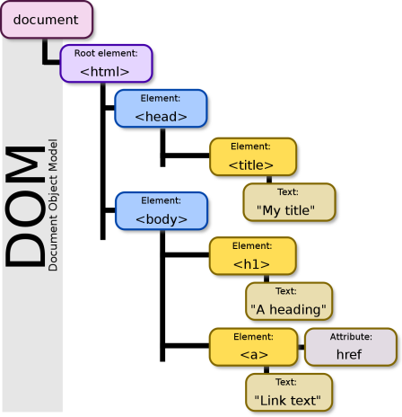

# **Lenguaje cliente JavaScript**

<br>

## **_Objetivos:_**

- Entender como una Página web Reacciona a los eventos;

- Entender el hecho de comunicación asíncrono(Algo que no sucede al mismo tiempo que otra cosa)

---

---

<br>

---

## **Contexto**

---

<br>

Hoy en día, las páginas web se utilizan a menudo para interactuar con los usuarios.

Por ejemplo, consultando un blog tendremos que ordenar los artículos, hacer una búsqueda o incluso mostrar una imagen a pantalla completa.

HTML y CSS son lenguajes declarativos bastante simples que no permitieron todos los tipos de presentación, y mucho menos la interacción.

También es necesario poder usar un lenguaje de programación por completo, es decir poder usarlo dentro del propio navegador, para poder hacer todo lo que no está previsto.

JavaScript permite, por ejemplo, cambiar el orden de un resultado de búsqueda, ordenándolo por fecha o por relevancia.

Esto es JavaScript.

---

---

<br>
<br>

---

## **JavaScript**

---

<br>

Javascript, el tercer lenguaje de esta trinidad, complementa HTML y CSS para permitir la programación de las interacciones del usuario.

JavaScript es un lenguaje de programación ejecutado directamente por el navegador web (lado del cliente).

---

<br>

### **_EJEMPLO_ Hello World**

<br>

El siguiente código crea un título interactivo, que muestra el texto "Hello World" en una ventana emergente cuando se hace clic.

<br>

```html
<!DOCTYPE html>

<html>
  <head>
    <meta charset="utf-8" />

    <title>Exercice</title>
  </head>

  <body>
    <h1>
      <em style="cursor: pointer" onclick="handleClick()">Cliquer</em> pour dire
      bonjour
    </h1>

    <script>
      function handleClick() {
        alert("Hello World");
      }
    </script>
  </body>
</html>
```

<br>

---

<br>

### **_EJEMPLO_ Hello World-2**

<br>

```html
<!DOCTYPE html>

<html>
  <head>
    <meta charset="utf-8" />

    <title>Exercice</title>
  </head>

  <body>
    <h1>
      <em style="cursor: pointer" onclick="handleClick()">Clique</em> pour dire
      bonjour
    </h1>

    <script src="script.js"></script>
  </body>
</html>
```

<br>

```JS

function handleClick(){

  alert("Hello World");

}


```

<br>

Puede incrustar código JavaScript en una página de dos maneras, usando la etiqueta `<script>`:

- Ya sea escribiéndolo directamente entre las etiquetas.

- Ya sea importándolo desde un archivo, cuya extensión es generalmente `.js`.

<br>

---

---

<br>
<br>

---

## **Eventos**

---

<br>

El principal interés de JavaScript en una página HTML es la gestión de eventos: clic, desplazamiento del cursor, desplazamiento de la página, escritura en un campo, atajos de teclado, etc.

<br>

Estas acciones de usuario son eventos a los que se pueden asociar acciones.

---

<br>

### **_Eventos_ Ejemplo**

<br>

Este código maneja dos eventos: pasar el mouse sobre el párrafo y presionar una tecla en el teclado.

Para cada uno de estos eventos, se muestra un mensaje diferente.

En `html`

```html
<!DOCTYPE html>

<html>
  <head>
    <meta charset="utf-8" />

    <title>Exercice</title>
  </head>

  <body onkeypress="handleKey()">
    <p onmouseover="handleMouse()">Je souhaite interagir avec toi.</p>

    <p>
      <script src="script.js"></script>
    </p>
  </body>
</html>
```

<br>

---

<br>

En archivo `.js`

```js
function handleMouse() {
  alert("Aquí estoy ...");
}

function handleKey() {
  alert("Hey ! no con el teclado !");
}
```

---

---

<br>
<br>

---

## **Manipular la página HTML con el DOM**

---

Con JavaScript, la estructura de la página está representada por un árbol llamado DOM (Document Object Model), que describe la jerarquía de etiquetas dentro del documento.

<br>



<br>

JavaScript proporciona utilidades para manipular elementos DOM.

Por ejemplo, el método document.getElementsByTagName("h1") devuelve el conjunto de títulos de tipo `<h1>`, que se pueden leer o modificar.

---

<br>

### **_Ejemplo_ Manipulación de elementos con JavaScript**

---

El siguiente código realiza dos procesos en los elementos de encabezado `<h1>` inicialmente presentes en la página.

- El primer proceso cambia el color del primer título y lo centra.

- El segundo proceso elimina el segundo título.

<br>

```html
<!DOCTYPE html>

<html>
  <head>
    <meta charset="utf-8" />

    <title>Transformation</title>
  </head>

  <body>
    <h1>Phrase mise en couleur avec du javascript</h1>

    <h1>Phrase inutile</h1>

    <script>
      // récupère la première balise h1 de la page

      const h1a = document.getElementsByTagName("h1")[0];

      h1a.style.color = "red";

      h1a.style.textAlign = "center";

      // récupère la seconde balise h1 de la page

      const h1b = document.getElementsByTagName("h1")[1];

      document.body.removeChild(h1b);
    </script>
  </body>
</html>
```

<br>

---

---

<br>
<br>

---

## **Solicitudes y asincronías**

---

<br>

- El segundo interés de JavaScript es saber cómo realizar solicitudes, por ejemplo, para recuperar y mostrar los ingredientes de una receta de cocina en el servidor al hacer clic en un botón "Ver más".

- El concepto de solicitud está relacionado con el de asincronía: en lugar de bloquear la visualización de toda la página mientras se espera que se recuperen los ingredientes del servidor, la visualización continúa y el usuario aún puede interactuar con la página.

- Cuando se completa la solicitud, se activa una acción predefinida llamada devolución de llamada.

- Encontramos el concepto de evento: como una petición que finaliza es un evento del mismo modo que pulsar una tecla en el teclado.

<br>

---

---

<br>
<br>

---

## **_Frameworks JavaScript_**

---

<br>

Las aplicaciones web de hoy en día a menudo se desarrollan utilizando frameworks.

Estos proporcionan un conjunto de herramientas y recursos que agilizan el desarrollo web.

Podemos citar los siguientes:

- Vue.Js

- React

- Angular

<br>

---

---

<br>
<br>

---

## **A Recordar**

---

<br>

- **JavaScript permite modificar elementos de una página web y reaccionar ante eventos, como hacer clic en un botón o recibir datos solicitados del servidor.**

<br>

---

---
