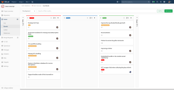

# **La autonomía en el oficio del desarrollador**

<br>

## **_Objetivos:_**

- Resaltar la importancia de la autonomía en esta profesión;

- Dar indicaciones sobre las técnicas para trabajar de forma independiente.

---

---

<br>

---

## **Contexto**

---

<br>

La profesión del desarrollador requiere una autonomía significativa.

De hecho, llevar a cabo una aplicación implica tomar decisiones y administrar prioridades.

Entre las herramientas necesarias para el desarrollo de esta autonomía, hay reuniones que le permiten sincronizarse con otros actores en proyectos o tareas y herramientas de gestión de códigos.

Integrado en un equipo, se beneficiará de las herramientas y métodos específicos de este equipo.

Hoy en día, estos métodos a menudo se inspiran en métodos ágiles.

Aquí ofrecemos una breve descripción general.

<br>

---

---

<br>
<br>

---

## **Fundamental: los Stand-Up (traducido a ponerse de pie)**

---

<br>

En medio de un proyecto, es normal comenzar el día con un primer stand-up con su equipo.

Esta es una oportunidad para hacer un balance del progreso del proyecto discutiendo las tareas realizadas durante el día anterior y las que se realizarán en el dia presente.

<br>

---

---

<br>
<br>

---

### **Ejemplo: Gestión de tareas en GitLab)**

---

<br>

GitLab es un software que ayuda a los desarrolladores a trabajar juntos.

Hace posible dibujar los cambios realizados en el software, pero también traza las diferentes tareas que se realizarán.

[GitLab](./03-Autonomia-como-desarrollador/img/tableau_todo_gitlab_1.png)

```
Descripción general de un resumen de tareas en Gitlab
```

<br>

Se llaman boletos de Gitlab.Gitlab puede planificar fácilmente las diferentes tareas y asignarlas a las personas en particular.

<br>



<br>

Aquí encontramos el método Kanban para organizar tareas.

<br>

---

---

<br>
<br>

---

### **Ejemplo: Sitio web prensa**

---

<br>

La aplicación web de un registro de prensa se puede cortar en dos partes: la interfaz de usuario y la lógica de la aplicación.

La interfaz de usuario contendrá los últimos artículos periodísticos, un menú para navegar entre las categorías de artículos y un formulario de conexión que conduce a un espacio de usuario.

Las tareas de este proyecto pueden ser:

- Construir un modelo de sitio,

- Escriba el código para mostrar los elementos y poder hacer clic en él,

- Escriba el código que muestra un artículo en su totalidad,

- Escribe el código de menú,

- Escriba el código de formulario de conexión,

- Escriba el código de espacio de usuario.

<br>

En cuanto a la lógica de la aplicación, los desarrolladores pueden compartir, por ejemplo, las siguientes tareas:

- Verifique los identificadores del usuario que se conecta a través del formulario de conexión,

- Diseñe y desarrolle los artículos y usuarios de la base de datos,

- Desarrolle el software necesario para permitir que la interfaz de usuario venga y recupere el contenido de la base de datos.

No es una línea exhaustiva, sino simplemente un ejemplo de cortar un proyecto en dos grupos de tareas, cada uno con el objetivo de llevar a cabo una pequeña parte del proyecto.

<br>

---

---

<br>
<br>

---

#### **Método**

---

<br>

Como desarrollador, es imperativo poder recortar su propio trabajo en varias tareas.

Tareas bastante simples, es decir, dirigías a un solo problema a la vez.

El hecho de tener tareas permite estimar el tiempo de trabajo y de tener una To Do List.

La autonomía juega un papel importante porque el desarrollador hará su lista de tareas en la mañana tratando de estimar el tiempo que tomará cada tarea.

Una vez hecho esto, puede comenzar su trabajo del día enfocándose en una tarea a la vez.

Al final del día, podrá hacer una pequeña evaluación (o parada nocturna) resumiendo las tareas realizadas y las dificultades encontradas.

<br>

---

---

<br>

---

## **A Recordar**

---

<br>

- _**La autonomía juega un papel importante en la profesión del desarrollador.**_

- _**Los proyectos de TI recortados en tareas, definidas mayormente por el desarrollador.**_

- _**Herramientas como GitLab le permiten administrar el avance del proyecto a través de un sistema de tickets de tareas.**_

<br>

---

---

<br>
<br>

---

### **Complemento: Algunas herramientas**

---

<br>

- [Tabla de tickets de GitLab](https://docs.gitlab.com/ee/user/project/issue_board.html)

- [WeKan](https://github.com/wekan/wekan)

<br>

---

---
