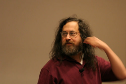

# **Las Licencias libres**

<br>

## **_Objetivos:_**

- Saber cuándo es posible reusar un trabajo sin firmar un contrato con el autor.

- Saber leer una licencia libre.

<br>

---

---

<br>
<br>

---

## **Contexto**

---

<br>

Los derechos de autor impide la reutilización gratuita del contenido, ya que se debe obtener la autorización previa del autor.

Por ejemplo, si encuentra una imagen o un código en la web, a priori, no puede reutilizarlos.

Debe comunicarse con el autor, por correo electrónico, por ejemplo, y obtener una autorización.

Incluso es aconsejable obtener una forma buena y debido si los problemas son importantes.

Por el contrario, si el contenido, esta imagen o este código, están bajo licencia gratuita, entonces esto significa que el autor ya ha dado una autorización a todo el mundo para usar su trabajo (bajo ciertas condiciones establecidas por la licencia).

<br>

---

---

<br>
<br>

---

## **Fundamental**

---

<br>

Una licencia libre es un contrato a priori propuesto por el propietario de un derecho de autor al resto del mundo.

Permite a todos usar libremente el contenido o el software sujeto a derechos de autor sin tener que solicitar una autorización previa.

La licencia arregla el marco de la autorización mediante los derechos de apertura. Todas las licencias gratuitas autorizan la copia y la redistribución de copias.

- La mayoría abre derechos adicionales, como el derecho de modificar la copia.

- También pueden mantener ciertas restricciones, por ejemplo, la obligación de redistribuir los cambios bajo la misma licencia.

<br>


```
Mimi & Eunice : Permission (❤️)
```

<br>

---

---

<br>
<br>

---

#### **Atención!:**

---

<br>

La licencia es un contrato que funciona dentro del marco de los derechos de autor, por lo que sigue sujeto a ella.

En Francia, la ley moral es inalienable, también la cita del autor sigue siendo obligatoria independientemente de la licencia.

<br>

---

---

<br>
<br>

---

## **En los orígenes, licencias de softwares libres**

---

<br>



<br>

```
Richard Stallman, à l'origine de la première licence libre
```

<br>


<br>

Las cuatro libertades fundamentales del software libre según Free Software Foundation:

1. Ejecutar el programa.

2. Estudiar el funcionamiento del programa (Open Source)

3. Redistribuir copias del Programa.

4. Modificar, mejorar el programa y publicar las modificaciones.

<br>

---

---

<br>
<br>

---

### **Ejemplo: Principales licencias de software libre**

---

<br>

- GPL & LGPL
- BSD
- MIT
- Apache
- MPL
- CeCILL
- Etc.

<br>

---

---

<br>
<br>

---

### **Ejemplo-2**

---

<br>


<br>

    La GNU-GPL (General Public Licence), primera licencia de software libre.

La Licencia Pública General de GNU es una licencia gratuita de Copyleft para software y otros tipos de obras.

<br>

[Para acceder a la licencia (v3)](https://www.gnu.org/licenses/gpl-3.0.en.html)

<br>

---

---

<br>
<br>

---

#### **Atención!: Libre no significa gratuito!**

---

<br>

Tenga en cuenta que el software o el contenido gratuito no es necesariamente gratuito, incluso si la posibilidad de copiarlo generalmente tiende a formas libres de distribución.

Es posible que deba pagar un soporte para obtener un libro impreso, por ejemplo, o un servicio, para beneficiarse del alojamiento de un servicio web. La libertad de copiar no está en duda, puede volver a imprimir el libro o alojar el servicio por sus propios medios.

<br>

---

---

<br>
<br>

---

### **Complemento: Cultura libre**

---

<br>


```
Lawrence Lessing, en los orígenes de Licences Creative Commons
```

- Aplique los principios del software gratuito a todos los tipos de obras de la mente, y especialmente los trabajos en línea.

- Confiar en la voluntad del autor para facilitar el re-uso creativo, remix, los mash-ups, etc.

- Pasar de << Todos los derechos reservados >>, a << Ciertos derechos reservados >>.

<br>


<br>


```
Las Licencias Creative Commons
```

<br>

---

---

<br>
<br>

---

### **Complemento-2: Historia y cultura libre (Framasoft, 2013)**

---

<br>

[Framabook](https://archives.framabook.org/histoiresetculturesdulibre/)

<br>

---

---
