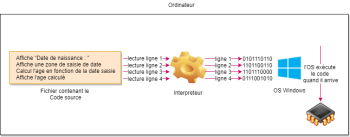
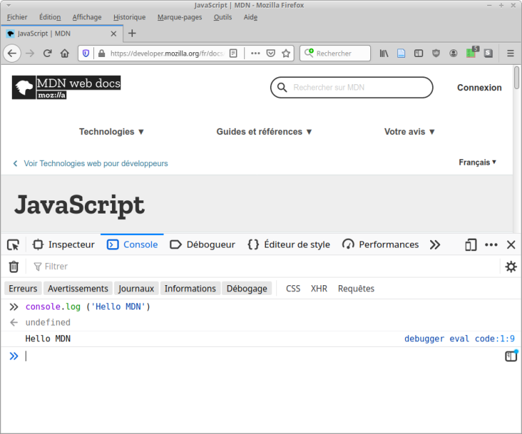

# **Ejecutar programas JS con un navegador web**

<br>

## **_Objetivos:_**

- Descubrir los fundamentos de JS

---

---

<br>

---

## **Contexto**

---

<br>

**JavaScript es un lenguaje de programación de scripts ampliamente utilizado para animar sitios web.**

<br>

- **Un lenguaje de script es:**

    - un lenguaje interpretado.

    <br>

- **Su sintaxis se considera de alto nivel, más cercano al lenguaje natural que al lenguaje de máquina:**

    - por lo tanto, es relativamente fácil de aprender y es independiente del hardware de la máquina en la que se ejecuta.

<br>

---

---

<br>
<br>

---

## **Origen**

---

<br>

En el origen de JavaScript se encuentra ECMAScript.

ECMAScript es un estándar compuesto por varias reglas implementadas en varios lenguajes de script.


**En sus inicios, JavaScript se utilizaba en los navegadores web:**

- los navegadores actuando como clientes web (ya que solicitan servicios a servidores web), JavaScript se vuelve popular para el desarrollo web orientado al cliente (asociado con HTML y CSS para la creación de páginas web).

<br>

---

---

<br>
<br>

---

## **Lenguaje interpretado**

---

<br>

**Un lenguaje interpretado es un lenguaje que es ejecutado por otro programa:**

- el intérprete.

<br>

El intérprete lee una línea de código, la analiza, la ejecuta si es correcta y pasa a la siguiente;

repite este proceso para cada instrucción del programa.

Un programa en lenguaje interpretado es, por lo tanto, ejecutado a medida que se va leyendo.
<br>

---



```
Esquema de un lenguaje Interpretado !
```

<br>

---

---

<br>
<br>

---

### **Complemento: Intérprete vs compilador**

---

<br>

A diferencia de un lenguaje interpretado, **un lenguaje compilado es traducido `solo una vez` desde el código fuente al lenguaje máquina**, **y** es **este código máquina** el que **se ejecutará posteriormente**.

El paso de traducción **no se repite en cada ejecución, lo que** generalmente **`es más eficiente en términos de rendimiento`**.

<br>

---

---

<br>
<br>

---

### **Método: Ejecutar JS en un navegador**

---

<br>

**Se puede ejecutar JavaScript en la consola web del navegador:**

- **En Chrome:** clic derecho > Inspeccionar o Ctrl+Shift+i, luego ir a la pestaña "Consola",

- **En Firefox:** clic derecho > Inspeccionar elemento o Ctrl+Shift+k, luego ir a la pestaña "Consola".

Luego se puede ejecutar código en el campo de la consola, asi 👇.

<br>

---



<br>

---

---

<br>
<br>

---

### **Complemento: Repl.it**

---

<br>

Existen interpretadores JavaScript en línea, como **[repl.it](https://repl.it/)**

<br>

---

---

<br>
<br>

---

### **Complemento: Node.js**

---

<br>

`Node.js` es un entorno de software que **permite crear aplicaciones ejecutando JavaScript en el lado del servidor.**

**Desde la aparición de `Node.js`,** **JS se ha vuelto de uso múltiple y ahora se utiliza como un lenguaje del lado del servidor,** comparable a lenguajes tradicionales **como PHP, Ruby, C, etc.**

<br>

---

---

<br>
<br>

---

## **A recordar**

---

<br>

- **JS es un lenguaje interpretado versátil que fue popularizado inicialmente por la web y se ha convertido en uso múltiple desde `Node.js` .**

<br>

---

---