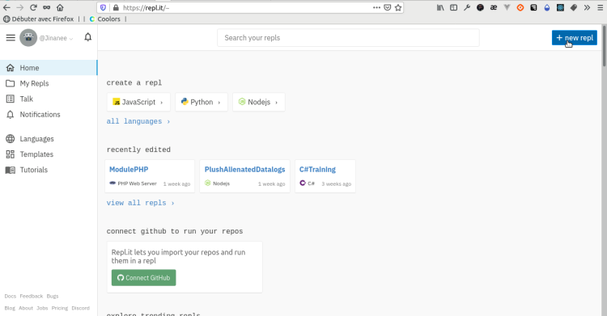
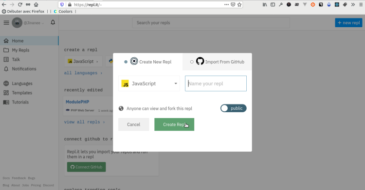
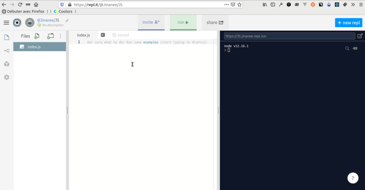
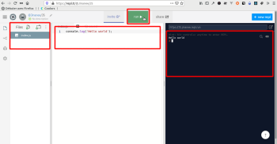

# **Ejecutar programas JS con Repl.it**

<br>

## **_Objetivos:_**

- **Crear nuestro entorno de trabajo en Repl.it;**

- **Crear nuestro primer programa en JavaScript.**

---

---

<br>

---

## **Contexto**

---

<br>

Cuando se comienza a desarrollar, es necesario configurar lo que se llama un entorno de desarrollo.

Para empezar, esto implica instalar las dependencias necesarias para ejecutar el lenguaje en la máquina.

Luego, es recomendable instalar y utilizar un IDE, es decir, un software que permita escribir nuestro código, generalmente adaptado al lenguaje utilizado.

Este IDE puede ofrecer funciones de detección y corrección de errores en el código.

Para facilitar esta configuración, el sitio web **Repl.it** permite tener un entorno de desarrollo completo en línea directamente en el navegador, para una amplia variedad de lenguajes.

<br>

---

---

<br>
<br>

---

## **Crear un programa JavaScript en Repl.it**

---

<br>

**Gracias a `Repl.it`, es posible crear entornos de desarrollo según el lenguaje que se desee utilizar.**

---

<br>

**En Repl.it:**

- Hacer clic en **"+ nuevo repl"** para abrir la ventana de creación.

- En **"Lenguaje"**, seleccionar **"HTML/CSS/JS"** y dar un nombre al Repl.

<br>





<br>

---

---

<br>
<br>

---

## **Escribir y ejecutar código**

---

<br>

**El código `JS` se escribe en archivos cuyos nombres terminan en `.js` (es la extensión del archivo).**

<br>



- **A la izquierda, se muestra la lista de archivos existentes.**

  - Los dos íconos permiten crear archivos y carpetas.

    - Ya se ha creado un archivo llamado `index.js`

    <br>

- **El botón `"Run"` permite ejecutar el programa.**

- **La parte central es el editor de texto donde se escribe el código.**

- **La parte derecha es la consola donde se muestra el resultado cuando el programa es ejecutado con `"Run"`.**

<br>

---

---

<br>
<br>

---

### **Complemento: Hello World !**

---

<br>

**Copia el siguiente código en el archivo `index.js` y haz clic en "Run".**

```js
console.log('Hello World')
```

Este primer programa muestra en la consola el texto entre paréntesis.

<br>

---

---

<br>
<br>

---

### **Complemento:**

---

<br>

**Existen otros `intérpretes de JavaScript en línea`:**

- **[CodePen](https://codepen.io)**

- **[JSFiddle](https://jsfiddle.net)**

- **[JS Bin](https://jsbin.com)**

<br>

---

---

<br>
<br>

---

## **A recordar**

---

<br>

- **Un `"repl"` es creado para un lenguaje específico, el código escrito en el editor de texto puede ser ejecutado usando el botón `"Run"`.**

- **El resultado se muestra en la consola ubicada a la derecha de la pantalla.**

<br>

---

---
