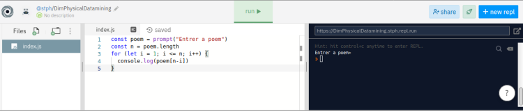

# **Validación de un algoritmo**

<br>

## **_Objetivos:_**

- **Entender la noción de la validación de un algoritmo**

---

---

<br>

<br>

---

## **Contexto**

---

<br>

El uso de algoritmos se ha vuelto masivo y es esencial asegurarse siempre, e incluso demostrar, que su algoritmo es válido para garantizar que su uso no presente ningún problema.

<br>

---

---

<br>
<br>

---

## **Probar un Algoritmo**

---

<br>

**Es posible proporcionar dos pruebas matemáticas que demuestren que un algoritmo es correcto:**

- una prueba de **`terminación`:**

    - **Asegura que** el algoritmo se detendrá inevitablemente en algún momento, es decir, **que no existen casos en los que entre en un bucle infinito.**

    <br>

    y

    <br>
    
- una prueba de **`validez`**

    - **Asegura que** el resultado es precisamente el objetivo buscado, **que se alcanza el propósito del algoritmo sin importar los datos de entrada.**

<br>

---

<br>

---

### **Consejo: Mas fácil decir que hacer ...**

---

<br>

**Estas pruebas suelen ser muy complejas y no son necesarias en el uso diario.**

**Un desarrollador utiliza la mayoría del tiempo algoritmos `"simples o ligeras adaptaciones de algoritmos conocidos y ya probados"`.**

**Estas pruebas son principalmente necesarias en el ámbito de la investigación informática o para aplicaciones muy críticas, como en un software de control de cohetes.**

<br>

---

### **Complemento: Probar un algoritmo**

---

<br>

**La lógica de `"Hoare"` es el formalismo más comúnmente utilizado para llevar a cabo las pruebas de validez y terminación.**

<br>

---

---

<br>
<br>

---

## **Validación**

---

<br>

Un algoritmo **se considera válido si el resultado devuelto es correcto para cualquier entrada posible.**

Por lo tanto, **es importante especificar correctamente el dominio de definición de las entradas.**

**Si una entrada es un número es necesario indicar si es:**

- un entero

- un entero positivo

- un número real

- etc.

**Un algoritmo dado podría funcionar solo con enteros y es importante que esto se especifique para que el algoritmo sea considerado válido.**

<br>

---

---

<br>
<br>

---

## **Verificar empíricamente la Validez**

---

<br>

Aunque no sea necesario realizar una prueba formal, es posible verificar la validez de manera muy sencilla.

Para ello, es necesario comprobar la validez para algunos valores clásicos y valores extremos.

<br>

---

### **Ejemplo: de verificación empírica**

---

<br>

El algoritmo a continuación recita el poema proporcionado al revés. Los valores clásicos serán cadenas de caracteres no vacías. El valor extremo a probar es una cadena de caracteres vacía.

Después de verificar estos casos, el desarrollador tiene un grado bastante alto de confianza en la validez de su algoritmo.

<br>

---

**Ejemplo:**

```
Entrada:
    poema, cadena de caracteres

n = longitud(poema)
Para i de 0 a n-1 hacer:
    Mostrar poema[n-i]
FinPara

const poema = prompt("Introduce un poema");
const n = poema.length;
for (let i = 0; i < n; i++) {
  console.log(poema[n - i - 1]);
}
```

---

<br>



<br>

---

---

<br>
<br>

---

## **Validación y test unitarios**

---

<br>

En un contexto profesional, un desarrollador puede implementar pruebas unitarias automatizadas que permiten verificar empíricamente la validez del algoritmo en cada modificación del código.

<br>

---

---

<br>
<br>

---

## **A recordar**

---

<br>

- **Un algoritmo es válido si siempre devuelve el resultado esperado para todas las entradas posibles.**

- **Es posible verificar empíricamente la validez ejecutando el algoritmo para algunos valores específicos, especialmente los valores extremos.**

<br>

---

---
