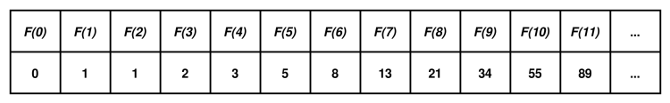

# **Cadena de Fibonacci**

<br>

## **_Objetivos:_**

- **Conocer la sucesión de Fibonacci**

- **Saber cómo construir la sucesión de Fibonacci**

---

---

<br>

<br>

---

## **Contexto**

---

<br>

**En su observación de la naturaleza, algunos matemáticos descubrieron la recurrencia de una secuencia de números muy específica:**

LA CADENA DE FIBONACCI

<br>

---

---

<br>
<br>

---

## **Cadena de Fibonacci**

---

<br>

La sucesión de Fibonacci es una secuencia infinita de números, definida de la siguiente manera.

<br>

---

**Aquí tenemos un ejemplo:**

```
Fibonacci[0] = 0
Fibonacci[1] = 1


Luego, para cualquier entero i mayor que 1:

Fibonacci[i] = Fibonacci[i-1] + Fibonacci[i-2]
Para i = 2, Fibonacci[2] = Fibonacci[1] + Fibonacci[0] = 1 + 0 = 1.

Para i = 3, Fibonacci[3] = Fibonacci[2] + Fibonacci[1] = 1 + 1 = 2.

Para i = 4, Fibonacci[4] = Fibonacci[3] + Fibonacci[2] = 2 + 1 = 3.

... Para i = 10, Fibonacci[10] = Fibonacci[9] + Fibonacci[8] = 34 +  21 = 55.

Y así sucesivamente.

```

---



```
Doce primeros términos de la cadena de Fibonacci
```

<br>

---

### **Observación**

---

<br>

Por ejemplo, esta secuencia se encuentra en la disposición de los pétalos de una alcachofa o en la disposición de las escamas de una piña.

Esta enigmática presencia en muchas disposiciones naturales continúa intrigando a los científicos y sigue siendo una fuente de investigación y de inspiración para creaciones artísticas en la actualidad.

<br>

---

---

<br>

<br>

---

## **Implementación**

---

<br>

Aquí tienes la implementación del cálculo de los primeros `n` términos de la secuencia de `Fibonacci` en `Python` y en `JavaScript`.

La implementación es bastante simple, ya que solo necesitas iterar y sumar sistemáticamente los dos valores anteriores.

<br>

---

**Ejemplo JavaScript: Cadena Fibonacci**

```js
const n = Number(prompt('Ingresa un numero entero mayor a 1:')) // Par exemple, 4

const fibo = new Array(n)

fibo[0] = 0

fibo[1] = 1


for (let i = 2; i < n; i++) {
  fibo[i] = fibo[i - 1] + fibo[i - 2]
}
console.log(fibo)
```

<br>

---

**Ejemplo Python: Cadena Fibonacci**

```python
n = int(input("Entrer un entier supérieur à 1:"))  #  Par exemple, 4
fibo = [0]*(n)
fibo[0] = 0
fibo[1] = 1
for i in range(2,n):
  fibo[i] = fibo[i-1] + fibo[i-2]
print(fibo)
```

<br>

---

### **Desarrollo paso a paso**

---

<br>

**Se crea una lista vacía de tamaño 5, y los elementos 0 y 1 se colocan en las dos primeras posiciones, resultando en `fibo = [0, 1, _, _, _]`.**

**Comenzamos el bucle:**

- **Primera iteración, `i = 2`:** `fibo[2] = fibo[1] + fibo[0] = 1`.

    - Ahora, fibo = [0, 1, 1, _, _].

    <br>

- **Segunda iteración, `i = 3`:** `fibo[3] = fibo[2] + fibo[1] = 2`.

    - Ahora, fibo = [0, 1, 1, 2, _].

    <br>

- **Tercera iteración, `i = 4`:** `fibo[4] = fibo[3] + fibo[2] = 3`.

    - Ahora, fibo = [0, 1, 1, 2, 3].

    <br>

- La variable i es igual a n, por lo que el bucle se termina.

<br>

---

### **Complemento: Complejidad**

---

<br>

La complejidad temporal de este algoritmo es `O(n)`.

Se puede ver claramente lo que explica esta complejidad, ya que hay dos bucles simples.

Podríamos ser más precisos al decir `O(2 * n)`, pero esta complejidad se considera equivalente a `O(n)` ya que simplemente estamos buscando un orden de magnitud.

<br>

---

---

<br>

<br>

---

## **A recordar**

---

<br>

- **La serie de Fibonacci es una secuencia de números que a menudo se encuentra en la naturaleza.**

- **La implementación del cálculo de sus términos es muy sencilla.**

<br>

---

---
