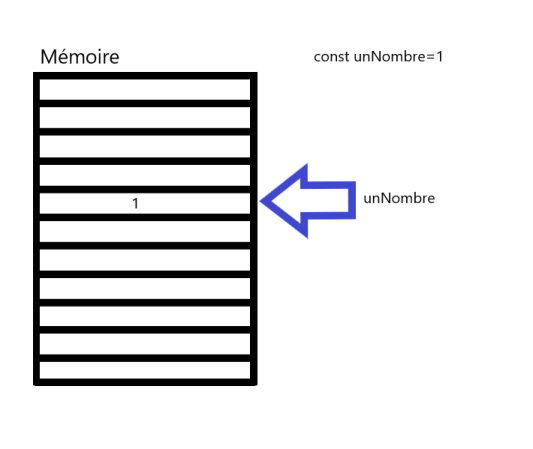
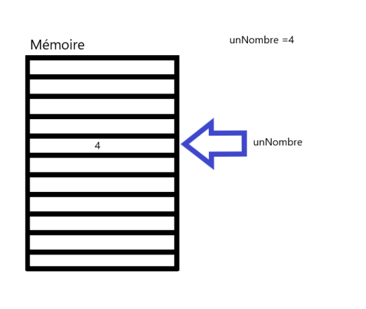

# **Que es una variable?**

<br>

## **_Objetivos:_**

- **Comprender qué es una variable**

- **Conocer las prácticas recomendadas para nombrarlas**

---

---

<br>

<br>

---

## **Contexto**

---

<br>

En los programas, las variables se utilizan para almacenar datos y realizar diversas operaciones sobre ellos.

Son una herramienta común en todos los lenguajes de programación que actúa como intermediario entre el programa y la memoria de la computadora.

Cada variable tiene un nombre y un valor.

El nombre de una variable es definido por el desarrollador en el código de su programa, pero existen reglas específicas en cada lenguaje para restringir el formato de los nombres de las variables.

**El valor es dinámico y puede cambiar según la ejecución del programa, de ahí el término "variable".**

<br>

---

---

<br>
<br>

---

## **Variable**

---

<br>

Un ordenador está equipado con una memoria, y esta memoria está compuesta por numerosas celdas.

Los programas pueden leer y escribir en estas celdas gracias a las variables.

Una variable es una celda de memoria con un nombre.

Se pueden crear tantas variables como se desee en un programa, para almacenar y recuperar información.

<br>

---

**Ejemplo JavaScript: Muestra un hello world**

```JavaScript
const aString = 'Hello World'

const aNumber = 1

console.log(aString)

console.log(aNumber)
```

<br>

---

**Ejemplo Python: Muestra un hello world**

```Python
a_string = "Hello World"
a_number = 1
print (a_string)
print (a_number)
```

---

<br>



```
Esquema representando la creación de una variable en memoria 
```

<br>



```
Esquema representando la modificación del valor de una variable 
```

<br>

---

---

<br>
<br>

---

## **Nombrar una variable: Reglas de syntaxis**

---

<br>

**Existen reglas para dar nombres a las variables:**

- Un nombre de variable:

    - **no puede comenzar con un dígito**

    - **no puede contener espacios**.

<br>

---

---

<br>
<br>

---

## **Nombrar una variable: convenciones**

---

<br>

**También existen convenciones que permiten hacer un programa más legible y comprensible.**

<br>

- Elegir **nombres claros** y precisos (al leer el nombre de una variable, **debe ser posible entender** para qué se utiliza en el programa).

- Escribir los nombres de las variables **en inglés**.

- **No** usar **caracteres especiales** (nos restringimos a las 26 letras en minúsculas y mayúsculas, los 10 dígitos y el guión bajo _).

- Para ser explícito, el nombre de una variable **puede contener varias palabras, para ello se puede:**

    - **reemplazar los espacios por guiones bajos** (método snake_case preferido en Python).

    - **o comenzar cada nueva palabra con una letra mayúscula** (método camelCase preferido en JavaScript).

<br>

---

---

<br>

<br>

---

## **camelCase (variables en JavaScript)**

---

<br>

`multipleWordsVariable`

<br>

---

<br>

<br>

---

## **snake_case (variables en Python)**

---

<br>

`multiple_words_variable`

<br>

---

---

<br>

<br>

---

### **Atención!: La diferencia entre mayúsculas y minúsculas**

---

<br>

El lenguaje Python, JavaScript y **la mayoría de los otros lenguajes diferencian entre mayúsculas y minúsculas (son sensibles a mayúsculas y minúsculas).**

Por lo tanto, `"totalprice" y "totalPrice"` **corresponden a dos variables diferentes.**

<br>

---

---

<br>
<br>

---

## **A recordar: (JavaScript), (Python)**

---

<br>

**JavaScript**

```js
/** JavaScript */
let variableName = value
```

<br>

---

**Python**

```python
# Python 
variable_name = value
```

<br>

---

---
