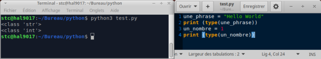

# **Tipo**

<br>

## **_Objetivos:_**

- **Comprender la utilidad de los tipos.**

---

---

<br>

<br>

---

## **Contexto**

---

<br>

**En un programa, hay ocasiones en las que ciertos datos no cambian.**

Estos **son valores constantes**, cuya declaración e inicialización son **un poco diferentes de las variables.**

<br>

---

---

<br>
<br>

---

## **Constantes**

---

<br>

**Una variable está asociada a un tipo,** que **determina el tamaño de la ubicación en memoria y las operaciones que se pueden realizar con esa variable.**

<br>

---

**Para mostrar el tipo de una variable llamada `"palabra"`:**

- **En JavaScript:** `console.log(typeof palabra)`

- **En Python:** `print(type(mot))`

<br>

---

---

<br>

<br>

---

## **Tipos comunes en JS**

---

<br>

- `number`: **Los números** 

- `string`: **Cadenas de caracteres**
 
- `boolean`: **Booleanos (una variable que puede ser verdadera (true) o falsa (false))** 

<br>

---

---

<br>

<br>

---

## **Tipos comunes en Python**

---

<br>

- `int`: **Los números enteros** 

- `float`: **Los números decimales**
 
- `str`: **Las cadenas de caracteres** 

<br>

---

### **Ejemplo: JS & Python**

---

<br>

**Ejemplo JavaScript: muestra el tipo de variables**

```js
let aString = 'Hola Mundo'
console.log(typeof aString)
let aNumber = 1
console.log(typeof aNumber)
```

---

```js
/* Salida en Consola */

string
number
```

---



```
Ejemplo en consola con python
```

---

<br>

**Ejemplo Python: muestra el tipo de variables**

```python
a_string = "Hola Mundo"
print(type(a_string))
a_number = 1
print(type(a_number))
```

---

```python
# Salida en Consola 

<class 'str'>
<class 'int'>
```

<br>

---

---

<br>
<br>

---

## **A recordar**

---

<br>

**JavaScript**

```js
/* JavaScript */
typeof variableName
```

<br>

---

**Python**

```python
# Python
type(variable_name)
```

<br>

---

---
