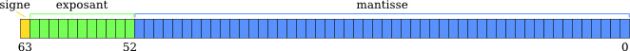

# **Flotantes y precision**

<br>

## **_Objetivos:_**

- **Comprender cómo se almacenan los números flotantes en la informática**

- **Comprender el concepto de precisión**

---

---

<br>

<br>

---

## **Contexto**

---

<br>

En informática, sabemos que todos los datos se almacenan en binario.

**Para los números decimales, es decir, con una coma, podemos preguntarnos cómo se almacena correctamente el valor, dado que la coma no es un número que se pueda almacenar:** 

- `Es un carácter`

---

<br>

Un enfoque inicial podría ser simplemente almacenar la parte entera y la parte decimal por separado, pero no es así como funciona.

En realidad, es un poco más complejo que eso, y en informática hablamos de números flotantes o números de punto flotante.

<br>

---

---

<br>

<br>

---

## **La codificación de los flotantes**

---

<br>

**Los números flotantes se almacenan en `64 bits` de manera que el primer `bit` desde la izquierda (el bit más significativo) determina el signo:**

- **si este bit es 0:**

    - el número es positivo

    <br>
    
- **si este bit es 1:**

    - el número es negativo

---

<br>
    
Los siguientes once bits codifican el exponente y los cincuenta y dos bits restantes codifican la mantisa.

**Los números se llaman flotantes porque la posición de la coma no es fija.**

**A DIFERENCIA de lo que podría dictar la intuición:**

- **NO SE TRATA de escribir los números con:** un bit para el signo

- **NO SE TRATA de escribir los números con:** once bits para la parte entera

    y
    
- **NO SE TRATA de escribir los números con:** los cincuenta y dos bits restantes para la parte decimal.

---

<br>



```
Formato de representación de los flotantes de doble precisión
```

---

<br>

---

---

<br>
<br>

---

## **Posición de la coma (el punto del flotante)**

---

<br>

**Los números flotantes se calculan de la siguiente manera, `en binario`:**

- `nbFlottant` **` = signo * 2exponente * mantisa`**

Por lo tanto, la posición de la coma en un número flotante depende de su exponente.

<br>

---

**Ejemplo:**

**Un ejemplo en decimal podría ser el número** `-2.648`.

**Este número se representaría con los siguientes datos:**

<br>

- **Signo:** negativo

- **Exponente:** -3

- **Mantisa:** 2468

---

<br>

El cálculo sería `10^-3`, es decir, `0.001`, `multiplicado por 2468`, **es decir, 2.468, y luego hecho negativo, es decir -2.468**

---

<br>

**Si cambiamos el exponente a `-2`, por ejemplo, el número resultante sería -24.68, y si lo cambiamos a -6, seria -0.002468**

**Como puedes ver, la posición de la coma es flotante y depende del valor del EXPONENTE.**

<br>

---

### **Ejemplo: Declarar un flotante y usarlo**

---

<br>

**Ejemplo JavaScript:**

```js
let nbFloat = 0.1
console.log(nbFloat)

nbFloat *= 0.1
console.log(nbFloat)

nbFloat += 1
console.log(nbFloat)
```

<br>

---

**Ejemplo Python:**

```python
nb_float = 0.1
print(nb_float)

nb_float *= 0.1
print(nb_float)

nb_float += 1
print(nb_float)
```

---

<br>

En Python, al igual que en JavaScript, se declaran y manipulan los números flotantes de la misma manera que los demás números.

<br>

---

--- 

<br>

<br>

---

### **Atención!: Imprecisiones**

---

<br>

No todos los números son perfectamente codificables con este método.

Los números que corresponden a una suma de potencias de dos se escriben de manera exacta, los demás se escriben de manera aproximada, lo que en algunos casos puede causar problemas de cálculo.

<br>

---

En matemáticas, `0.1 + 0.2 = 0.3`.

**La respuesta a la pregunta `"¿es 0.2 más 0.1 igual a 0.3?"` es `"sí"`.**

**De manera similar, `0.25 + 0.25 = 0.5`, por lo que la respuesta a la pregunta `"¿es 0.25 más 0.25 igual a 0.5?"` es `"sí"`.**

Sin embargo, debido a los problemas de aproximación de los números flotantes, esto no es cierto en la informática.

**Ejemplo: Problemas de aproximación JavaScript**

```js
console.log(0.1 + 0.2 === 0.3)

console.log(0.25 + 0.25 === 0.5)
```

<br>

---

**Ejemplo: Problemas de aproximación Python**

```js
print(0.1 + 0.2 == 0.3)

print(0.25 + 0.25 == 0.5)
```

---

<br>

Estos dos programas muestran `false` y luego `true`, porque `0.1` no se puede codificar correctamente.

**Por lo tanto, cuando los programas suman `0.1` y `0.2`, en realidad están sumando números muy cercanos a `0.1` y `0.2`, por lo que el resultado obtenido no es igual a `0.3` y la prueba es `falsa`.**

**En cambio, `0.25` está codificado correctamente, por lo que la segunda suma da un resultado exacto y la prueba es verdadera.**

<br>

---

---

<br>
<br>

---

## **Evitar problemas de aproximación con [mathjs](https://mathjs.org/)**

---

<br>

**Para evitar problemas de aproximación al realizar cálculos o comparaciones con números flotantes, es necesario trabajar con [mathjs](https://mathjs.org/), una biblioteca diseñada para manejar problemas de aproximación de números flotantes en JavaScript.**

<br>

---

---

<br>
<br>

---

## **A recordar**

---

<br>

- **Los números flotantes se almacenan en 64 bits y se llaman flotantes porque la posición de la coma depende del exponente.**

<br>

---

---
