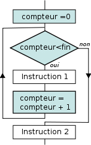

# **Principio de la iteración**

<br>

## **_Objetivos:_**

- **Comprender el uso de la iteración.**

---

---

<br>

<br>

---

## **Contexto**

---

<br>

Cuando **repetimos varias veces las mismas acciones**, hablamos de **iteración**.

Una estructura de iteración es una estructura de código que permite repetir las mismas acciones, con posibles pequeñas diferencias.

Por ejemplo, aplicar una misma secuencia de acciones a una variable diferente en cada iteración.

Existen varios tipos de estructuras de iteración, pero suelen ser comunes en diferentes lenguajes.

<br>

---

---

<br>

<br>

---

## **Iteración**

---

<br>

**Una iteración representa la ejecución de un bloque** (como for) **de instrucciones**.

**Un conjunto de iteraciones** representa la ejecución repetida del mismo **bloque de instrucciones:**

- decimos que estamos iterando sobre un bloque de instrucciones.

<br>

---

### **Estructura de iteración**

---

<br>

**Las `estructuras de iteración` nos dan una forma de realizar bucles en las instrucciones:**

- el bucle creado permite ejecutar las iteraciones dadas en el cuerpo del bloque.

<br>

---

### **Condición de salida**

---

<br>

**Un bucle se ejecuta "un cierto número de veces" `antes de que este se tenga que detenerse`, y que permita que el resto del programa continúe su ejecución debidamente.**

---

<br>

**Si un bucle nunca se detiene, se le llama bucle infinito:**

- el programa queda bloqueado porque el bucle se repite infinitamente.

---

<br>

Las estructuras de iteración requieren una condición de salida, es decir, **una condición que haga detenerse las repeticiones tan pronto como se cumpla.**

<br>

---

### **Contador**

---

<br>

**A menudo se utiliza un contador dentro del bucle:**

- una variable entera, **generalmente inicializada en `"0"`**, se incrementa en cada nueva iteración.

- **El contador** se utiliza para **contar el número de iteraciones realizadas.**

---

<br>

El valor del contador se utiliza muy a menudo en la condición de salida, para detener el bucle después de un cierto número de iteraciones.

<br>

---



```
Iteración con un contador
```

<br>

---

---

<br>

<br>

---

## **A recordar**

---

<br>

- **Las estructuras de iteración permiten repetir varias veces una misma secuencia de instrucciones mediante un bucle.**

<br>

---

---
