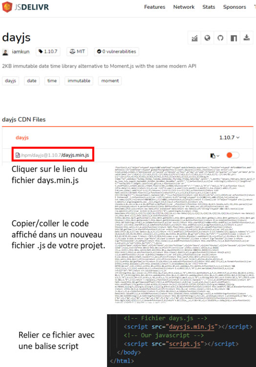

# **Days.js**

<br>

## **_Objetivos:_**

- **Aprender los fundamentos de `Days.js`**

---

---

<br>

<br>

---

## **Contexto**

---

<br>

Aunque es posible manipular fechas en JavaScript, realizar operaciones más complejas puede requerir mucho código para obtener el resultado deseado.

Se han creado herramientas para simplificar estas manipulaciones.

Ahora abordaremos `Days.js`, una biblioteca especializada en la gestión de fechas.

<br>

---

### **Método:**

---

<br>

**Para descargar el archivo, debes dirigirte a la página:**

- [https://day.js.org/docs/en/installation/browser](https://day.js.org/docs/en/installation/browser)

Haz clic en **"jsDelivr" en "Day.js can be included by way of a CDN provider like cdnjs.com, unpkg and jsDelivr ..."**

---

<br>

**Si la página no aparece:**

[https://cdn.jsdelivr.net/npm/dayjs@1/dayjs.min.js](https://cdn.jsdelivr.net/npm/dayjs@1/dayjs.min.js)

Agrega un archivo que podrías nombrar, por ejemplo, **"daysjs.min.js"** y **copia este código de la biblioteca**.

**Luego, en el código `HTML`, enlaza este archivo `"daysjs.min.js"` de la siguiente manera:**

- `<script src="dayjs.min.js"></script>`

<br>

---

<br>

**Aquí veremos cómo instalar esta biblioteca en tu proyecto mediante enlaces CDN y descarga.**

`Days.js` ofrece otras posibilidades de instalación, pero estas requieren conceptos que aún no se han abordado en esta etapa.

**Toda la información está disponible en la sección de instalación en el sitio oficial.**

<br>

---

### **Instalación mediante `CDN`:**

- Deberás integrar los enlaces `CDN` antes de tu propio JavaScript y antes de la etiqueta de cierre **`</body>`**

```html
<!-- nuestro código -->
<!-- CDN Daysjs -->
<script src="https://unpkg.com/dayjs@1.8.21/dayjs.min.js"></script>
<!-- nuestro JavaScript -->
<script src="script.js"></script>
</body>
</html>
```

<br>

---

### **Instalación mediante descarga:**

---

<br>

Para descargar el archivo, primero debes ir al sitio `jsdelivr.com`.

Luego, haz clic en el enlace con el nombre de archivo "`dayjs.min.js`".

Esto abrirá una nueva página con el código de la biblioteca en su versión minimizada.

Luego, simplemente copia y pega este código en un archivo JavaScript que integres en tu proyecto.

Finalmente, solo necesitas enlazar este último archivo con una etiqueta `<script>` en tu página `HTML`.

<br>



<br>

La instalación de `Days.js` ahora está completa y podemos comenzar a usarla.

`Days.js` permite crear fechas, formatearlas, recuperar sus datos (como año, mes, día de la semana, día del año, etc.), manipular fechas (suma/resta/diferencia entre 2 fechas), conocer el número de días en el mes y muchas otras funcionalidades que puedes encontrar en la documentación.

<br>

---

**Ejemplo: JavaScript**


```js
let date = dayjs('10-09-2021 10:30:04');

console.log(date.format()); // Muestra: 2021-10-09T00:00:00+02:00
console.log(date.format('dddd D MMMM YYYY')); // Muestra: Saturday 9 October 2021
console.log(date.year()); // Muestra: 2021
console.log(date.month()); // Muestra: 9
console.log(date.day()); // Muestra: 6 (que corresponde al 7º día de la semana, comenzando el domingo con un valor de 0)
console.log(date.hour()); // Muestra: 10
console.log(date.minute()); // Muestra: 30
console.log(date.second()); // Muestra: 4

console.log(date.add(7, 'day').format('le DD/MM/YYYY à hh:mm:ss')); // Muestra: le 16/10/2021 à 10:30:04
console.log(date.subtract(7, 'year').format('le DD/MM/YYYY à hh:mm:ss')); // Muestra: le 09/10/2014 à 10:30:04

console.log(date.startOf('year').format('le DD/MM/YYYY')); // Muestra: le 01/01/2021
console.log(date.endOf('month').format('le DD/MM/YYYY')); // Muestra: le 31/10/2021...

```

<br>

---

---

<br>

<br>

---

## **A recordar**

---

<br>

- **`Days.js` es una biblioteca para manipular y mostrar fechas y horas en JavaScript.**

<br>

---

---