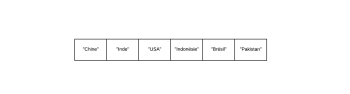
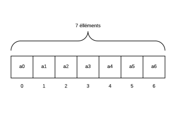

# **Declaración**

<br>

## **_Objetivos:_**

- **Saber almacenar elementos en un array;**

- **Aprender a "recuperar" o "modificar" el contenido de una posición en un array.**

---

---

<br>

<br>

---

## **Contexto**

---

<br>

**Junto con las variables convencionales como `strings`, `números` o `booleanos`, "existen variables que permiten almacenar varios elementos al mismo tiempo".**

**Estas variables, llamadas arrays,** son muy utilizadas porque **permiten manipular conjuntos de datos similares.**

```
Por ejemplo, imagina un software de correo electrónico donde es probable que, internamente, cada carpeta sea un array con cada correo de la carpeta como elementos.
```

<br>

---

---

<br>

<br>

---

## **Array**

---

<br>

Los arrays son estructuras que **pueden contener múltiples elementos, como:** 

- números

- strings

- etc.

---

<br>

**Los arrays generalmente** almacenan **un solo tipo de elemento**, **pero** lenguajes como **`JavaScript` y `Python` permiten mezclar varios tipos en un mismo array**.

<br>

---

<br>



```
Tabla de cadenas de caracteres
```

<br>

---

### **Observación: Denominación**

---

<br>

- **En JavaScript,** estas estructuras **se llaman "`arrays`"** y dependen de la clase Array (array en inglés).

- **En Python,** se utiliza más el término **"`listas`"**.

<br>

---

---

<br>

<br>

---

## **Indexación**

---

<br>

**Las posiciones en un array se identifican mediante un índice:**

- la primera posición tiene el índice 0

- la segunda tiene el índice 1

- la tercera tiene el índice 2

- y así sucesivamente.

---

<br>

**`Los índices` "permiten acceder a una posición" específica "en" un "array para leer su contenido o modificarlo".**

```
Dado que los índices comienzan en 0, las posiciones en un array con 7 elementos, se numerarán desde el índice '0' hasta el '6'.
```

<br>

---

<br>



```

TABLA(Array Indexado) INDEXADA

Tabla con sus Indices, que empieza siempre desde "0"
```

<br>

---

---

<br>

<br>

---

## **Declaración**

---

<br>

**En `JavaScript` y `Python` un array se declara:**

- **usando corchetes**
    
      y
        
- **los elementos se separan por comas:**

    - **[elemento1, elemento2, elemento3]**

---

<br>

**También se puede crear un array vacío.**

Sus elementos pueden ser números, booleanos, strings, etc.

<br>

---

**Los arrays se pueden mostrar en la salida.**

**Ejemplo JavaScript: array de 5 posiciones**

```JavaScript
const playlist = ['Remy', 'Népal', 'Kery James', 'August D.', 'Damso']
console.log(playlist)
```

---

<br>

**Ejemplo Python: array de 5 posiciones**

```Python
playlist = ['Remy', 'Népal', 'Kery James', 'August D.', 'Damso']
print(playlist)
```

<br>

---

---

<br>

<br>

---

## **Lectura de posiciones**

---

<br>

**<u>Se accede</u> a los elementos de un array <u>mediante su `índice`</u> <u>dentro de corchetes.</u>**

**La sintaxis es la misma en `Python` y `JavaScript`:**

- **array`[0]`** : devuelve el primer elemento del array **"array"**

- **array`[1]`** : devuelve el segundo

- **array`[5]`** : devuelve el sexto

- y así sucesivamente.

---

<br>

- **En Python:**

    - Acceder a un índice que no existe en el array, **generara un error**

---
    
<br>

- **En JavaScript:**

    - devolverá **el valor `"undefined"`**.

<br>

---

**Ejemplo JavaScript:**

```js
const playlist = ['Remy', 'Népal', 'Kery', 'August D.', 'Damso']
console.log(playlist[0]) // Remy
console.log(playlist[2]) // Kery
console.log(playlist[5]) // undefined
```

---

<br>

**Ejemplo Python:**

```Python
playlist = ['Remy', 'Népal', 'Kery', 'August D.', 'Damso']
print(playlist[0]) # Remy
print(playlist[2]) # Kery
print(playlist[5]) # error
```

<br>

---

---

<br>

<br>

---

## **Escribir en una posición `INDEXADA`**

---

<br>

<u>Se puede escribir en una posición de un array utilizando su índice con la misma sintaxis:</u>

- **array`[0]` = 'nuevo valor'**.

---

<br>

**En JavaScript:**

- se puede usar esta escritura 👆 para agregar algún elemento nuevo al array **(en un índice que aún no existe)**.

---

<br>

**En Python:**

- **solo se pueden modificar las posiciones** <u>**que ya tienen un valor**</u> declarado en esa posición en el array.

<br>

---

**Ejemplo JavaScript:**

```js
const playlist = ['Remy', 'Népal', 'Kery', 'August D.', 'Damso']
console.log(playlist[3]) // August D.
playlist[3] = 'Orelsan'
playlist[5] = 'Keny Arkana'
console.log(playlist[3]) // Orelsan
```

---

<br>

**Ejemplo Python:**

```Python
playlist = ['Remy', 'Damso', 'Kery', 'August D.', 'Sniper']
print(playlist[3]) # August D.
playlist[3] = 'Orelsan'
playlist[5] = 'Keny Arkana' # error
print(playlist[3]) # Orelsan
```

<br>

---

---

<br>

<br>

---

### **Complemento: Tipos**

---

<br>

Existen otros tipos de arrays con características ligeramente diferentes para adaptarse a diferentes situaciones.

**Entre ellos, los diccionarios utilizan el principio `clave-valor`:**

- cada posición del array se nombra con una clave (en lugar de un índice) que permite acceder al valor almacenado.

<br>

---

---

<br>

<br>

---

## **A recordar**

---

<br>

- **Los arrays sirven para:**

    - **almacenar:**
    
      - múltiples elementos en posiciones indexadas, accesibles y modificables mediante su índice.**

<br>

---

---
