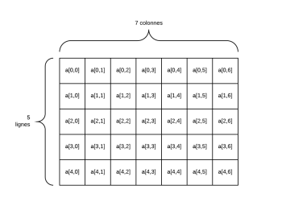
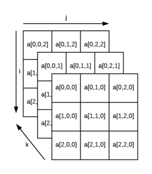

# **Recorrido de Arrays**

<br>

## **_Objetivo_**

- **Aprender a crear y utilizar un array bidimensional.**

- **Saber cómo recorrer un array bidimensional.**

---

---

<br>

<br>

---

## **Contexto**

---

<br>

Un **array clásico contiene una sola fila con varias columnas**, y se puede asimilar a una lista.

**Sin embargo,** un array **puede contener variables y otros arrays.**

En este caso, **hablamos de un array multidimensional,** que **tiene varias filas y columnas.**

**El más común es `el array de 2 dimensiones`, que es muy útil para representar los arrays que manipulamos en el mundo físico.**

**Por ejemplo, la cuadrícula de píxeles de una pantalla es un array de 2 dimensiones.**

Veremos que son bastante simples de usar, aunque **requieren el uso cuidadoso de bucles anidados para ser recorridos.**

<br>

---

---

<br>

<br>

---

## **Array 2D**

---

<br>

**Un `array multidimensional` es:**

- **un array que contiene otros arrays en su interior.** 

    - **Un array en 2 dimensiones es,** por lo tanto, **un array cuyos elementos son ellos mismos arrays de valores.**

---

<br>

**En Python y JavaScript, se agrega una segunda dimensión utilizando la misma notación entre corchetes dentro de un array:**

- `array = [[a1, a2], [b1, b2], [c1, c2]]`

---

<br>



```
Array a 2 dimensiones
```

<br>

---

**Ejemplo JavaScript: Una clase se divide en `4 grupos` de `3 estudiantes` cada uno**

```javascript
const grupos = [
  ['Manon', 'Lou', 'Alexandre'],
  ['Lucas', 'Antonin', 'Ayman'],
  ['Elliot', 'Kylian', 'Alix'],
  ['Cassandre', 'Tom', 'Erika']
]
```

---

<br>

**Ejemplo Python: Una clase se divide en `4 grupos` de `3 estudiantes` cada uno**

```python
grupos = [
  ['Manon', 'Lou', 'Alexandre'],
  ['Lucas', 'Antonin', 'Ayman'],
  ['Elliot', 'Kylian', 'Alix'],
  ['Cassandre', 'Tom', 'Erika']
]
```

<br>

---

---

<br>

<br>

---

## **Recorriendo un array bidimensional**

---

<br>

**En dos dimensiones, un array debe ser recorrido de manera doble:** 

- se utiliza **un bucle anidado**

    - usando **dos contadores diferentes**
    
      - uno para el **recorrido en longitud (conjunto de filas)**

        y otro
      
      -  para el **recorrido en profundidad (elementos de una fila)**

<br>

---

### **Lectura de un elemento en un `array bidimensional`**

---

**Para leer un `array bidimensional`, se deben usar "dos índices":**

- **el índice de la columna:** 

    - Este permite recuperar un array correspondiente a la fila

        y
    
- **el índice de la fila:**

    - Este índice finalmente accede al elemento.

---

<br>

**Por lo tanto, se utilizan dos pares de corchetes sucesivos:** 

- **array `[i] `y` [j]`:**

    - `"i"` como el **índice de la fila**
    
        y
        
    - `"j"` como el **índice de la columna**

<br>

---

### **Ejemplo: El programa recorre uno por uno cada grupo y muestra sus elementos.**

---

<br>

**Ejemplo JavaScript: array bidimensional de tamaño `4`**

```javascript
const grupos = [
  ['Manon', 'Lou', 'Alexandre'],
  ['Lucas', 'Antonin', 'Ayman'],
  ['Elliot', 'Kylian', 'Alix'],
  ['Cassandre', 'Tom', 'Erika']
]
for (let i = 0; i < grupos.length; i++) {
  console.log('\nGrupo', i)
  for (let j = 0; j < grupos[i].length; j++) {
    console.log(grupos[i][j])
  }
}
```

---

<br>

**Ejemplo Python: array bidimensional de tamaño `4`**

```python
grupos = [
  ['Manon', 'Lou', 'Alexandre'],
  ['Lucas', 'Antonin', 'Ayman'],
  ['Elliot', 'Kylian', 'Alix'],
  ['Cassandre', 'Tom', 'Erika']
]
for i in range(len(grupos)):
  print('\nGrupo', i)
  for j in range(len(grupos[i])):
    print(grupos[i][j])
```

<br>

---

---

<br>

<br>

---

## **Complemento: Numero de dimensiones**

---

<br>

**Se pueden crear arrays con más de `2 dimensiones`:**

- 3 dimensiones si un array contiene arrays que a su vez contienen arrays de valores

- 4 dimensiones si un array contiene arrays que a su vez contienen arrays que contienen arrays de valores, etc.

---

<br>



```
Array de 3 dimensiones
```

<br>

---

---

<br>

<br>

---

## **A recordar**

---

<br>

Los arrays multidimensionales permiten almacenar otros arrays en lugar de valores simples.

<br>

---

---