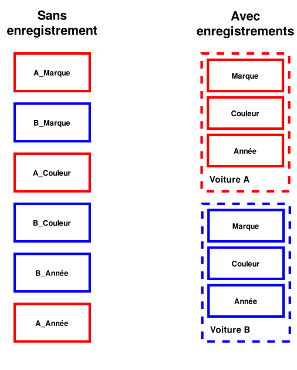

# **Noción de registros**

<br>

## **_Objetivo_**

- **Comprendre la utilidad de los registros.**

- **Saber cómo declarar un registro en JavaScript.**

---

---

<br>

<br>

---

## **Contexto**

---

<br>

Para un desarrollador, **puede ser conveniente "almacenar varios valores" relacionados en una misma variable.**

**Para lograr esto, es necesario utilizar registros.**

<br>

---

---

<br>

<br>

---

## **Registro**

---

<br>

Un registro es un tipo que corresponde a un conjunto de variables (llamadas campos) de tipos ya definidos.

De esta manera, una sola variable tendrá varios componentes, cada uno con su propio tipo.

Por lo tanto, se puede ver un registro como una colección de variables.

<br>

---

### **Ejemplo: Registro de un Coche**

---

<br>

**En un programa, se puede definir el tipo estructurado "coche" que tendrá los siguientes componentes:** `"marca"`, `"color"` y `"año de producción"`.

Los dos primeros son cadenas de caracteres y el último es un número entero.

Todas las variables de tipo `"coche"` en el programa tendrán estos componentes.

---

<br>

**Ejemplo: Tipo coche**

**Tipo coche:**

- **marca:**

    - cadena de caracteres

---

<br>
    
- **color:**

    - cadena de caracteres

---

<br>
    
- **año:**

    - entero
    

<br>

---

### **Simplificación de la manipulación**

---

<br>

El uso de registros puede simplificar los programas y su lectura.

Aquí tienes un ejemplo en el que queremos comparar dos coches, `A` y `B`.

En el primer caso, la operación se realiza sin registros, a diferencia del segundo caso que los utiliza.

Esto proporciona una mayor legibilidad y reduce el número de variables que el programador debe gestionar.

<br>

---

**Ejemplo:**

```
Si A_marca == B_marca:
    Mostrar "Misma marca"
FinSi

Si A_color == B_color:
    Mostrar "Mismo color"
FinSi

Si A_año == B_año:
    Mostrar "Mismo año"
FinSi
```

---

```
Si coche_A.marca == coche_B.marca:
    Mostrar "Misma marca"
FinSi
Si coche_A.color == coche_B.color:
    Mostrar "Mismo color"
FinSi
Si coche_A.año == coche_B.año:
    Mostrar "Mismo año"
FinSi

```

<br>

---

---

<br>

<br>

---

## **Gestion de la memoria**

---

Aunque haya menos variables, el programa seguirá utilizando la misma cantidad de memoria.

La memoria simplemente estará "mejor" ordenada ya que los componentes se almacenarán juntos en la memoria.

Las variables de tipo "coche" ocuparán más espacio en memoria que las variables de tipo simple (entero, etc.).

---

<br>



```
con registro vs sin registro
```

<br>

---

---

<br>

<br>

---

## **Implementación en JavaScript**

---

<br>

En JavaScript, es posible crear registros utilizando el tipo `"object"`.

<br>

---

**Ejemplo JavaScript: modifica el registro del coche de Bob.**

```javascript
const cocheBob = { // Inicializamos todos los componentes
  marca: 'Renault',
  color: 'azul',
  año: 2012
}
cocheBob.año = 2020 // Actualizamos un componente
console.log(cocheBob.color) // Mostramos uno de los componentes
```

<br>

---

---

<br>

<br>

---

## **Acceder al valor de un componente**

---

<br>

**Existen dos sintaxis para acceder al valor de un componente:**

<br>

---

**Ejemplo JavaScript: accede a la información del registro del coche de Bob de dos maneras.**

```js
const cocheBob = { // Inicializamos todos los componentes
  marca: 'Renault',
  color: 'azul',
  año: 2012
}
// Las dos siguientes sintaxis devuelven el mismo valor
console.log(cocheBob.color, cocheBob['color'])
```

<br>

---

---

<br>

<br>

---

## **A recordar**

---

<br>

- **Los registros permiten tener variables que representan objetos más complejos.**

- **En JavaScript, el tipo `"object"` se puede usar para crear registros.**

<br>

---

---