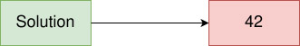
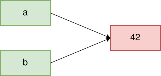

# **Valor, Variable, Referencia**

<br>

## **_Objetivo_**

- **Conocer y comprender los conceptos de valor, variable y referencia**

- **Conocer el concepto de tipo primitivo y tipo compuesto**

---

---

<br>

<br>

---

## **Contexto**

---

<br>

Una variable tiene un valor que se almacena en memoria y se puede copiar.

**Pero también es posible realizar otra operación:**

- la referencia.

<br>

---

### **Introducción a través del ejemplo**

---

<br>

**Tomemos un ejemplo simple en Python y JavaScript:**

```Python
solución = 42
```

---

<br>

Aquí se dice comúnmente que "la variable `solución` **tiene el valor** `42`". Pero, ¿qué es un valor? ¿Y qué es una variable?

<br>

---

---

<br>

<br>

---

## **Valor**

---

<br>

**Un valor es una información constante almacenada como una secuencia de bits y tiene un tipo.**

<br>

---

### **Ejemplo: Retoma de ejemplo**

---

<br>

**En el ejemplo anterior:**

```Python
42
```

---

... es el valor utilizado.

**Es de tipo entero.**

<br>

---

---

<br>

<br>

---

## **Variable**

---

<br>

**Una variable es un símbolo que hace referencia a un valor almacenado en memoria**

<br>

---

### **Ejemplo: Retoma de ejemplo**

---

<br>

**En el ejemplo anterior:**

```Python
solución
```

---

... es la variable asociada al valor 42.



```
Referenciación de un valor mediante una variable
```

---

<br>

**Referenciación de un valor mediante una variable**

```Python
a = 42

b = 42
```

<br>



```
Referencia del mismo valor por dos variables
```

Aquí, `a` y `b` son dos variables que hacen referencia al mismo valor, `42`.

<br>

---

---

<br>

<br>

---

## **Asignación y almacenamiento de valores**

---

<br>

**Cuando asociamos una variable con un valor, utilizamos una asignación con el operador** `=`

<br>

---

**Ejemplo:**

```Python
a = 42
```

---

<br>

**En este ejemplo, el valor se almacena directamente en memoria en una dirección específica.**

<br>

---

---

<br>

<br>

---

## **Almacenamiento de valor y referenciamiento**

---

<br>

**Cuando usamos una asignación, los valores se almacenan en memoria en una dirección específica.**

Luego, la variable almacena una referencia a la dirección de ese valor.

En otras palabras, **una variable puede cambiar de valor.**

<br>

---

---

<br>

<br>

---

## **A recordar**

---

<br>

- **Al trabajar con un lenguaje de programación, usamos variables que permiten manipular valores a través de un sistema de referencias.**

- **Estos valores tienen un tipo y las variables pueden cambiar de valor.**

<br>

---

---