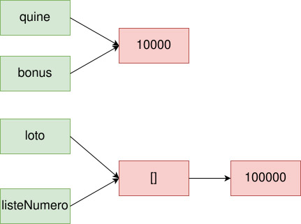
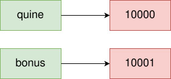
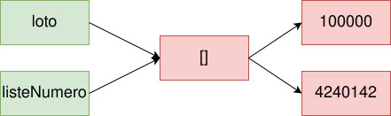

# **Tipado dinámico y asignación**

<br>

## **_Objetivo_**

- **Conocer el concepto de tipado dinámico.**

- **Comprender el comportamiento de la asignación en Python y JavaScript.**

---

---

<br>

<br>

---

## **Contexto**

---

<br>

Se pueden **distinguir diferentes formas de tipar variables** según los lenguajes.

**Algunos** lenguajes **tienen tipado estático**, mientras que otros **tienen tipado dinámico.**

Esto significa que en los **de tipado estático no es posible cambiar el tipo de una variable después de su declaración.**

Esto ocurre a menudo en lenguajes de bajo nivel que están cerca de la máquina y su gestión de memoria.

Los lenguajes **de tipado dinámico son** mucho más **flexibles**, permitiendo **cambiar el tipo de una variable durante la ejecución del programa.**

<br>

---

---

<br>

<br>

---

## **JavaScript y Python: lenguajes con `tipado dinámico`**

---

<br>

**JavaScript y Python son lenguajes con tipado dinámico:**

- las variables pueden cambiar de valor **incluso si tienen un tipo diferente**.

---

<br>

En este contexto, los tipos están asociados con los valores y no con las variables.

<br>

---

### **Ejemplo: Tipado dinámico**

---

<br>

**Aquí, `a` es una variable que cambia de tipo "entero" a "cadena de caracteres".**

**Ejemplo:**

```js
a = 42

a = 'fezfe'
```

<br>

---

---

<br>

<br>

---

### **Recordatorio: Tipo Primitivo**

---

<br>

**Los tipos primitivos son los tipos de valores más simples que contienen solo información atómica.**

<br>

---

### **Ejemplo: Tipos primitivos en `Python` y `JavaScript`**

---

<br>

**Hay cuatro tipos primitivos comunes en Python y JavaScript:**

- Enteros

- Flotantes

- Cadenas de caracteres

- Booleanos

<br>

---

### **Complemento:**

---

<br>

**Además, en JavaScript existen tres tipos primitivos adicionales:**

- BigInt

- Símbolos

- Tipo "undefined"

<br>

---

---

<br>

<br>

---

## **Recordatorio: Tipo Compuesto**

---

<br>

**Los tipos compuestos son tipos construidos a partir de un conjunto de tipos primitivos, como las listas, los arreglos o los objetos.**

<br>

---

### **Ejemplo: Tipos compuestos en JavaScript**

---

<br>

**En JavaScript, dos ejemplos de tipos compuestos son:**

- **Arreglos:** `[]`

- **Objetos (registros):** `{}`

<br>

---

<br>

<br>

---

## **Comportamiento de la asignación para el tipado dinámico**

---

<br>

**Cuando asignamos una variable a otra en lenguajes con tipado dinámico (como Python o JavaScript), NO COPIAMOS EL VALOR:**

- **mas bien copiamos una referencia a ese valor.**

---

<br>

**Esta sutileza tiene implicaciones muy significativas cuando se trata con tipos compuestos.**

<br>

---

---

<br>

<br>

---

## **Comprobar el referenciamiento de un valor mediante dos variables en JavaScript**

---

<br>

**En JavaScript, el operador de igualdad nos permite verificar si dos variables hacen referencia al mismo valor o no.**

<br>

---

**Ejemplo:**

```js
let quine = 10000
let bonus = quine
console.log('Igualdad:', quine === bonus)

let loto = [100000]
let listaNumero = loto
console.log('Igualdad:', loto === listaNumero)
```

---

<br>

**obtenemos:**

```
Igualdad: true

Igualdad: true
```

---

<br>



```
Conservación del referenciamiento durante la asignación de una variable a otra
```

<br>

---

---

<br>

<br>

---

## **Comprobar el referenciamiento de un valor mediante dos variables en Python**

---

<br>

**En Python, la función `id` devuelve la identidad del objeto Python que almacena la valor subyacente.**

**Por lo tanto, utilizando el operador de igualdad en estas identidades, podemos verificar si dos variables hacen referencia al mismo valor o no.**

<br>

---

**Ejemplo: Asignación en Python**

```python
quine = 10000
bonus = quine
print('ID de quine:', id(quine))
print('ID de bonus:', id(bonus))
print('Egalité:', id(quine) == id(bonus))

loto = [100000]
listeNumero = loto
print('ID de loto:', id(loto))
print('ID de listeNumero:', id(listeNumero))
print('Egalité:', id(loto) == id(listeNumero))
```

---

<br>

**obtenemos:**

```
ID de quine: 140510876310096
ID de bonus: 140510876310096
Igualdad: True
ID de loto: 140080656991808
ID de listeNumero: 140080656991808
Igualdad: True
```

**La sutileza aquí es que `quine` y `bonus` no contienen ambos una copia del valor `10000`, sino que hacen referencia a la misma ubicación de memoria que contiene el valor `10000`.**

<br>

---

---

<br>

<br>

---

## **Comportamiento de modificación del valor**

---

<br>

- Si se trata de un tipo primitivo, se copia el valor y luego se modifica. 

    En otras palabras, la referencia cambia.

    ---

    <br>

- **Si se trata de un tipo compuesto, no se cambia la referencia original:**

    - solo se modifican las referencias a los valores dentro del tipo compuesto si estos son de tipos primitivos.
    
        Si los valores son de tipos compuestos, se aplica la misma regla de comportamiento, y así sucesivamente.

<br>

---

**Ejemplo Python: Modificación de un entero en Python**

```Python
quine = 10000
bonus = quine
print('ID de quine:', id(quine))
print('ID de bonus:', id(bonus))
print('Igualdad:', id(quine) == id(bonus))

bonus = bonus + 1
print('ID de quine:', id(quine))
print('ID de bonus:', id(bonus))
print('Igualdad:', id(quine) == id(bonus))
```

---

<br>

**obtenemos:**

```
ID de quine: 140713190459984
ID de bonus: 140713190459984
Egalité: True
ID de quine: 140713190459984
ID de bonus: 140713190459888
Egalité: False
```

**Este ejemplo demuestra que, en el caso de modificar una variable de tipo primitivo, la identidad (la referencia) cambia.**

---

<br>

**Ejemplo JavaScript: Modificación de un entero en JS**

```js
let quine = 10000
let bonus = quine
console.log('Egalité:', quine === bonus)
bonus = bonus + 1
console.log('Egalité:', quine === bonus)
```

---

<br>

**obtenemos:**

```
Egalité: True
Egalité: False
```



```
Copia del valor referenciado Al modificar un tipo primitivo
```

<br>

---

### **Modificación de un Array en Python**

---

<br>

**Ejemplo Python:**

```js
loto = [100000]

listeNumero = loto
print('ID de loto:', id(loto))
print('ID de listeNumero:', id(listeNumero))
print('Egalité:', id(loto) == id(listeNumero))

listeNumero.append(4240142)
print('ID de loto:', id(loto))
print('ID de listeNumero:', id(listeNumero))
print('Egalité:', id(loto) == id(listeNumero))
```

---

<br>

**obtenemos:**

```
ID de loto: 140713190902976
ID de listeNumero: 140713190902976
Egalité: True
ID de loto: 140713190902976
ID de listeNumero: 140713190902976
Egalité: True
```

Esto demuestra que en el caso de modificar una variable de tipo compuesto, **la referencia no cambia.**

Es importante tener en cuenta que este comportamiento puede ser sorprendente, ya que el contenido de `"loto"` **se modifica de la misma manera que el contenido de `"listeNumero"`**, debido a que ambas variables hacen referencia al mismo contenido: 

- no se realiza ninguna copia.

---

<br>

**Ejemplo JavaScript:**

```js
let loto = [100000]
let listeNumero = loto
console.log('Egalité:', loto === listeNumero)
listeNumero.push(4240142)
console.log('Egalité:', loto === listeNumero)
```

---

<br>

**obtenemos:**

```
Egalité: True
Egalité: True
```

---

<br>



```
La referencia se conserva cuando se modifica un valor de tipo compuesto.
```

<br>

---

---

<br>

<br>

---

## **A recordar**

---

<br>

- **Al realizar una asignación, estamos asignando referencias en lugar de valores a las variables.**

    **Si modificamos un valor a través de una variable, solo las referencias de las variables de tipos primitivos se verán afectadas.**

    ---

    <br>

- **Por lo tanto, una asignación simple no es suficiente para copiar un tipo compuesto:** 

    - **la variable original y la nueva variable apuntarán al mismo valor (matriz, registro, etc.).**
    
      **Las modificaciones realizadas se reflejarán en ambas variables.**

<br>

---

---