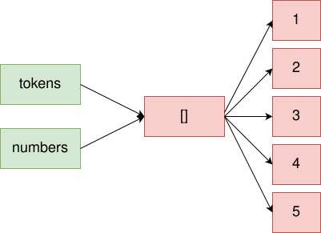
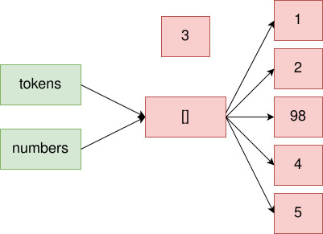

# **Clonación de variables de tipo compuesto**

<br>

## **_Objetivo_**

- **Aprender a copiar valores en JavaScript y Python**

- **Comprender la diferencia entre la copia y la copia recursiva.**

---

---

<br>

<br>

---

## **Contexto**

---

<br>

**Hemos aprendido a copiar una variable**, **y** esto **no** **es** muy **complicado.**

**Sin embargo,** esto es aplicable a variables simples, y **es diferente cuando se trata de variables compuestas, como registros.**

<br>

---

### **Por ejemplo:**

---

<br>

**Si copiamos una matriz de registros que a su vez contienen registros:**

- ¿se duplicarán los registros anidados o la copia de la matriz simplemente creará referencias simples?

---

<br>

Claramente, se percibe que la copia de variables aquí es un poco más complicada de comprender.

<br>

---

### **Ejemplo: Un error común**

---

<br>

A veces deseamos copiar valores entre diferentes variables.

Para hacerlo, generalmente utilizamos la asignación.

<br>

---

**Por ejemplo, en Python:**

```python
tokens = [1, 2, 3, 4, 5]
numbers = tokens
print(numbers)
```

---

**Resultado:**

```c#
[1, 2, 3, 4, 5]
```

---

<br>

**Se obtiene el mismo comportamiento en JavaScript:**

```js
let tokens = [1, 2, 3, 4, 5]
let numbers = tokens
tokens[2] = 98
console.log(numbers)
```

---

<br>

**Resultado:**

```c#
[1, 2, 98, 4, 5]
```

---

- **¿Por qué ocurre esto?**

- **¿Cómo se puede solucionar?**

<br>

---

---

<br>

<br>

---

## **Explicación: Referenciación de valores de tipo compuesto**

---

<br>

**Cuando se asigna una variable a otra, en el caso de tipos compuestos se copia la referencia al valor.**

---

<br>



```
Dos variables referenciando la misma matriz después de la asignación.
```

---

<br>

Así, **si se cambia el valor de la matriz utilizando una de las dos variables:**

- **la otra variable mostrará el valor actualizado en lugar del antiguo.**

<br>



```
Modificación de un elemento en una matriz referenciada por dos variables.
```

---

<br>

**El valor 3 ya no está referenciado:**

- **se crea un nuevo valor `98` y se referencia en la matriz.**

<br>

---

### **Explicación del ejemplo anterior**

---

<br>

**Podemos observar que en Python, las dos variables hacen referencia al mismo valor:**

```python
print(id(tokens) == id(numbers))
```

---

<br>

**Resultado:**

```c#
True
```

---

<br>

También podemos **ver esto en JavaScript utilizando la prueba de igualdad con el operador `===`.**

```javascript
console.log(tokens === numbers)
```

---

<br>

**Resultado:**

```
true
```

<br>

---

---

<br>

<br>

---

## **Realizar una copia**

---

<br>

Para realizar **una copia de un valor de un tipo compuesto, es necesario utilizar funciones** dedicadas **que se encargan de copiar las variables de tipos primitivos.**

<br>

---

### **Realizar una copia en Python**

---

<br>

**En Python, se utiliza la función `copy` del módulo `copy`.**

<br>

---

**Ejemplo:**

```python
import copy
tokens = [1, 2, 3, 4, 5]
numbers = copy.copy(tokens)
```

---

<br>

**Las variables `numbers` y `tokens` hacen referencia a dos valores diferentes:**

```python
print(id(tokens) == id(numbers))
```

<br>

**Resultado:**

```
False
```

<br>

---

### **Realizar una copia en JavaScript**

---

<br>

**En JavaScript, se utiliza el método `Object.assign()` para realizar una copia.**

<br>

---

**Ejemplo:**

```js
let tokens = [1, 2, 3, 4, 5]
let numbers = Object.assign([], tokens)

/* Los corchetes vacíos en la función `Object.assign([], tokens)` indican que "se debe crear un nuevo arreglo vacío y copiar los valores de <<< tokens >>> en él" . */
```

---

<br>

**El comportamiento es idéntico al encontrado en Python:**

```js
tokens[2] = 98
console.log(tokens, numbers)
```

<br>

**Resultado:**

```c#
[1, 2, 98, 4, 5], [1, 2, 3, 4, 5]
```

<br>

---

---

<br>

<br>

---

## **Copia recursiva de valores**

---

<br>

**Durante una copia, solo se copian los primeros valores superficiales, por lo que en el caso de estructuras anidadas (como una matriz de matrices), no se copian todos los valores.**

**Para copiar completamente todos los valores presentes, es necesario utilizar una copia recursiva.**

<br>

---

---

<br>

<br>

---

### **Ejemplo:**

---

<br>

**En Python, se puede utilizar la función `copy.deepcopy` que realiza una copia recursiva de valores.**

<br>

---

**Ejemplo: Python**

```python
import copy
cours = {
  'id_cours': 1337,
  'nom_cours': 'IngDoc',
  'theme': 'Ingénierie Documentaire',
  'etudiants': [
    {
      'nom': 'Norris',
      'prenom': 'Chuck',
      'age': 73,
      'pays': 'USA'
    },
    {
      'nom': 'Doe',
      'prenom': 'Jane',
      'age': 45,
      'pays': 'Angleterre'
    }
  ]
}
copie_cours = copy.deepcopy(cours)
```

<br>

---

---

<br>

<br>

---

## **Observación:**

---

<br>

**En JavaScript (ES6), no es posible realizar una copia recursiva de manera nativa.**

**Debes definir una función específica o utilizar una biblioteca especializada para lograrlo.**

<br>

---

### **Ejemplo: Copia recursiva en JavaScript utilizando una función dedicada**

---

<br>

**Se define la siguiente función para realizar una copia recursiva:**

<br>

---

**Ejemplo: JavaScript**

```javascript
const deepCopyFunction = (inObject) => {
  let outObject, value, key
  if (typeof inObject !== "object" || inObject === null) {
    // Devuelve el valor de inObject si no es un objeto
    return inObject
  }
  // Crea un arreglo u objeto para contener los valores
  outObject = Array.isArray(inObject) ? [] : {}
  for (key in inObject) {
    value = inObject[key]
    // Copia recursiva de objetos anidados, incluidos los arreglos
    outObject[key] = deepCopyFunction(value)
  }
  return outObject
}
```

---

<br>

```js
const cours = {
  'id_cours': 1337,
  'nom_cours': 'IngDoc',
  'theme': 'Ingénierie Documentaire',
  'etudiants': [
    {
      'nom': 'Norris',
      'prenom': 'Chuck',
      'age': 73,
      'pays': 'USA'
    },
    {
      'nom': 'Doe',
      'prenom': 'Jane',
      'age': 45,
      'pays': 'Angleterre'
    }
  ]
}
const copie_cours = deepCopyFunction(cours)
cours.etudiants[0].id_cours = 1987
console.log(cours, copie_cours)  
```

---

<br>

**En este caso, se modifica el primer estudiante de la propiedad `etudiants` del `objeto cours`, al cual se le ha agregado una propiedad `id_cours` con el valor `1987`.**

```js
{
  id_cours: 1987,
  nom_cours: 'IngDoc',
  theme: 'Ingénierie Documentaire',
  etudiants: [
    { nom: 'Norris', prenom: 'Chuck', age: 73, pays: 'USA' },
    { nom: 'Doe', prenom: 'Jane', age: 45, pays: 'Angleterre' }
  ]
} {
  id_cours: 1337,
  nom_cours: 'IngDoc',
  theme: 'Ingénierie Documentaire',
  etudiants: [
    { nom: 'Norris', prenom: 'Chuck', age: 73, pays: 'USA' },
    { nom: 'Doe', prenom: 'Jane', age: 45, pays: 'Angleterre' }
  ]
}
```

<br>

---

---

<br>

<br>

---

### **Elementos de comprobación de copia**

---

<br>

**Para Python:**

- **[https://docs.python.org/3/library/copy.html](https://docs.python.org/3/library/copy.html)**

---

<br>

**Para JavaScript:**

- **[https://developer.mozilla.org/es/docs/Web/JavaScript/Reference/Global_Objects/Object/assign](https://developer.mozilla.org/es/docs/Web/JavaScript/Reference/Global_Objects/Object/assign)**

---

<br>

**Código fuente original de la función de copia recursiva:**

- **[https://gist.github.com/djD-REK/e8b1497e7fbf0374e4eada669e5609cf#file-custom-deep-copy-function-using-recursion-js](https://gist.github.com/djD-REK/e8b1497e7fbf0374e4eada669e5609cf#file-custom-deep-copy-function-using-recursion-js)**

<br>

---

---

<br>

<br>

---

## **A recordar**

---

<br>

**Para copiar el valor de una variable en otra, es necesario utilizar funciones de copia:**

- **En Python:**

  - `copy.copy` 

  ---

  <br>
  
  y

  ---

  <br>

- **En JavaScript:**

  - `Object.assign`

<br>  

---

<br>

Para **realizar una copia completa de un valor**, **se requiere usar:**

- **funciones:** 

  - **`copy.deepcopy` en Python**

  o
  
- **sintaxis de copia recursiva:**

  - **desarrollar una `función específica` en JavaScript**

<br>

---

---