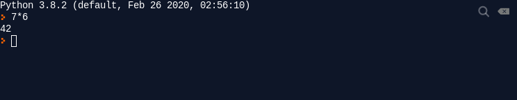
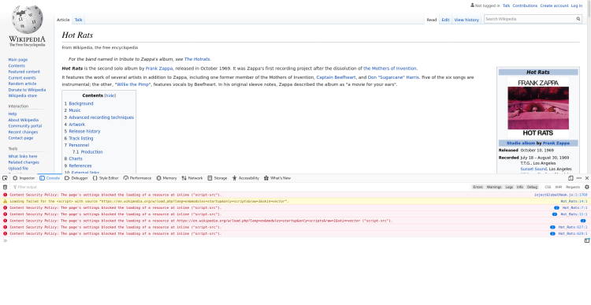
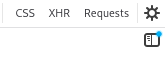
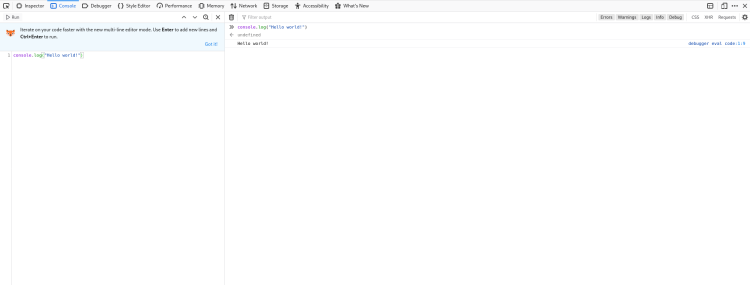
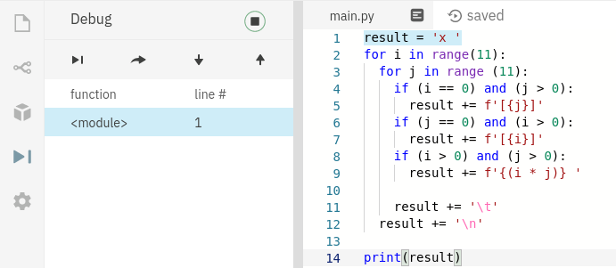
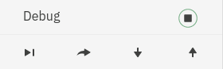
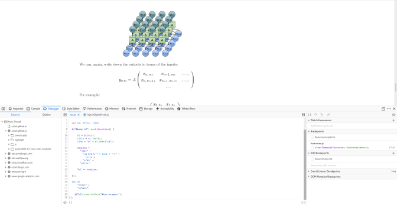
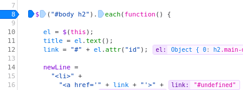
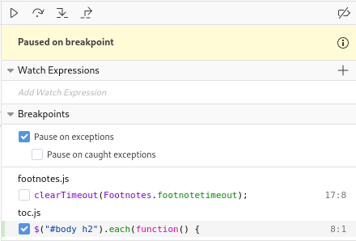
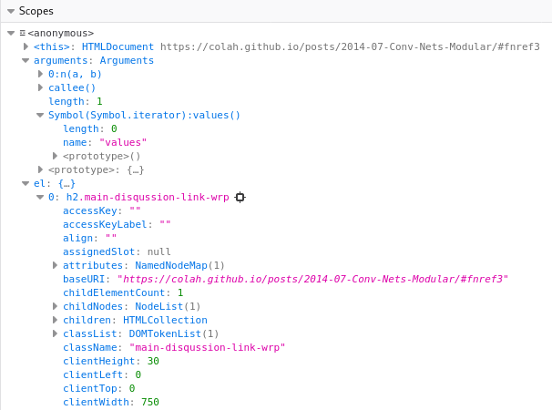

# **Herramientas para la corrección de errores**

<br>

## **_Objetivo_**

- **Familiarizarse con algunas herramientas para corregir errores.**

---

---

<br>

<br>

---

## **Contexto**

---

<br>

Si bien es posible corregir errores utilizando los métodos previamente mencionados, también resulta conveniente conocer las herramientas diseñadas específicamente para esta tarea.

<br>

---

---

<br>

<br>

---

## **Intérprete y consola**

---

<br>

**Para comprender los problemas de manera más rápida y efectiva,** se puede utilizar un intérprete **(también conocido como `REPL`)** que permite ejecutar una instrucción a la vez y obtener el resultado directamente en la consola.

**"Resulta útil aislar una parte del código" para depurar la sección que presenta un problema.**

<br>

---

### **Ejemplo: Intérprete de "Python" en `Repl.it`**

---

<br>

En Repl.it, el código que escribimos se ejecuta en un intérprete de Python que se encuentra a la derecha de la interfaz.

Sin embargo, también es posible trabajar directamente con este intérprete y escribir instrucciones de manera directa.

---

<br>



```
Interprete python de Repl.it
```

<br>

---

### **Ejemplo: consola FireFox**

---

<br>

**La consola permite visualizar los resultados que se emiten en las salidas estándar y de errores:**

- Aquí se muestran los valores proporcionados mediante `console.log` y los mensajes de error.

---

<br>

**Se accede a la consola con el atajo `Ctrl + Shift + C`.**

**A partir de aquí, es posible utilizar el intérprete que permite ingresar comandos directamente en la ventana para obtener resultados de instrucciones.**

<br>



```
Vista previa de la consola en un artículo de Wikipedia.

Se observan errores en el script de esta página.
```

<br>

---

### **Observación: Herramientas de desarrollo de Firefox**

---

<br>

Cuando estamos desarrollando aplicaciones web en JavaScript, podemos inspeccionar la representación y la ejecución correcta del programa directamente en el navegador.

En el caso de Firefox, contamos con diversas herramientas para lograr esto.

<br>

---

---

<br>

<br>

---

## **Enfoque incremental de desarrollo o depuración**

---

<br>

En Firefox, es posible utilizar el **modo de edición de varias líneas** para **avanzar de manera incremental en el desarrollo del código o en la depuración.**

---

<br>

**Se activa haciendo clic en:**



---

<br>

Obtenemos una consola dividida en dos partes, con un editor y un intérprete.

De esta manera, se puede modificar el código fácilmente y luego ejecutarlo.

---

<br>



```
Modo de edición de varias líneas
```

<br>

---

---

<br>

<br>

---

## **Depurador** 

---

<br>

Cuando nos encontramos **en una estructura de código más compleja** donde es difícil aislar el código, podemos utilizar un depurador.

**Un depurador permite inspeccionar todo el estado del programa desde diferentes líneas, estableciendo puntos de interrupción.**

<br>

---

### **Depurador de Python en Repl.it**

---

<br>

`Repl.it` cuenta con un depurador de Python bastante sencillo que permite visualizar las distintas llamadas a funciones.



<br>

---

**En este depurador:**

- **se puede entrar en la ejecución de una instrucción:**

  - `(Step-Into)`

  ---

  <br>
  
- **se puede salir de la ejecución de una instrucción:**

  - `(Step-Out)`

  ---

  <br>
  
- **Avanzar a la siguiente instrucción:**

  - `(Step-Over)`

  ---

  <br>
  
- **Continuar con la ejecución normal:**

  - `(Resume)`

---

<br>

Es importante tener en cuenta que este depurador está en proceso de desarrollo y por el momento no permite inspeccionar todo el estado del programa, como los diferentes valores de las variables.

---

<br>



<br>

---

---

<br>

<br>

---

## **Depurador de JavaScript en Firefox**

---

<br>

**Firefox también cuenta con un depurador que permite ejecutar las líneas una a una a partir de un punto de interrupción `(break-point)` o cuando ocurre una excepción.**

**Al igual que en el caso de la consola, se accede a él con el atajo `Ctrl + Shift + C`**

---

<br>



```
Vista previa del depurador en un artículo de blog (https://colah.github.io/)
```

<br>

---

---

<br>

<br>

---

## **Depurar código paso a paso con el depurador en Firefox**

---

<br>

Cuando nos encontramos con un error, podemos comprender el contexto de este recorriendo el código desde un punto específico.

Para lograrlo, definimos un punto de interrupción.

<br>



```
Punto de interrupción
```

---

Si reiniciamos el código **(actualizando la página)**, la ejecución se detiene en el punto de interrupción especificado.

Podemos obtener una vista previa de los distintos puntos de interrupción seleccionados y elegir avanzar en la ejecución del código instrucción por instrucción.

Más precisamente, podemos optar por pasar a la siguiente instrucción o adentrarnos en la ejecución del código de una función.

---

<br>



```
Avanzar en el código
```

---

Durante la depuración, tenemos acceso a todas las valores de las variables definidas en los diferentes ámbitos.

---

<br>



```
Exploración de los ámbitos
```

---

En particular, podemos explorar toda la jerarquía de objetos.

<br>

---

---

<br>

<br>

---

### **Complemento: Documentación de las herramientas de desarrollo de Firefox**

---

<br>

**Puedes consultar la documentación sobre las herramientas de desarrollo de Firefox en:** 

- **[https://developer.mozilla.org/fr/docs/Outils](https://developer.mozilla.org/fr/docs/Outils)**

<br>

---

---

<br>

<br>

---

## **A recordar**

---

<br>

- **Existen varias herramientas para desarrollar o inspeccionar código en JavaScript:**

  - **el depurador y el intérprete (o consola).**

  ---

  <br>

- **Para JavaScript, los navegadores web como Firefox cuentan con sus propias herramientas.**

<br>

---

---