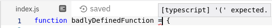

# **Herramientas para la corrección de errores**

 

## **_Objetivo_**

- **Explorar métodos y herramientas para prevenir errores.**

---

---

 

 

---

## **Contexto**

---

 

Si bien es crucial corregir errores cuando se detectan, es aún más beneficioso evitar que ocurran en primer lugar.

Aunque el riesgo cero no es posible, existen numerosas herramientas y métodos que permiten minimizar los riesgos y detectar problemas durante las etapas de desarrollo.

Aquí te presentamos algunas técnicas que puedes seguir para desarrollar programas lo más confiables posible.

Algunas son simples y otras más complejas de implementar, pero todas son ampliamente utilizadas por los equipos de desarrollo.

 

---

---

 

 

---

## **Implementar pruebas**

---

 

Cuando se desarrolla una nueva funcionalidad para un programa, es posible escribir pruebas que verifiquen su correcto funcionamiento ante situaciones esperadas e inesperadas.

Al corregir un error, se puede añadir una prueba para verificar la validez de la solución.

 

---

---

 

 

---

## **Adoptar convenciones de programación**

---

 

Seguir convenciones de programación comunes permite estructurar el código de manera adecuada y facilita que nuevos programadores no cometan errores posteriormente.

 

---

---

 

 

---

## **Convención de programación para JavaScript**

---

 

**Existen varios estándares de codificación en JavaScript que son similares entre sí.**

---

 

**Es común adoptar uno de ellos:**

- **[w3schools.com](w3schools.com)**

- **[standardjs.com](standardjs.com)**

 

---

---

 

 

---

## **Evitar la duplicación de código**

---

 

**La duplicación de código introduce una mantenibilidad más compleja y correcciones incompletas de errores.**

**Se debe evitar duplicar el código y en su lugar, se debe factorizar las partes repetidas.**

 

---

 

**Para lograrlo, se utilizan principalmente funciones.**

 

---

---

 

 

---

## **Utilizar herramientas de desarrollo** 

---

 

**Se pueden emplear herramientas para corregir el código:**

- **Los linters:**

  - analizan la sintaxis del programa mientras se escribe y señalan los errores a medida que aparecen.

  ---

   

- **Los formateadores:**

  - ajustan la apariencia del código producido para que cumpla con ciertos estándares.

---

 

**Un linter solo identifica problemas de sintaxis o formato pero no los corrige.**

**Un formateador soluciona problemas de formato.**

 

---

### **Ejemplo: Linter de JavaScript**

---

 

`Repl.it` cuenta con su propio linter incorporado en su editor de texto.

Este linter señala problemas de sintaxis y formato.

---

 

También existen **extensiones** para editores **como Atom `(linter-js-standard)`** o **VSCode `(vscode-standardjs)`** que **facilitan su uso durante el desarrollo.**

 

---

### **Ejemplo: Formateadores de JavaScript**

---

 

`Repl.it` cuenta con su propio formateador accesible directamente desde su interfaz mediante un botón.

**[https://beautifier.io](https://beautifier.io)**, una herramienta en línea para formatear JavaScript.

---

 

**También hay extensiones disponibles para editores como Atom o VSCode:**

**Como `Atom Beautify` **[https://atom.io/packages/atom-beautify](https://atom.io/packages/atom-beautify)**, que permiten utilizar formateadores directamente durante el desarrollo.**

 

---

---

 

 

---

### **Herramientas de comparación de contenido de archivos**

---

 

**Es posible utilizar una herramienta de comparación que realice la comparación de cadenas de caracteres entre dos archivos para observar las diferencias antes y después del formateo.**

 

---

**Por ejemplo:**

- **Para esto, se puede utilizar un formateador en línea como [https://www.diffchecker.com/](https://www.diffchecker.com/)**

  o
  
- **Directamente una utilidad de línea de comandos como `diff`.**

 

---

---

 

 

---

## **A recordar**

---

 

- **Los "errores pueden prevenirse" adoptando "buenas prácticas durante el desarrollo".**

- **Herramientas de desarrollo como `linters` o `formateadores` pueden utilizarse para aplicar estas prácticas de manera más efectiva.**

 

---

---