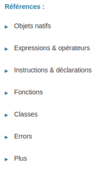

# **Mozilla Developer Network `(MDN)`**

<br>

## **_Objetivo_**

- **Familiarizarse con el `MDN`**

---

---

<br>

<br>

---

## **Contexto**

---

<br>

**La `MDN` (Mozilla Developer Network) es un sitio web comunitario que ofrece documentación y tutoriales sobre tecnologías web, como:**

- HTML

- CSS

- JavaScript

    y
    
- El protocolo HTTP.

<br>

---

---

<br>

<br>

---

## **Acceder a la Documentación de JavaScript en `MDN`**

---

<br>

**[https://developer.mozilla.org/es/](https://developer.mozilla.org/es/)**


<br>

1. **Desde la página de inicio, el menú desplegable "Tecnologías" contiene un enlace a "la documentación de MDN" sobre JavaScript, [https://developer.mozilla.org/es/docs/Web/JavaScript](https://developer.mozilla.org/es/docs/Web/JavaScript)**

---

<br>

2. **Esta documentación está disponible en español a través de un menú desplegable en la parte superior derecha.**

    **Sin embargo, las páginas en inglés son las primeras en actualizarse y puede haber un retraso antes de que la comunidad francesa las traduzca.**

<br>

---

---

<br>

<br>

---

## **Estructura `MDN`**

---

<br>

La página principal de la documentación de JavaScript contiene información sobre este lenguaje y enlaces a tutoriales y a la referencia completa.

**Se considera que la referencia es la documentación principal.**

<br>

---

<br>

En la parte izquierda de la página, encontrarás las principales secciones de esta referencia.



```
Principales secciones de referencias
```

---

<br>

- **Objetos Nativos:**

    - Contiene todos los objetos nativos estándar (`Array`, `Date`, etc.), incluyendo sus métodos y propiedades.

    ---

    <br>

- **Expresiones y Operadores:**

    - Presenta las palabras clave básicas (`this`, `function`, `class`, etc.), los operadores aritméticos, de asignación y, en general, todas las expresiones del lenguaje.

    ---

    <br>

- **Instrucciones y Declaraciones:**

    - Aquí se encuentran las instrucciones `if...else`, así como las declaraciones `var`, `let` y `const`.

    ---

    <br>

- **Errores:**

    - Contiene todos los errores, excepciones y advertencias que el `intérprete` de JavaScript puede generar.

<br>

---

---

<br>

<br>

---

## **Ejemplos de búsqueda**

---

<br>

**Si un desarrollador necesita información sobre el método map**

- **`(map: que permite aplicar un proceso a todos los elementos de un arreglo)`**

<br>

---

**tenemos dos opciones en `MDN`.**


---

<br>

1. **Desde el menú lateral:**

    - **Puede hacer `clic` en la `sección "Objetos Nativos"` y luego en `"Array"`, ya que "map es un método de la clase `Array`".**

        **También "desde el menú lateral", puede hacer `clic` en `Array.prototype.map` para descubrir todos los métodos de la clase `Array`.**

        ---

        <br>

2. **Desde la barra de búsqueda:**

    - **Puede "escribir" `"array map"` "en la barra de búsqueda" en la parte superior derecha "y encontrar la" página de la documentación que contiene la "información que estamos buscando".**

---

<br>    


<br>

---

---

<br>

<br>

---

## **Leer una página de la `MDN`**

---

<br>

**Siguiendo el ejemplo de la página de `map`, esta presenta varias secciones.**

**En primer lugar:**

- **hay una breve descripción de lo que hace el método**

---

<br>

**seguido de:**

- **`un pequeño editor` para probar el método si es posible**

<br>


<br>

---
---

<br>

**Luego, la sección de Sintaxis contiene toda la información relevante, como:**

- **Los parámetros** que se pueden **ingresar al método** y su valor de **retorno**.

- **Los parámetros** entre corchetes **`[]`** son opcionales.

- **La función** que se utiliza **para realizar el mapeo debe tener argumentos específicos.**

<br>


<br>

---
---

<br>

La siguiente parte de la página contiene una descripción más detallada para comprender cómo funciona el método, posibles advertencias, mejores prácticas y ejemplos.

También hay información sobre la introducción del método en la especificación, lo cual puede ser útil para los desarrolladores que trabajan con versiones antiguas.

---

<br>

Finalmente, generalmente hay una tabla de compatibilidad con navegadores para los desarrolladores cuyo código está destinado a la web.

<br>


<br>

---
---

<br>

Al final de la página, se encuentra la sección "Vea también", que generalmente contiene métodos/funciones relacionadas que a veces son más adecuadas para lo que el desarrollador desea lograr.

En el caso de map, MDN también sugiere ver forEach, que en algunos casos puede ser más adecuado que map.

<br>

---

---

<br>

<br>

---

### **Complemento:** 

---

<br>

**[MDN JavaScript (developer.mozilla.org)](https://developer.mozilla.org/es/docs/Web/JavaScript)**

<br>

---

---

<br>

<br>

---

## **A recordar**

---

<br>

- **`MDN` es un sitio web comunitario de documentación, con una documentación JavaScript muy completa.**

- **Cada página tiene prácticamente la misma estructura.**

- **Está dividida en grandes categorías para facilitar la búsqueda de información.**

<br>

---

---