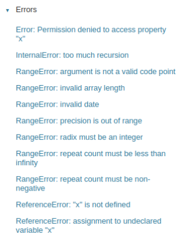
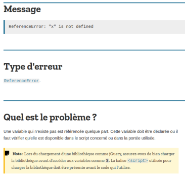

# **Los errores en JavaScript**

<br>

## **_Objetivo_**

- **Aprender a buscar funciones en `MDN`.**

---

---

<br>

<br>

---

## **Contexto**

---

<br>

Al igual que muchos otros lenguajes, **JavaScript cuenta "con un sistema de manejo de errores".**

**Cuando "EL INTERPRETE ENCUENTRA" código problemático, puede devolver un error estándar dirigido al desarrollador.**

```
Es esencial entender cómo interpretar y corregir adecuadamente estos errores.
```

<br>

---

---

<br>

<br>

---

## **Errores en `MDN`**

---

<br>

**`MDN` dispone de una lista completa de los errores nativos de `JavaScript`.**

<br>



<br>

---

### **Ejemplo: ReferenceError: `"x"` is `not defined`**

---

<br>

**Este error es común y fácil de entender.**

**[Su página en MDN](https://developer.mozilla.org/es/docs/Web/JavaScript/Reference/Errors/Not_defined) nos indica que ocurre cuando se hace referencia a una variable `"x"` que no existe** (no está declarada) **en el alcance utilizado.**

**También se proporcionan ejemplos para reproducir este error con variables no declaradas o fuera del alcance.**

<br>



<br>

---

### **Ejemplo: TypeError: `invalid` `'in'` operand `"x"`**

---

<br>

```js
const hello = 'hello world';
if ('hello' in hello) {
  console.log('hello se encuentra en la cadena de caracteres ' + hello);
}
```

---

<br>

El código anterior **podría parecer normal para un desarrollador de Python** que esté acostumbrado a usar la palabra clave `in` **para saber si una cadena está presente en otra.**

**Sin embargo, `en JavaScript`, este código devuelve un error.**

**Una consulta [a la página de este error en MDN explica](https://developer.mozilla.org/es/docs/Web/JavaScript/Reference/Errors/in_operator_no_object) que `in` solo funciona `en objetos`** (para verificar si una propiedad existe) **y no en cadenas de caracteres.**

<br>

---

### **Ejemplo: SyntaxError: `missing` = `in` const declaration**

---

<br>

Este error de sintaxis ocurre **cuando una constante no está inicializada.**

**Las constantes deben inicializarse en la declaración**, a diferencia de las variables declaradas con `let` o `var` que no hacen falta iniciarlas, aunque normalmente **es una buena práctica** iniciarlas también ... (es decir, darle valor)

La página de **[este error en MDN](https://developer.mozilla.org/fr/docs/Web/JavaScript/Reference/Errors/Missing_initializer_in_const)** también **brinda consejos en la sección `"Solucionar el problema"`.**

---

<br>

Por ejemplo, **sugiere que** si surge este error, probablemente no es una constante lo que se debe declarar.

**Una constante generalmente se conoce en el momento de la declaración (declararla).**

<br>

---

---

<br>

<br>

---

## **A recordar**

---

<br>

- **Es importante ser capaz de analizar los errores buscándolos en `MDN` para resolver problemas de manera efectiva.**

<br>

---

---