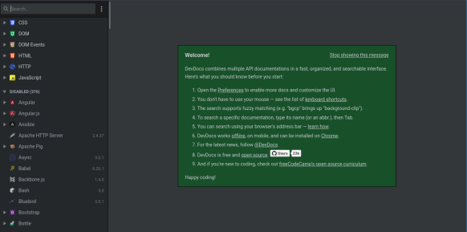
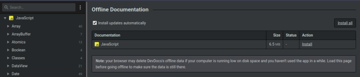

# **Devdocs.io**

 

## **_Objetivo_**

- **Explorar `DevDocs.io`**

---

---

 

 

---

## **Contexto**

---

 

Lo interesante de los lenguajes de programación populares es la activa comunidad que contribuye a su desarrollo y documentación.

`MDN` no es el único sitio que ofrece recursos valiosos para los desarrolladores; existen otros sitios, algunos mantenidos por la comunidad.

Dependiendo de las necesidades, estos pueden incluir documentación, foros para solicitar ayuda o listas de discusión para reportar problemas en el lenguaje.

 

---

---

 

 

---

## **`Devdocs.io`**

---

 

**[DevDocs.io](https://devdocs.io/) es un sitio web que, al igual que `MDN`, proporciona documentación sobre:**

**tecnologías web:**

- `HTML`

- `CSS`

- `HTTP`

- `JS`

---

 

**así como bibliotecas y frameworks:**

- `jQuery`

- `Angular`

- etc

---

 

**En las preferencias** (ubicadas a la izquierda de la barra de búsqueda), **es posible filtrar y mostrar solo la documentación relacionada con `JavaScript`.**

---

 

En la sección de configuración, el botón `"Offline Data"` te llevará a una página que ofrece la opción de descargar la documentación de JavaScript.

Para hacerlo, simplemente haz clic en el botón `"Install"` que se encuentra a la derecha de la página.

 

---

 

Una vez que la descarga haya finalizado, el sitio estará disponible incluso cuando no estés conectado a Internet.

 

---

---