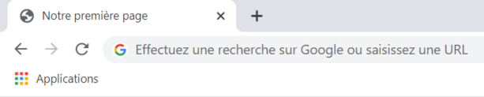
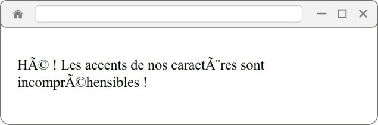

# **Las etiquetas de encabezado**

<br>

## **_Objetivos:_**

- Descubrir cuales son las etiquetas de encabezado

---

---

<br>

---

## **Contexto**

---

<br>

El navegador necesitará información sobre la página que va a mostrar.

Para proporcionar esta información importante, vamos a utilizar etiquetas específicas.

<br>

---

---

<br>
<br>

---

## **Etiquetas de encabezado: `<head>`**

---

<br>

Ahora que hemos aprendido a declarar un documento HTML, vamos a proporcionar más información al navegador sobre nuestro contenido.

Esta información se llama metadatos.

Estos datos no serán visibles directamente en la página:

son un poco la "personalidad" de la misma.

Para contener estos metadatos, necesitamos usar la etiqueta de encabezado `<head>`, que siempre es el primer hijo de `<html>`.

```html
<!DOCTYPE html>

<html lang="fr">
  <head> </head>
</html>
```

<br>

---

---

<br>
<br>

---

## **Método: indentación**

---

<br>

Hay que desplazar hacia la derecha las etiquetas que se encuentran entre otras etiquetas para aumentar la legibilidad.

Las etiquetas de apertura y cierre del mismo tipo se alinean en el mismo nivel: esto se llama indentación.

<br>

---

---

<br>
<br>

---

### **Recordatorio**

---

<br>

No podemos tener mas de una etiqueta `<head>` por documento HTML.

<br>

---

---

<br>
<br>

---

## **El titulo en el encabezado `<head>`: `<title>`**

---

<br>

La etiqueta `<title>` permite definir el título de la página, que se mostrará en la pestaña del navegador.

La etiqueta `<title>` se coloca en el `<head>`, que se encuentra en el `<html>`.

¡Seguimos construyendo elementos!

```html
<!DOCTYPE html>

<html lang="fr">
  <head>
    <title>Notre première page</title>
  </head>
</html>
```

Aquí el resultado de estas etiquetas en el navegador google chrome, vemos que se trata del nombre de la pestaña:



```
Etiqueta <title>
```

<br>

---

---

<br>
<br>

---

## **Metadatos en el encabezado `<head>`: <meta />**

---

<br>

También es necesario agregar una **etiqueta especial que defina la codificación del documento.**

Una codificación bien elegida formatea correctamente los textos que estarán presentes en el documento, incluyendo caracteres especiales y alfabetos que no son latinos (chino, japonés, etc.), así como emojis.

Esta etiqueta es una etiqueta **`<meta />`** con el **atributo charset = ""**.

Por lo general, elegimos el valor **utf-8**, que permite codificar correctamente todos los idiomas.

Es **importante especificar el charset**, ya que puede ocurrir que el editor de texto codifique mal el documento HTML, lo que provoca problemas de visualización de caracteres.

Para evitar estos problemas, se recomienda codificar los archivos HTML en UTF-8.

Es necesario indentar esta etiqueta, ya que se encuentra dentro de otro elemento(dentro de `<head>`).

```html
<!DOCTYPE html>

<html lang="fr">
  <head>
    <title>Nuestra primera página web</title>

    <meta charset="utf-8" />
  </head>
</html>
```

<br>

---

---

<br>
<br>

---

### **Recordatorio**

---

<br>

La etiqueta `<meta />` es auto-cerrante: esta no necesita de una otra "PAREJA o PAR a ella" para cerrarse.

<br>

---

---

<br>
<br>

---

### **Ejemplo: Ejemplo de una mala practica**

---

<br>

Si utilizamos el valor incorrecto en el atributo charset de la etiqueta `<meta />`, por ejemplo, el que permite codificar el alfabeto latino ISO-8859-1, y que el HTML está codificado en UTF-8, esto produce lo siguiente:

```html
<!DOCTYPE html>

<html lang="fr">
  <head>
    <meta charset="ISO-8859-1" />

    <title>Notre première page</title>
  </head>

  <body>
    Oye! Los acentos de nuestros caracteres son incomprensibles!
  </body>
</html>
```

El código en el editor de texto aparece normalmente, pero una vez interpretado por el navegador, los caracteres que no forman parte del alfabeto latino no pueden mostrarse correctamente:



<br>

---

---

<br>
<br>

---

### **Observación: Mínimo encabezado**

---

<br>

Las etiquetas de encabezado anteriores son las etiquetas mínimas que debemos integrar en la sección `<head>`, pero es posible **agregar otras etiquetas de metadatos.**

Por ejemplo, podemos agregar una **descripción que aparecerá en los resultados de búsqueda de Google** utilizando los atributos **name="description"** y **content=""** de la etiqueta `<meta />`.

También podemos utilizar la etiqueta `<link>` para importar hojas de estilo en la página HTML.

```html
<head>
  <!-- en meta name="description" se deja description para indicarle a content que es de tipo descriptivo -->

  <meta name="description" content="Escribe la descripción de tu sitio aquí." />
</head>
```

Como podemos ver cuando buscamos el sitio de Visual Studio Code en Google, la descripción que aparece es la siguiente, y corresponde a la descripción ingresada en la correspondiente etiqueta `<meta />`.

Para ver el contenido de esta etiqueta, es necesario abrir la consola del navegador (tecla F12 o clic derecho "Inspeccionar elemento") y buscar (CTRL+F) el formalismo de la etiqueta `<meta name="description" />`.

Encontrará el código correspondiente.


```
Ejemplo de uso de la etiqueta <meta>
```

<br>

---

---

<br>
<br>

---

## **A Recordar**

---

<br>

- **La página necesita información específica para interpretar correctamente el código: para ello, se utiliza la etiqueta `<head>` que contendrá otras etiquetas de metadatos.**

- **La etiqueta `<title>` declarará el título de la página que será visible como el nombre de la pestaña.**

- **La etiqueta `<meta>`, asociada a otros atributos, afina los metadatos de la página.**

<br>

---

---

<br>
<br>

---

### **Complemento**

---

<br>

[mas atributos de la etiqueta <meta>](https://developer.mozilla.org/fr/docs/Web/HTML/Element/meta)

<br>

---

---
