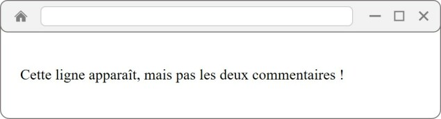
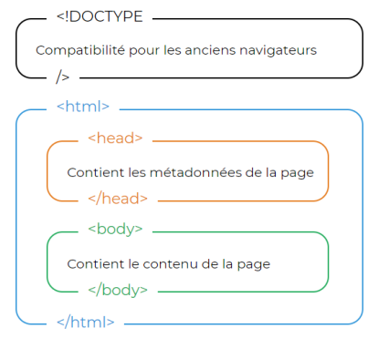

# **Las etiquetas de cuerpo**

<br>

## **_Objetivos:_**

- Descubrir cuales son las etiquetas de cuerpo

---

---

<br>

---

## **Contexto**

---

<br>

Hasta ahora, nos hemos enfocado en cómo crear y proporcionar información en nuestra página web, pero no hemos mostrado nada en nuestro navegador.

Para ello, vamos a ver la etiqueta `<body>`, que nos dará la posibilidad de agregar otros elementos HTML en ella.

<br>

---

---

<br>
<br>

---

## **El cuerpo: `<body>`**

---

<br>

La etiqueta `<body>` contiene el contenido visible de la página, es el cuerpo de la página. Podemos agregar texto, imágenes, estructuras de navegación, formularios...

```html
<!DOCTYPE html>

<html lang="fr">
  <head>
    <!-- ... -->
  </head>

  <body>
    Añadiremos el contenido de nuestra pagina web en esta etiqueta.
  </body>
</html>
```

<br>

---

---

<br>
<br>

---

### **Recordatorio**

---

<br>

Solo podemos tener una etiqueta de este tipo por documento HTML, y se ubica como hijo directo de la etiqueta `<html>`, al igual que la etiqueta `<head>`.

<br>

---

---

<br>
<br>

---

## **`<!-- Comentarios -->`**

---

<br>

El comentario es una estructura un poco especial.

De hecho, el contenido de éste será visible en el código HTML de la página, pero no será mostrado en el navegador.

Son útiles para agregar notas, especialmente para comprender mejor el código más adelante, cuando tenga que modificar una de sus páginas antiguas (por ejemplo, si queremos recordar dónde en el código comienza cierta parte).

El comentario puede estar en todas las secciones de una página HTML: en el `<head>`, el `<body>`, e incluso en otras etiquetas.

Podemos agregar tantos comentarios como deseemos. Para agregar uno, debemos comenzar nuestro comentario con la sintaxis `<!--, escribir su contenido y cerrarlo con la sintaxis -->`, como aquí:

```html
<!-- Comentario que no sera visible en la pagina -->
```

---

**EJEMPLO de comentarios**

<br>

Por ejemplo podemos escribir comentarios al igual que aquí en nuestra pagina HTML, para acordarnos de donde comenzar y donde se termina el bloque de texto:

```html
<!DOCTYPE html>

<html lang="fr">
  <head>
    <!-- ... -->
  </head>

  <body>
    <!-- Comienzo del código de texto -->

    <p>Esta linea aparece, pero no los dos comentario !</p>

    <!-- Fin del código de texto -->
  </body>
</html>
```

He aquí el resultado de este bloque de código en el navegador:



<br>

---

---

<br>
<br>

---

## **Un poco de estilo**

---

<br>

Para tener una idea de lo que podemos hacer al agregar estilo, vamos a usar un concepto que ya hemos visto antes: **un atributo**.

El que nos interesa ahora es el atributo _style = ""_: nos permitirá agregar color a nuestra página o cambiar el tamaño de la fuente, por ejemplo.

Agreguemos el atributo **style = ""** que contiene la propiedad para cambiar el color de fondo al **`<body>`**.

Es posible darle el valor de un color designado por su nombre en inglés (red, orange, blue).

```html
<!DOCTYPE html>

<html lang="fr">
  <head>
    <meta charset="utf-8" />

    <title>Nuestra primera pagina web</title>
  </head>

  <body style="background-color: red;">
    He aquí el contenido de nuestra primera pagina web escrito en HTML!

    <!-- Esto es un comentario -->
  </body>
</html>
```

Para agregar **más estilo al elemento `<body>`**, es posible utilizar otras propiedades como **font-size** para modificar el tamaño de la fuente, **color** para cambiar el color del texto, **text-align** para modificar la alineación del texto, y muchas más.

Basta con separar las declaraciones de propiedades con punto y coma (;).

```html
<!DOCTYPE html>

<html lang="fr">
  <head>
    <meta charset="utf-8" />

    <title>Nuestra primera pagina web</title>
  </head>

  <body
    style="background-color: grey; font-size: 20px; color: white; text-align: center;"
  >
    He aquí el contenido de nuestra primera pagina web escrito en HTML!
  </body>
</html>
```

<br>

---

---

<br>
<br>

---

### **Atención!: En practica**

---

<br>

En el mundo profesional, no se recomienda usar el atributo style en las etiquetas (esto se llama estilo en línea), porque cuando el número de propiedades de estilos en linea se vuelva demasiado grande, se vuelve difícil de leer y mantener.

En el ejemplo anterior, se observa que la definición de la etiqueta se vuelve más larga y, por lo tanto, mas difícil de leer y comprender.

Además, es difícil mantener y hacer evolucionar el estilo de un sitio donde todo el diseño está disperso en un gran número de páginas.

<br>

---

---

<br>
<br>

---

### **Recordatorio**

---

<br>

La traducción al español en términos de IT/programación sería la siguiente:

- **La etiqueta `<body>` es el cuerpo que contiene los elementos visibles de la página.**

- **Es posible recordar elementos importantes sin que se muestren gracias a los comentarios.**

- **Para agregar estilo a los elementos HTML, se puede utilizar el atributo style="" en la etiqueta `<body>`, lo que modificará su comportamiento.**

- **También es importante recordar que el documento HTML es una sucesión de cajas, que a su vez están dentro de otras cajas.**

<br>



```
Esquema recapitulativo de la estructura principal de una pagina web en HTML

```

<br>

---

---
