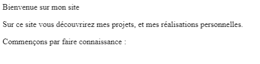
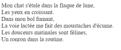

# **Los párrafos**

<br>

## **_Objetivos:_**

- Descubrir como añadir contenido textual en los párrafos

- Añadir saltos de linea para construir párrafos mas completos

---

---

<br>

---

## **Contexto**

---

<br>

Vamos a estructurar párrafos dentro de nuestras páginas:

para ello, veremos cómo agregar contenido de texto utilizando la etiqueta `<p>`.

<br>

---

---

<br>
<br>

---

## **Como funciona?**

---

<br>

La etiqueta `<p>` permite representar un párrafo en la página HTML.

De la misma manera que los párrafos de texto que podríamos utilizar para estructurar nuestras ideas en un texto tradicional, es importante separar las ideas en diferentes `<p>`.

---

**EJEMPLO**

<br>

La etiqueta <p> se crea de la misma manera que los otros elementos HTML que contienen contenido:

```html
<p>Soy un párrafo !</p>
```

<br>

---

---

<br>
<br>

---

## **Varios párrafos por consiguiente**

---

<br>

Es posible encadenar párrafos:

para hacerlo, simplemente hay que ponerlos uno después del otro, al mismo nivel de indentación.

```html
<!DOCTYPE html>

<html>
  <head>
    <meta charset="utf-8" />

    <title>Mi sitio web</title>
  </head>

  <body>
    <p>Bienvenidos a mi sitio web</p>

    <p>
      En este sitio web descubriréis mis proyectos y realizaciones personales.
    </p>
  </body>
</html>
```

Este bloque de código puede servir como base para desarrollar un pequeño portafolio, solo será necesario enriquecerlo con otros contenidos y etiquetas.



<br>

---

---

<br>
<br>

---

## **Saltos de linea**

---

<br>

Para agregar saltos de línea en un párrafo, se debe utilizar la etiqueta auto-cerrante: `<br>`.

La etiqueta `<p>` automáticamente agrega un salto de línea al final del párrafo.

```html
<p>
  Un párrafo largo,<br />

  que merece estar sobre dos paginas.
</p>
```

Pra un ejemplo mas completo,vamos a formatear un poema:

```html
<p>
  Mon chat s'étale dans la flaque de lune,<br />

  Les yeux en croissant.<br />

  Dans mon bol fumant,<br />

  La voie lactée me fait des moustaches d'écume.<br />

  Les douceurs matinales sont félines,<br />

  Un ronron dans la routine.<br />
</p>
```



```
Resultado del poema Frances en navegador
```

<br>

---

---

<br>
<br>

---

### **Atención!**

---

<br>

Podríamos de la misma manera que con los párrafos, poner varios `<br>`, para hacer varios saltos de linea, pero se trata de una mala practica.

Es recomendable usar CSS para espaciar los párrafos, todo esto conservando una organización semántica correcta.

<br>

---

---

<br>
<br>

---

### **Observación**

---

<br>

A veces podemos encontrar esta etiqueta en su forma XHTML: `<br />`.

Es la misma etiqueta, simplemente en una versión diferente.

Pero preferimos la versión HTML: <br>, sin la barra diagonal al final.

<br>

---

---

<br>
<br>

---

## **A Recordar**

---

<br>

- **La etiqueta `<p>` permite crear bloques de texto en forma de párrafos. Es posible realizar saltos de línea en este elemento mediante la etiqueta auto-cerrante <br>.**

<br>

---

---