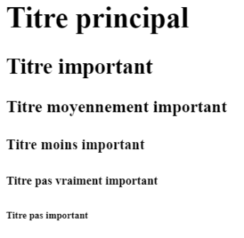

# **Los títulos**

<br>

## **_Objetivos:_**

- Añadir nuevas etiquetas de estructuración a nuestra pagina web

- Descubrir las diferentes etiquetas de titulo y saber usarlas

---

---

<br>

---

## **Contexto**

---

<br>

Con el fin de estructurar la pagina web, veremos como añadir los títulos.

<br>

---

---

<br>
<br>

---

## **Como funciona?**

---

<br>

Para declarar títulos en nuestra página, podemos usar las etiquetas `<h1>`, `<h2>`, `<h3>`, `<h4>`, `<h5>` y `<h6>` (h de heading, que significa "título"), que se utilizan para jerarquizar los títulos entre sí.

Estas etiquetas se colocan en el `<body>`.

Los elementos de título se clasifican por importancia gracias al número que sigue a la letra "h": el `<h1>` es el título principal, el `<h2>` es un título importante, `<h3>` es un poco menos importante y así sucesivamente, hasta `<h6>` que es el menos importante de todos.

---

**EJEMPLO**

<br>

La etiqueta <p> se crea de la misma manera que los otros elementos HTML que contienen contenido:

```html
<h1>Titulo principal</h1>

<h2>Titulo importante</h2>

<h3>Titulo medianamente importante</h3>

<h4>Titulo menos importante</h4>

<h5>Titulo no del todo importante</h5>

<h6>Titulo no importante</h6>
```

Si mostramos el código anterior, podemos ver que el navegador aplica un estilo predeterminado para cada título, para indicar el cambio de importancia.



```
Importancia de los títulos h1 h6
```

<br>

---

---

<br>
<br>

---

### **La jerarquía**

---

<br>

Para construir una página semánticamente válida, es importante respetar los niveles de las etiquetas de encabezado.

No se deben encadenar etiquetas al azar (por ejemplo, h1> h3> h6), sino más bien como esto: h1> h2> h3.

El respeto de este orden es importante, especialmente en dos casos: las personas con discapacidad visual suelen utilizar un lector de pantalla que escanea el contenido HTML de la página y, con la ayuda de una voz sintética, lee el contenido al usuario.

Este lector de pantalla se basa en parte en la jerarquía de los títulos para orientarse en la estructura de la página.

Además, los motores de búsqueda utilizan robots de indexación que recorren el código HTML para extraer el contenido y así categorizar mejor el sitio para la indexación.

Un contenido mal ordenado podría afectar negativamente el posicionamiento.

<br>

---

---

<br>
<br>

---

#### **Atención!: Titulo y estilo**

---

<br>

La elección del nivel del título no debe hacerse en función de su estilo, sino en función de la semántica, de la importancia que se quiere dar al título.

Las etiquetas HTML no están diseñadas para dar formato al texto, sino para organizarlo.

Para dar formato se utilizará CSS o estilo en línea.

<br>

---

---

<br>
<br>

---

#### **Atención!: h1 y titulo**

---

<br>

No hay que confundir la etiqueta h1, que es el titulo principal en la pagina, con la etiqueta `<title>`, que es el titulo en la pagina en la pestaña del todo arriba del navegador.

<br>

---

---

<br>
<br>

---

#### **Atención!: Un solo h1 por pagina**

---

<br>

Además, solo puede haber un título `<h1>` por página (o por sección).

El hecho de poner varios `<h1>` en una misma página no es un error, pero es una mala práctica que degrada la semántica. En cambio, es posible utilizar los otros títulos tantas veces como se desee.

<br>

---

---

<br>
<br>

---

## **A Recordar**

---

<br>

- **Los títulos son elementos HTML que permiten estructurar el contenido.**

- **Es importante respetar la jerarquía de las etiquetas y no usarlas para aplicar un estilo particular.**

- **Sólo puede haber un `<h1>` por página, ya que este es el título principal de la página, sin confundirse con la etiqueta `<title>`.**

<br>

---

---
