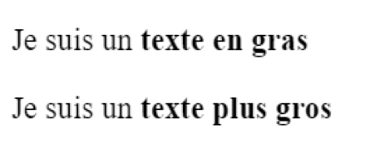
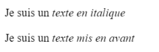
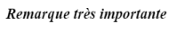

# **La semántica**

<br>

## **_Objetivos:_**

- Descubrir las etiquetas de formato semántico

- Saber usarlas adecuadamente

---

---

<br>

---

## **Contexto**

---

<br>

Existen etiquetas especiales cuyo papel es destacar partes importantes del texto y que permiten mejorar la semántica de la página.

Reforzar la semántica HTML es fundamental, ya que su uso da sentido al contenido, lo que aumenta su calidad y mejora el posicionamiento en los motores de búsqueda y la compatibilidad con los lectores de pantalla.

<br>

---

---

<br>
<br>

---

## **Etiqueta `<strong>`**

---

<br>

La etiqueta `<strong>` se utiliza para indicar que una frase o unas palabras dentro de un texto tienen una alta importancia, un carácter serio o urgente.

Los navegadores generalmente lo muestran en negrita.

Además, esta etiqueta no debe usarse para fines de estilo, se prefieren las propiedades CSS adecuadas para eso.

<br>

---

---

<br>
<br>

---

### **Observación: No confundir la etiqueta `<strong>` y la etiqueta `<b>`**

---

<br>

Existe una **etiqueta `<b>`** (b de bold que significa "negrita") cuyo estilo predefinido también es poner el texto en negrita.

**Se puede usar para indicar palabras clave o la primera oración de cada párrafo de un artículo.**

Sin embargo, tenga cuidado de no confundirlo con la etiqueta `<strong>`.

**Los elementos `<b>` y `<strong>` tendrán el mismo estilo visual,** pero **`<strong>` aporta una diferencia semántica y representa una lógica, especialmente para los lectores de pantalla y los motores de búsqueda.**

Cambiar el estilo del elemento `<strong>` es pertinente, mientras que modificar el estilo de la etiqueta `<b>`, que ya representa un elemento en negrita, podría causar confusión.

En resumen, la etiqueta `<b>` no debe usarse a menos que se desee poner el texto en negrita sin darle importancia.

---

**EJEMPLO**

<br>

```html
<p>Yo soy un <b>texto en negrita</b></p>

<p>Yo soy un <strong>texto mas importante</strong></p>
```



```
ejemplo de que es la misma cosa "visualmente", pero no semánticamente!
```

<br>

---

---

<br>
<br>

---

## **Etiqueta de énfasis `<em>`**

---

<br>

**El elemento `<em>` se utiliza para indicar una o varias palabras dentro de un texto sobre las que se quiere hacer hincapié.**

Normalmente, **en los navegadores se muestra con** una fuente en **cursiva**.

Sin embargo, es importante **no utilizar** esta etiqueta únicamente **para fines estilísticos**, ya que tiene una significado semántico preciso para los lectores de pantalla y los motores de búsqueda.

<br>

---

---

<br>
<br>

---

### **Observación: No confundir la etiqueta `<em>` con la etiqueta `<i>`**

---

<br>

En el lenguaje HTML, existe otra etiqueta llamada **`<i>`** cuyo estilo visual **también es una fuente en cursiva.**

Si bien la apariencia es idéntica, cada una tiene un propósito diferente.

**La etiqueta `<i>` se puede usar para especificar una palabra en un idioma extranjero dentro de una oración, por ejemplo.**

**En cambio, se usará la etiqueta `<em>` para una o varias palabras en las que se desea enfatizar la pronunciación oral.**

---

**EJEMPLO**

<br>

```html
<p>Yo soy un <i>texte en itálica </i></p>

<p>Yo soy un <em>texte destacado </em></p>
```



```
ejemplo de que es la misma cosa "visualmente", pero no semánticamente!
```

<br>

---

---

<br>
<br>

---

#### **Observación**

---

<br>

Es posible encadenar etiquetas semánticas con el fin de poner varios formatos, pero hace faltas re-cerrarlas en el buen orden:

```html
<strong>
  <em> Observación muy importante </em>
</strong>
```



```
encadenación de etiquetas seguidas re-cerradas en el buen orden para dar un formato semántico fuerte, que es el de énfasis y strong que se visualiza como en negrita y cursiva 
```

<br>

---

---

<br>
<br>

---

## **Atención!**

---

<br>

Estas etiquetas deben ser utilizadas respetando su significado.

Por lo tanto, es necesario reflexionar sobre su función antes de utilizarlas: **no deben usarse para agregar estilo, sino para expresar su intención.**

**Podría decidir, mediante una hoja de estilo, que los términos contenidos en las etiquetas `<strong>` o `<em>` se muestren de una manera completamente diferente.**

<br>

---

---

<br>
<br>

---

## **Las otras etiquetas**

---

<br>

Existen otras etiquetas especiales en el resaltado de texto, especialmente estas:

- `<code>`: <code> que permite formatear código informático </code>

- `<cite>`: <cite> que permite realizar citas cortas, como nombres de obras de arte, títulos de libros </cite>

- `<blockquote>`: <blockquote> para citar frases </blockquote>

- `<mark>`: <mark> que resalta información importante </mark>

- `<del>`: <del> para tachar texto </del>

- `<small>`: <small> que reduce el tamaño de una información, especialmente útil para información legal al final de la página </small>

- `<sup>` y `<sub>`: que ponen contenido respectivamente en <sup>superíndice</sup> e <sub>índice.</sub>

<br>

---

---

<br>
<br>

---

## **A Recordar**

---

<br>

- **Hay que utilizar las etiquetas semánticas con el objetivo de destacar texto y no para cambiar el estilo de la página.**

- **Respetar las reglas de uso de estas etiquetas es importante para construir páginas HTML de calidad.**

<br>

---

---

<br>
<br>

---

### **Complemento**

---

<br>

[Formateo avanzado de texto](https://developer.mozilla.org/fr/docs/Learn/HTML/Introduction_to_HTML/Advanced_text_formatting)

<br>

---

---
