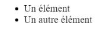
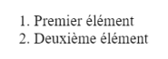
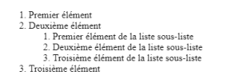

# **Las Listas**

<br>

## **_Objetivos:_**

- Descubrir los diferentes tipos de Listas

---

---

<br>

---

## **Contexto**

---

<br>

Para organizar mejor la información en la página, es posible utilizar listas de diferentes tipos.

<br>

---

---

<br>
<br>

---

## **Listas No Ordenadas**

---

<br>

Las **listas no ordenadas** permiten organizar elementos uno tras otro sin jerarquía, **como cuando escribimos una lista de compras, por ejemplo.**

Este elemento de lista está compuesto por dos etiquetas:

- **`<ul>`** (para lista no ordenada) que representa la lista

- y una o varias etiquetas `<li>`, que son los elementos de la lista.

---

**EJEMPLO**

<br>

```html
<ul>
  <li>Un elemento</li>

  <li>Otro elemento</li>
</ul>
```



```
Lista que no tiene jerarquía, asi se ve en el navegador
```

<br>

---

---

<br>
<br>

---

## **Listas Ordenadas**

---

<br>

También es posible crear **listas en las que el orden es importante,** como al escribir una tabla de contenidos, por ejemplo.

Para esto, utilizaremos la etiqueta **`<ol>`** (para "lista ordenada") que contiene, para cada elemento de la lista, las etiquetas `<li>`.

---

**EJEMPLO**

<br>

```html
<ol>
  <li>Primer elemento</li>

  <li>Segundo elemento</li>
</ol>
```



```
Lista que tiene jerarquía, asi se ve en el navegador
```

<br>

---

---

<br>
<br>

---

## **Sub-listas**

---

<br>

También es posible anidar listas dentro de otras para crear sub-listas.

Para ello, se agrega una nueva lista (ya sea ordenada o no) dentro del elemento de la lista elegida.

```html
<ol>
  <li>Primer elemento</li>

  <li>
    Segundo elemento

    <ol>
      <li>Primer elemento de la sub-lista</li>

      <li>Segundo elemento de la sub-lista</li>

      <li>Tercer elemento de la sub-lista</li>
    </ol>
  </li>

  <li>Troisième élément</li>
</ol>
```



```
Sub-lista reflejada en el navegador
```


<br>

---

---

<br>
<br>

---

### **Atención!**

---

<br>

Una etiqueta de lista ul u ol, solo aceptará etiquetas li como hijos.

Cualquier otro elemento colocado dentro de estas etiquetas será considerado como una sintaxis HTML inválida.

<br>

---

---

<br>
<br>

---

### **Observación: Atributos obsoletos**

---

<br>

Es posible personalizar el estilo de los diseños lista mediante la propiedad de CSS "list-style-type".

<br>

---

---

<br>
<br>

---

## **A Recordar**

---

<br>

- **Es posible crear elementos de lista no ordenados si el orden no es importante, o, por el contrario, listas ordenadas si las ideas deben jerarquizarse. Una lista está compuesta por etiquetas de lista (respectivamente <ul> y <ol>), que contienen etiquetas de elementos de lista (<li>).**

<br>

---

---