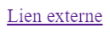
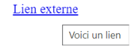

# **Enlace hipertexto**

<br id="Enlaces-hypertexto">

## **_Objetivos:_**

- Saber usar enlaces externos

- Descubrir otros tipos de enlaces

---

---

<br>

---

## **Contexto**

---

<br>

Vamos a ver cómo agregar enlaces hacia recursos externos, es decir, que no están alojados en nuestro servidor.

<br>

---

---

<br>
<br>

---

## **Elemento `<a>`**

---

<br>

El elemento **`<a>`** (de anchor, que significa ancla) permite **incluir un enlace redireccionador** ha algo en especifico **en una página HTML.**

El enlace al que nos debe redireccionar al apunta el elemento **se especifica mediante el atributo href="".**

```html
<a href="https://www.youtube.com/@mouredev">Enlace hacia YouTube Brais Moure</a>

en el navegador web: una vez visitado se vuelve morado: recordemos que todo se
puede estilizar hasta el color después de haberlo visitado, SI HASTA ESO!
```



```
Enlace que pasa de azul a morado, una vez visitado en el navegador
```

<br>

<a href="https://www.youtube.com/@mouredev">Enlace hacia YouTube Brais Moure</a>

También tenemos un atributo llamado title="" que permite añadir un titulo al enlace:

este sera visto por el usuario al sobrevolar con el raton por encima del enlace.

```html
<a
  href="https://www.youtube.com/@mouredev"
  title="Aprenderemos mucho con su curso de python y su libro de git y github"
  >Enlace hacia YouTube Brais Moure</a
>
```



```
Texto separado que aparece al sobrevolar el enlace con el raton, gracias a la propiedad title
```

<a href="https://www.youtube.com/@mouredev" title="Aprenderemos mucho con su curso de python y su libro de git y github">Enlace hacia YouTube Brais Moure</a>

<br>

Tenemos también la posibilidad de utilizar el elemento <nav> para definir una sección destinada a la navegación en un documento (con menús, tablas de contenido, etc.).

```html
<nav>
  <h2>Menu de navigation</h2>

  <ul>
    <li>
      <a href="URL du lien">Expériences professionnelles</a>
    </li>

    <li>
      <a href="URL du lien">Diplômes</a>
    </li>

    <li>
      <a href="URL du lien">Compétences</a>
    </li>
  </ul>
</nav>
```

<br>

---

---

<br>
<br>

---

### **Atención!: El estilo**

---

<br>

_Recalcamos lo mencionado mas arriba:_

El enlace estará subrayado y en azul por defecto (y en violeta una vez visitado) y el cursor del ratón se convierte en una mano para permitir a los usuarios identificarlo más fácilmente.

Es posible cambiar este estilo con CSS, pero se recomienda siempre permitir que el usuario identifique que se trata de un enlace.

<br>

---

---

<br>
<br>

---

### **Complemento**

---

<br>

Es posible poner otros elementos entre las etiquetas `<a>`, por ejemplo, una imagen. Esta imagen será entonces clickable.

```html
<a href="URL">
  
</a>
```

<a href="https://www.playstation.com">
  

<br>

---

---

<br>
<br>

---

## **Otros tipos de enlaces**

---

<br>

Hay dos tipos más de enlaces que permiten realizar acciones desde la página.

En el atributo href="", es necesario agregar los prefijos siguientes:

- tel: para hacer una llamada telefónica desde un dispositivo móvil.

o

- mailto: para enviar un correo electrónico.

```html
<a href="tel:+33600000000">07 73 56 98 85</a>

<a href="mailto:email@example.com">dumitrulovelace@gmail.com</a>
```

<a href="tel:+33600000000">07 73 56 98 85</a>

<a href="mailto:email@example.com">dumitrulovelace@gmail.com</a>

La llamada o el envío de correo electrónico no se realizarán a través de la propia página web, sino que se abrirá la aplicación por defecto del sistema.

<br>

---

---

<br>
<br>

---

## **A Recordar**

---

<br>

- **Es posible agregar enlaces clicables a recursos externos gracias a la etiqueta `<a>` que rodea el texto del enlace, especificando la ruta hacia el recurso en el atributo href="".**

<br>

---

---