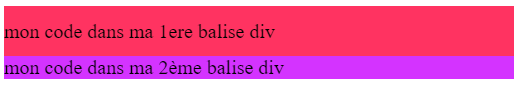
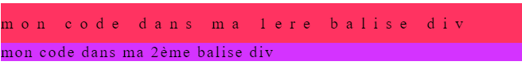
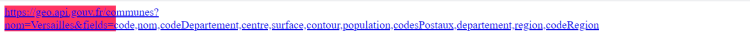
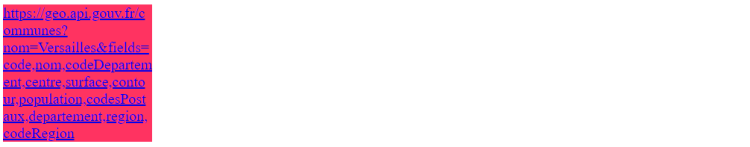

# **El espaciado**

<br>

## **_Objetivos:_**

- Saber gestionar el espaciado del texto en CSS

---

---

<br>

---

## **Contexto**

---

<br>

Existen diferentes propiedades CSS para definir el espaciado del texto, ya sea el espacio horizontal o vertical entre las líneas o entre las palabras.

Pueden tener como parámetro la mayoría de las unidades de longitud y tamaño.

<br>

---

---

<br>
<br>

---

## **Line-height**

---

<br>

La propiedad **line-height** permite establecer la altura linear de un contenedor.

<br>

---

**EJEMPLO**

```html
<!DOCTYPE html>

<html lang="es">
  <head>
    <meta charset="utf-8" />

    <title>Titulo de la pagina</title>

    <link rel="stylesheet" href="style.css" />

    <style>
      div.primero {
        font-size: 20px;

        line-height: 50px;

        background-color: #ff3361;
      }

      div.segundo {
        font-size: 20px;

        background-color: #d433ff;
      }
    </style>
  </head>

  <body>
    <div class="primero">mi código en mi 1era etiqueta div</div>

    <div class="segundo">mi código en mi 2da etiqueta div</div>
  </body>
</html>
```



<br>

---

---

<br>
<br>

---

## **Letter spacing**

---

<br>

La propiedad letter-spacing permite definir un espaciado entre las letras de una palabra.

<br>

---

**EJEMPLO**

```html
<!DOCTYPE html>

<html lang="es">
  <head>
    <meta charset="utf-8" />

    <title>Titulo de la pagina</title>

    <link rel="stylesheet" href="style.css" />

    <style>
      div.primero {
        font-size: 20px;

        line-height: 50px;

        letter-spacing: 10px;

        background-color: #ff3361;
      }

      div.segundo {
        font-size: 20px;

        background-color: #d433ff;

        letter-spacing: 2px;
      }
    </style>
  </head>

  <body>
    <div class="primero">mi código en mi 1era etiqueta div</div>

    <div class="segundo">mi código en mi 2da etiqueta div</div>
  </body>
</html>
```



<br>

---

---

<br>
<br>

---

## **Word-wrap**

---

<br>

La propiedad word-wrap permite definir la separación de palabras.

Si una palabra está contenida en un bloque de tamaño definido y este es más grande que el tamaño del bloque, se puede controlar cómo debe mostrarse la palabra al final de la línea.

<br>

---

**EJEMPLO: Visualización de una URL larga**

```html
<!DOCTYPE html>

<!-- Por favor, si no se entiende exactamente lo que hace verlo en REPL.IT y asi veras lo que hace, puedes cambiar por otro valor en la propiedad de word-wrap, como por no-wrap, wrap, break-word, normal ... -->

<html lang="fr">
  <head>
    <meta charset="utf-8" />

    <title>Titulo de la pagina</title>

    <link rel="stylesheet" href="style.css" />

    <style>
      div.primero {
        font-size: 20px;

        background-color: #ff3361;

        width: 200px;

        word-wrap: normal;
      }
    </style>
  </head>

  <body>
    <div class="primero">
      <a
        href="https://geo.api.gouv.fr/communes?nom=Versailles&fields=code,nom,codeDepartement,centre,surface,contour,population,codesPostaux,departement,region,codeRegion"
        target="_blank"
      >
        https://geo.api.gouv.fr/communes?nom=Versailles&fields=code,nom,codeDepartement,centre,surface,contour,population,codesPostaux,departement,region,codeRegion
      </a>
    </div>
  </body>
</html>
```

---

Resultado con el valor Normal: 👇



---

Resultado con el valor Break-word: 👇



<br>

---

---

<br>
<br>

---

## **A recordar**

---

<br>

- **La propiedad line-height permite establecer la altura del contenedor de una línea.**

- **La propiedad letter-spacing permite definir el espaciado entre las letras de una palabra.**

- **La propiedad word-wrap permite definir la división de una palabra.**

<br>

---

---

<br>
<br>

---

### **Complemento**

---

<br>

- [Line-height](https://developer.mozilla.org/fr/docs/Web/CSS/line-height)

- [Letter-spacing](https://developer.mozilla.org/fr/docs/Web/CSS/letter-spacing)

- [Word-wrap](https://developer.mozilla.org/fr/docs/Web/CSS/overflow-wrap)

<br>

---

---
