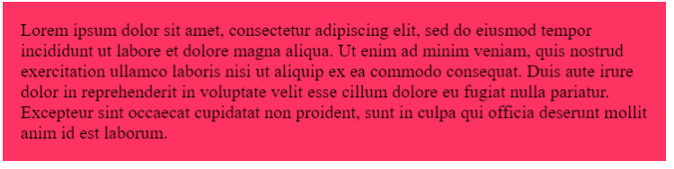
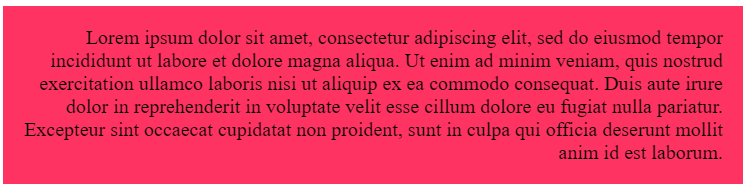
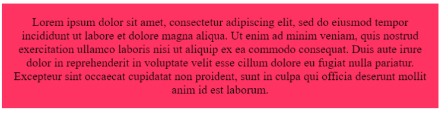
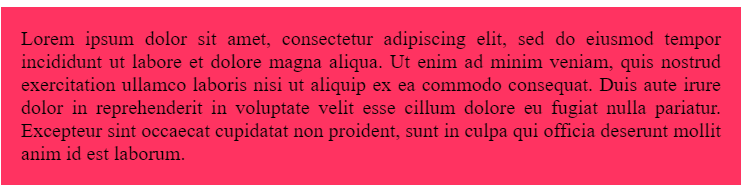
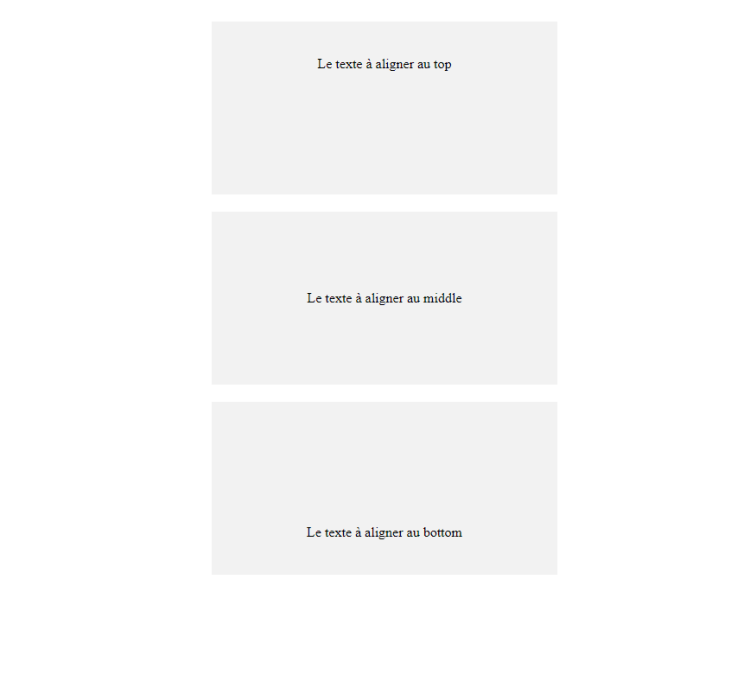

# **El alineamiento**

<br>

## **_Objetivos:_**

- Saber gestionar el alineamiento del texto en CSS

---

---

<br>

---

## **Contexto**

---

<br>

Existen diferentes propiedades CSS para definir la alineación del texto, ya sea la alineación horizontal o vertical, dentro de un contenedor.

<br>

---

---

<br>
<br>

---

## **text-align**

---

<br>

La propiedad text-align permite definir la alineación horizontal del texto/contenido en un bloque.

Existen varias valores posibles para esta propiedad: left, right, center, justify.

<br>

---

**EJEMPLO: Uso de la propiedad text-align**

```html
<!DOCTYPE html>

<html lang="es">
  <head>
    <meta charset="utf-8" />

    <title>Titulo de la pagina</title>

    <link rel="stylesheet" href="style.css" />

    <style>
      div.primero {
        font-size: 20px;

        background-color: #ff3361;

        word-break: break-word;

        text-align: left;
      }
    </style>
  </head>

  <body>
    <div class="primero">
      Lorem ipsum dolor sit amet, consectetur adipiscing elit, sed do eiusmod
      tempor incididunt ut labore et dolore magna aliqua. Ut enim ad minim
      veniam, quis nostrud exercitation ullamco laboris nisi ut aliquip ex ea
      commodo consequat. Duis aute irure dolor in reprehenderit in voluptate
      velit esse cillum dolore eu fugiat nulla pariatur. Excepteur sint occaecat
      cupidatat non proident, sunt in culpa qui officia deserunt mollit anim id
      est laborum.
    </div>
  </body>
</html>
```

Resultado con valor left (izquierda), por defecto:



---

Resultado con valor right (derecha):



---

Resultado con valor center (centro):



---

Resultado con valor justify (justificado):



<br>

---

---

<br>
<br>

---

## **Vertical-align**

---

<br>

La propiedad vertical-align permite definir la alineación vertical del texto/contenido en una línea o en una celda de una tabla. Hay varias posibles valores para esta propiedad.

Es fácil alinear verticalmente elementos utilizando tablas, sin embargo, no se recomienda usar tablas para definir la estructura de una página HTML.

Por lo tanto, vamos a simular tablas con CSS utilizando las propiedades display: table y table-cell.

<br>

---

**EJEMPLO**

```html
<!DOCTYPE html>

<html lang="es">
  <head>
    <meta charset="utf-8" />

    <title>Titulo de la pagina</title>

    <link rel="stylesheet" href="style.css" />

    <style>
      .contenedor {
        display: table;

        height: 200px;
      }

      .contenido-top {
        text-align: center;

        display: table-cell;

        vertical-align: top;
      }

      .contenido-middle {
        text-align: center;

        display: table-cell;

        vertical-align: middle;
      }

      .contenido-bottom {
        text-align: center;

        display: table-cell;

        vertical-align: bottom;
      }
    </style>
  </head>

  <body>
    <div class="contenedor">
      <div class="contenido-top">texto a alinear en el top</div>
    </div>

    <div class="contenedor">
      <div class="contenido-middle">texto a alinear en el middle</div>
    </div>

    <div class="contenedor">
      <div class="contenido-bottom">texto a alinear en el bottom</div>
    </div>
  </body>
</html>
```



<br>

---

---

<br>
<br>

---

## **A recordar**

---

<br>

- **La propiedad text-align permite definir la alineación horizontal del texto/contenido en un bloque.**

- **La propiedad vertical-align permite definir la alineación vertical del texto/contenido en una línea o en una celda de una tabla.**

<br>

---

---

<br>
<br>

---

### **Complemento**

---

<br>

- [text-align](https://developer.mozilla.org/fr/docs/Web/CSS/text-align)

- [vertical-align](https://developer.mozilla.org/fr/docs/Web/CSS/vertical-align)

<br>

---

---
