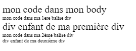

# **Las Unidades CSS**

<br>

## **_Objetivos:_**

- Conocer y utilizar las diferentes unidades CSS para modificar el tamaño de un texto.

---

---

<br>

---

## **Contexto**

---

<br>

**El CSS ofrece varias unidades de medida para expresar dimensiones.**

**Existen dos categorías de unidades:**

**- Unidades absolutas: no dependen de ninguna otra dimensión del contenido HTML,**

**- Unidades relativas: van a variar en función de las dimensiones del elemento HTML padre.**

<br>

---

---

<br>
<br>

---

## **Unidad px**

---

<br>

Es una unidad absoluta utilizada para definir una dimensión, en este caso, el tamaño del texto.

Sin embargo, hay que tener cuidado con su uso ya que su falta de adaptabilidad puede afectar la accesibilidad del sitio.

<br>

---

**EJEMPLO: Definir el tamaño de un texto**

```html
<!DOCTYPE html>

<html lang="es">
  <head>
    <meta charset="utf-8" />

    <title>Titulo de la pagina</title>

    <link rel="stylesheet" href="style.css" />

    <style>
      .textoPX {
        color: green;

        font-size: 150px;
      }
    </style>
  </head>

  <body>
    <p class="textoPX">texto en el que el tamaño esta definido en px</p>
  </body>
</html>
```


El texto siempre tendrá el mismo tamaño sin importar el tamaño de la pantalla o de un posible elemento padre.

<br>

---

---

<br>
<br>

---

## **Unidad en 'em'**

---

<br>

Es una unidad relativa.

Permite definir el tamaño de un texto de manera proporcional a su elemento padre.

<br>

---

**EJEMPLO: Diferencia px vs em**

```html
<!DOCTYPE html>

<html lang="es">
  <head>
    <meta charset="utf-8" />

    <title>Titulo de la pagina</title>

    <link rel="stylesheet" href="style.css" />

    <style>
      .padre {
        font-size: 18px;
      }

      .hijo {
        font-size: 2em;
      }
    </style>
  </head>

  <body>
    <div class="padre">
      texto elemento padre tamaño 18px

      <div class="enfant">texto elemento hijo tamaño 2em</div>
    </div>
  </body>
</html>
```


---

La dimensión del texto contenido en el div "hijo" es igual a la del padre multiplicada por 2, es decir, 36 px.

El uso de "em" permite mantener la proporcionalidad.

Si se modifica el tamaño de un padre sin redefinir el tamaño del hijo, este último se calculará automáticamente.

<br>

---

---

<br>
<br>

---

## **Unidad en 'rem'**

---

<br>

Es una unidad relativa.

Funciona de la misma manera que la unidad "em", excepto que no es proporcional a su elemento padre, sino al elemento raíz HTML (es decir, `<html>`).

Esto significa que, si el tamaño de fuente del elemento HTML está definido como 16 px, 1 rem será equivalente a 16 px para todos los elementos del documento.

<br>

---

**EJEMPLO: rem**

```html
<!DOCTYPE html>

<html lang="es">
  <head>
    <meta charset="utf-8" />

    <title>Titulo de la pagina</title>

    <link rel="stylesheet" href="style.css" />

    <style>
      html {
        font-size: 20px;
      }

      div.primero {
        font-size: 0.5rem; /*10px*/
      }

      div.segundo {
        font-size: 0.5rem; /*10px*/
      }

      div.primero_hijo {
        font-size: 1rem; /*20px*/
      }

      div.segundo_hijo {
        font-size: 1em; /*10px*/
      }
    </style>
  </head>

  <body>
    mi código en mi body

    <div class="primero">
      mi código en mi primera etiqueta div

      <div class="primero_hijo">hijo de mi primer div</div>
    </div>

    <div class="segundo">
      mi código en mi segunda etiqueta div

      <div class="segundo_hijo">hijo de mi segundo div</div>
    </div>
  </body>
</html>
```



---

Las etiquetas div con los respectivos id "primero" y "segundo" tienen un tamaño definido en rem, por lo que será proporcional al tamaño de la etiqueta raíz (20 px).

Por lo tanto, 0.5 rem aquí corresponde a 10 px.

La primera etiqueta secundaria (id=primero_hijo) también tiene un tamaño definido en rem.

Por lo tanto, 1 rem aquí corresponde a 20 px.

La segunda etiqueta secundaria (id=segundo_hijo) tiene un tamaño definido en em.

Por lo tanto, es proporcional al elemento padre y no a la raíz.

Por lo tanto, 1 em aquí corresponde a 10 px.

<br>

---

---

<br>
<br>

---

## **Unidad en 'vw' (viewport width)**

---

<br>

Es una unidad relativa proporcional al ancho de la ventana de visualización del navegador.

1 vw es igual a 1 % del ancho de la ventana.

<br>

---

**EJEMPLO: vw**

```html
<!DOCTYPE html>

<html lang="es">
  <head>
    <meta charset="utf-8" />

    <title>Titulo de la pagina</title>

    <link rel="stylesheet" href="style.css" />

    <style>
      div.primero {
        font-size: 10vw;
      }

      div.segundo {
        font-size: 5vw;
      }
    </style>
  </head>

  <body>
    <div class="primero">mi código en mi primera etiqueta div</div>

    <div class="segundo">mi código en mi segunda etiqueta div</div>
  </body>
</html>
```


---

En este ejemplo, el ancho de la ventana es de 1000 px.

El texto contenido en la primera div será el 10 % de 1000 px, es decir, 100 px.

El texto contenido en la segunda div será el 5 % de 1000 px, es decir, 50 px.

<br>

---

---

<br>
<br>

---

## **Unidad en 'vh' (viewport height)**

---

<br>

Es una unidad relativa proporcional a la altura de la ventana de visualización del navegador.

1 vh es igual al 1% de la altura de la ventana.

Los cálculos serán los mismos que con vw, pero basándose en la altura de la ventana en lugar de la anchura.

<br>

---

---

<br>
<br>

---

## **A recordar**

---

<br>

Hay varias unidades para definir el tamaño del texto:

- **px: unidad en píxeles que no es muy adecuada para la accesibilidad del sitio.**

- **em: unidad basada en el tamaño del texto del bloque padre.**

- **rem: unidad basada en el tamaño de texto del bloque raíz.**

- **vh y vw: unidades basadas en el tamaño de la ventana del navegador.**

<br>

---

---