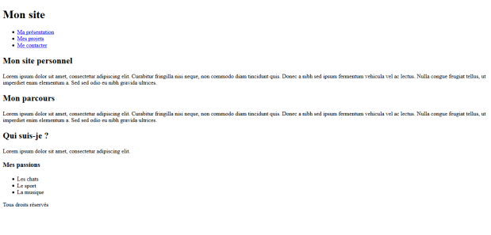
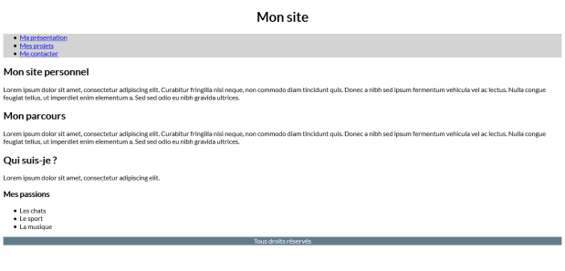

# **Etiquetas semánticas**

<br>

## **_Objetivos:_**

- Saber utilizar las etiquetas semánticas con el fin de estructurar una pagina

---

---

<br>

---

## **Contexto**

---

<br>

Las etiquetas semánticas dan importantes indicaciones sobre el papel de los datos que contienen.

Su uso permite identificar fácilmente los elementos o agruparlos según su importancia y papel en la página.

<br>

---

---

<br>
<br>

---

## **Etiquetas semánticas**

---

<br>

_Las etiquetas semánticas son las siguientes:_

- **La etiqueta `<header>` agrupa todos los elementos de encabezado de la página, como el logo.**

- **El elemento `<nav>` permite navegar por el sitio: es el menú de navegación.**

- **La etiqueta `<main>` contiene toda la información importante de la página: es el contenido principal.**

- **El elemento `<article>` contiene información que es independiente del resto de la página: por ejemplo, cuando representamos una galería de artículos, los artículos son independientes entre sí (podrían existir unos sin los otros).**

- **La etiqueta `<section>` es una etiqueta de organización de contenido, pero esta vez los datos que contiene dependen del contexto, una sección aislada pierde el significado de los datos que contiene.**

- **El elemento `<aside>` agrupa elementos al margen del contenido. Esto puede ser interesante para contener publicidades, por ejemplo. De hecho, estas últimas no siempre tienen relación con el contenido de la página.**

- **La etiqueta `<footer>` es el pie de página, se pueden encontrar las menciones legales y los enlaces a la información de contacto.**

Estas etiquetas no tienen un impacto visual en la página, pero mejoran el significado de los datos que contienen.

Todas deben ser utilizadas dentro de la etiqueta `<body>`.

<br>

---

**EJEMPLO**

Vamos a utilizar las etiquetas semánticas para estructurar nuestro sitio personal.

Comencemos agregando un `<header>`, que contiene el nombre del sitio:

```html
<header>
  <h1>Mi sitio</h1>
</header>
```

A continuación, agregaremos un menú de navegación que contendrá los enlaces "Mi presentación", "Mis proyectos" y "Contáctame".

El atributo role="navigation" se puede utilizar en conjunto con la etiqueta nav.

Agregar este atributo aumenta la compatibilidad con las tecnologías de asistencia, especialmente las más antiguas.

```html
<nav role="navigation">
  <ul>
    <li><a href="#">Mi presentación</a></li>

    <li><a href="#">Mis proyectos</a></li>

    <li><a href="#">Contáctame</a></li>
  </ul>
</nav>
```

Luego estructuraremos la parte principal del sitio, que contendrá dos artículos en una sección:

```html
<main>
  <section>
    <article>
      <h2>Mi sitio personal</h2>

      <p>
        Lorem ipsum dolor sit amet, consectetur adipiscing elit. Erabitur
        fringilla nisi neque, non commodo diam tincidunt quis. Donec a nibh sed
        ipsum fermentum vehicula vel ac lectus. Nulla congue feugiat tellus, ut
        imperdiet enim elementum a. Sed sed odio eu nibh gravida ultrices.
      </p>
    </article>

    <article>
      <h2>Mi trayectoria</h2>

      <p>
        Lorem ipsum dolor sit amet, consectetur adipiscing elit. Curabitur
        fringilla nisi neque, non commodo diam tincidunt quis. Donec a nibh sed
        ipsum fermentum vehicula vel ac lectus. Nulla congue feugiat tellus, ut
        imperdiet enim elementum a. Sed sed odio eu nibh gravida ultrices.
      </p>
    </article>
  </section>
</main>
```

Y añadiremos un `<aside>` que nos permitirá presentarnos a los visitantes:

```html
<aside>
  <article>
    <h2>¿Quién soy yo?</h2>
    <p>
      Lorem ipsum dolor sit amet, consectetur adipiscing elit.
      <h3>Mis pasiones</h3>
      <ul>
        <li>Los gatos</li>
        <li>El deporte</li>
        <li>La música</li>
      </ul>
    </p>
  </article>
</aside>
```

El aside obviamente antes de agregar un pie de página, en el cual podemos poner los derechos de autor:

```html
<footer>
  <p>Todos los derechos reservados</p>
</footer>
```

---

He aquí la pagina estructurada:



---

**Agreguemos un poco de estilo CSS dentro de una etiqueta `<style>` en el `<head>` e importemos una fuente para diferenciar más fácilmente los elementos.**

El elemento `<link href="https://fonts.googleapis.com/css?family=Lato:400,100,300" rel="stylesheet">` permite acceder al servicio de Google Fonts.

Google Fonts es un servicio de alojamiento gratuito de fuentes para la Web, iniciado en 2010.

En nuestro caso, nos permite utilizar la fuente Lato en nuestra aplicación web.

```html
<head>
  <meta charset="utf-8" />

  <title>Mi sitio</title>

  <link
    href="https://fonts.googleapis.com/css?family=Lato:400,100,300"
    rel="stylesheet"
  />

  <style>
    body {
      font-family: "Lato", sans-serif;
    }

    header {
      text-align: center;
    }

    nav {
      background-color: lightgrey;
    }

    footer {
      text-align: center;

      background-color: #607d8b;

      color: white;
    }
  </style>
</head>
```



<br>

---

---

<br>
<br>

---

### **Observación**

---

<br>

Es importante estructurar correctamente una página web para permitir que los motores de búsqueda indexen mejor el sitio y que las personas con discapacidad visual puedan usar su lector de pantalla.

<br>

---

---

<br>
<br>

---

## **A recordar**

---

<br>

Las etiquetas semánticas son importantes y permiten estructurar mejor una página y su contenido, para darles más sentido.

Hemos visto que una página puede contener:

- **Un header: encabezado de la página.**
   
- **Un main: parte principal de la página.**
   
- **Artículos: que contienen información independiente del contexto.**
   
- **Secciones: que contienen información dependiente del contexto.**
   
- **Un aside: parte secundaria de una página.**
   
- **Un footer: pie de página.**

Diagrama resumen de las etiquetas semánticas:


<br>

---

---
