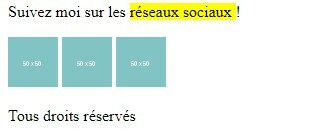

# **Contenedores Genéricos**

<br>

## **_Objetivos:_**

- Saber diferenciar los contenedores genéricos de otras etiquetas

- Saber utilizarlas para agrupar elementos

---

---

<br>

---

## **Contexto**

---

<br>

Es posible agrupar elementos HTML mediante un tipo de etiqueta semánticamente neutra: los contenedores genéricos.

Veremos este tipo de etiquetas.

<br>

---

---

<br>
<br>

---

## **Contenedor genérico**

---

<br>

Existen dos contenedores genéricos: `<div>` y `<span>`.

Estas etiquetas no tienen ningún valor semántico, es decir, no proporcionan información sobre los datos que contienen, a diferencia de las etiquetas semánticas.

El hecho de que los elementos div y span no tengan ningún valor semántico puede hacer pensar que van en contra del papel del HTML.

Esto es totalmente cierto, y es la razón por la que idealmente intentaremos usar estos elementos solo como último recurso y si no tenemos otra opción creíble.

Los elementos HTML div y span son contenedores destinados a estructurar el contenido, pero tienen un papel complementario y diferentes reglas de renderizado.

- **`<div>`:** permite principalmente agrupar elementos en el mismo bloque (se dice entonces que la div es un elemento de tipo bloque), para estilizarlos con CSS más fácilmente.

- **`<span>`:** a diferencia de `<div>`, coloca los elementos en línea (etiqueta de tipo en línea), lo que permite incluirlos fácilmente en párrafos o botones, por ejemplo.

El elemento de **tipo bloque:**

- **Si no se define ningún ancho, ocupa todo el ancho de su elemento padre.**

- **Puede tener márgenes y rellenos.**

- **Si no se define ninguna altura, toma la altura de sus elementos secundarios.**

- **Ignora la propiedad vertical-align.**

El elemento de **tipo en línea:**

- **Se inserta en el flujo de texto.**

- **No salta de línea como lo haría un elemento de bloque.**

- **Ignora los márgenes, ancho y altura.**

- **Acepta las propiedades white-space y vertical-align.**

En general, puede incluir cualquier elemento de bloque dentro de otro elemento de bloque. También puede incluir cualquier elemento en línea en un elemento de bloque y cualquier elemento en línea en otro elemento en línea.

**Lo único que no se puede hacer es incluir un elemento de bloque dentro de un elemento en línea, con una excepción: el elemento `<a>` puede envolver cualquier tipo de contenido, tanto de bloque como en línea.**

<br>

---

**EJEMPLO**

Usaremos el contenedor genérico `<div>` para agrupar elementos que no tienen una etiqueta dedicada.

Agregaremos un grupo de elementos para las redes sociales y un grupo que contenga sus logotipos.

Dentro del grupo de elementos para las redes sociales, usaremos el elemento `<span>` para seleccionar una parte del texto dentro del elemento `<p>`.

```html
<footer>
  <div>
    <p>
      Sígueme en las
      <span style="”background-color:yellow”"> réseaux sociaux </span>!
    </p>

    <div>
      

      

      
    </div>
  </div>

  <p>Todos los derechos reservados</p>
</footer>
```



<br>

---
---

<br>
<br>

---

## **A recordar**

---

<br>

Existen dos contenedores genéricos: <div> y <span> que permiten agrupar elementos cuando no hay un contenedor semántico disponible:

- `<div>`: se utiliza para agrupar elementos en un bloque.

- `<span>`: se utiliza para colocar elementos en línea.

<br>

---

---
