# **Las cajas de CSS**

<br>

## **_Objetivos:_**

- Modificar la visualización de los elementos en relación a los demás.

- Gestionar el espacio de los elementos HTML.

- Gestionar el tamaño de los elementos.

---

---

<br>

---

## **Contexto**

---

<br>

Ahora vamos a ver cómo manejar la visualización de elementos HTML entre sí, y veremos que es posible modificar su propio espacio mediante propiedades CSS.

<br>

---

---

<br>
<br>

---

## **Propiedad Display**

---

<br>

La propiedad CSS "display" permite gestionar la visualización de un elemento en relación con otros en la página.

Esta propiedad tiene tres valores que se pueden asignar para modificar la visualización de los elementos:

- Display: **Inline**;

- Display: **block**;

- Display: **Inline-block**;

<br>

---

---

<br>
<br>

---

## **Valor Inline**

---

<br>

Con el valor display: inline, los elementos se colocan uno al lado del otro en la misma línea.

El elemento tomará solo el ancho necesario para mostrar su contenido, hasta que no haya más espacio en longitud.

Los elementos siguientes se colocarán en la siguiente línea.

Las propiedades width y height no tienen ningún efecto en un elemento inline.

<br>

---

**EJEMPLO**

```css
.inline {
  display: inline;
}
```

Tomemos el ejemplo de una lista con puntos en la que se desee mostrar algunos elementos en la misma línea.

Esto es lo que podría parecer:

```html
<ul>
  <li>Inicio</li>

  <li>Lista de artículos</li>

  <li class="inline">Mi cuenta</li>

  <li class="inline">Cerrar sesión</li>
</ul>
```

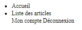

<br>

---

---

<br>
<br>

---

## **Valor Block**

---

<br>

Con el valor display: block, los elementos se apilarán uno encima del otro.

Un elemento ocupará una línea (tomará toda la anchura, independientemente del tamaño de su contenido), nunca estará junto a otro elemento.

Tomemos el ejemplo de estos enlaces, por defecto se mostrarían uno al lado del otro.

<br>

---

**EJEMPLO**

```html
<nav>
  <a href="#">Inicio</a>

  <a href="#">Lista de artículos</a>

  <a href="#">Mi cuenta</a>

  <a href="#">Cerrar sesión</a>
</nav>
```


Por el contrario, con el valor display block:

```css
nav > a {
  display: block;
}
```

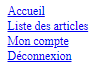

<br>

---

---

<br>
<br>

---

## **Valor Inline-block**

---

<br>

El valor display: inline-block, por su parte, comparte ciertas características de las propiedades anteriores.

De hecho, ahora podremos aplicar las propiedades que permiten modificar sus dimensiones, y los elementos se colocarán uno al lado del otro hasta que se llene todo el espacio en la línea.

A diferencia de inline, las propiedades width y height están activas: es posible modificar el tamaño del elemento manteniendo en el flujo de la línea actual.

Retomando el ejemplo de nuestra lista.

Además de alinear todos los elementos en una misma línea, podríamos querer darles un poco de espacio con el siguiente código:

<br>

---

**EJEMPLO**

```html
<nav>
  <ul>
    <li>Inicio</li>
    <li>Lista de artículos</li>
    <li>Mi cuenta</li>
    <li>Cerrar sesión</li>
  </ul>
</nav>
```

```css
nav li {
  display: inline;
  width: 150px;
  height: 50px;
  line-height: 50px;
  text-align: center;
  border: 1px solid red;
}
```

Sin embargo, el efecto esperado no está aquí 👇.

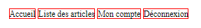

Si aplicamos el valor inline-block a la propiedad display, la visualización ahora cumple con nuestras expectativas.

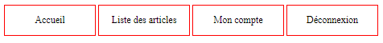

<br>

---

---

<br>
<br>

---

## **Altura y Anchura**

---

<br>

Los elementos HTML tienen una altura y una anchura que se pueden modificar utilizando las propiedades height y width, dándoles cualquier **[unidad reconocida en CSS](https://developer.mozilla.org/fr/docs/Web/CSS/CSS_Values_and_Units)**.

Existen diferentes familias de unidades, las unidades absolutas (px, in, cm, mm, pc, pt), las unidades relativas al viewport (vh, vw, vmin, vmax), las unidades en porcentaje (%) y las unidades relativas al texto (em, rem, ex, ch).

Para definir un `<div>` de 150 píxeles de ancho y 100 píxeles de alto, simplemente tendríamos que declarar el siguiente CSS:

<br>

---

**EJEMPLO**

```css
div {
  width: 150px;
  height: 100px;
}
```

La altura y el ancho de los elementos no se pueden modificar si el elemento está en display: inline.

Algunos elementos, como enlaces, imágenes y etiquetas que permiten la formateación semántica del texto (negrita, énfasis...), se muestran por defecto en línea.

A diferencia de los elementos de tipo bloque como títulos, párrafos o listas.

Es posible definir la altura y el ancho mínimo de un elemento gracias a las propiedades min-width y min-height. Si el tamaño del bloque disminuye, no podrá ser inferior a los valores de las propiedades min-width y min-height.

Del mismo modo, es posible definir la altura y el ancho máximos de un elemento con las propiedades max-width y max-height.

<br>

---

**EJEMPLO: Alinear elementos**

Si queremos alinear los elementos `<main>` y `<aside>`, debemos darles la propiedad display: inline-block para que puedan colocarse uno al lado del otro.

Como ambos elementos ocuparán todo el espacio disponible, es necesario establecer un ancho que no puedan superar.

Aquí, el `<aside>` ocupará un cuarto del espacio disponible en la línea:

```css
main {
  display: inline-block;

  width: 75%;
}

aside {
  display: inline-block;

  width: 25%;
}
```

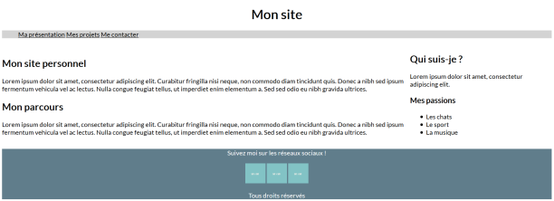

<br>

---

---

<br>
<br>

---

### **Observación: Salto de linea**

---

<br>

La propiedad word-wrap permite gestionar cómo se realizará el salto de línea de una línea, por ejemplo, si su contenedor es demasiado pequeño.

Es posible modificar la separación de palabras para que la palabra no se corte en medio, o cortarlas con un guión.

<br>

---

---

<br>
<br>

---

## **Gestionar el espaciado**

---

<br>

Cuando creas código HTML, utilizas etiquetas que se anidan unas dentro de otras.

El siguiente código consta de tres comandos HTML.

Una etiqueta `<div>` que contiene una etiqueta `<h1>` y una etiqueta `<p>`.

<br>

---

**EJEMPLO**

```html
<div>
  <h1>Titre</h1>

  <p>Exemple de texte</p>
</div>
```

En CSS, cada elemento es una caja, por lo que tenemos una caja `<div>` que contiene dos cajas `<h1>` y `<p>`, que podemos representar de la siguiente manera:

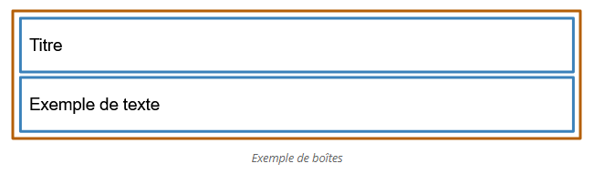

La idea central del modelo de cajas es que cada elemento HTML (y por lo tanto, cada caja CSS) se puede representar mediante una pila de 4 cajas:

- La primera, central, estará compuesta por el contenido del elemento en sí mismo,

- La segunda, por los márgenes internos del elemento,

- La tercera, por los bordes del elemento,

- La cuarta, por los márgenes externos del elemento.

Aquí se muestra la representación de un elemento HTML según el modelo de cajas:

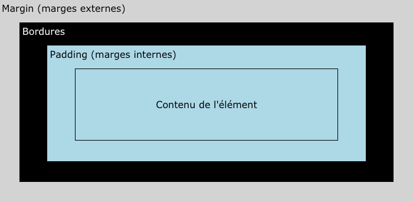

<br>

---

---

<br>
<br>

---

## **Las propiedades de CSS enlazadas a las diferentes cajas**

---

<br>

CSS nos proporciona diferentes propiedades que nos permiten especificar el tamaño de los diferentes elementos que componen las distintas cajas:

- **Las propiedades `width` y `height` nos permiten definir el ancho y el alto de la caja "contenido" o "content".**

- **La propiedad `padding` nos permite definir el tamaño de los márgenes internos.**

- **La propiedad `border` nos permite definir bordes para nuestro elemento.**

- **La propiedad `margin` nos permite definir el tamaño de los márgenes externos.**

<br>

---

---

<br>
<br>

---

### **Observación: Uso de propiedad Padding (Margenes internos)**

---

<br>

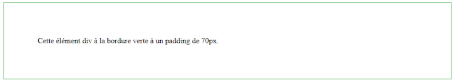

<br>

La propiedad padding es una propiedad abreviada que permite definir las diferentes separaciones de relleno en los cuatro lados de un elemento.

Sintetiza los siguientes:

- [padding-top](https://developer.mozilla.org/fr/docs/Web/CSS/padding-top)

- [padding-right](https://developer.mozilla.org/fr/docs/Web/CSS/padding-right)

- [padding-bottom](https://developer.mozilla.org/fr/docs/Web/CSS/padding-bottom)

- [padding-left](https://developer.mozilla.org/fr/docs/Web/CSS/padding-left)

Podemos representar esta definición mediante:

<br>

---

**EJEMPLO**

```css
.container {
  padding: 25px;
}

/*{ padding : padding-top padding-right padding-bottom padding-left } */
```

**padding puede estar seguido por diferentes valores (1 a 4) de diferentes tipos:**

- **longitud:** especifica un relleno **en px, pt, cm, etc.**
- **%:** especifica un relleno **en % del ancho del elemento contenedor.**
- **inherit:** especifica que el relleno **debe heredarse del elemento padre.**

<br>

---

Si el padding tiene 1 solo valor, `.container {padding: 25px;}`, esto corresponde al valor del relleno en los cuatro lados del .container, visto en el ejemplo código arriba 👆:

**EJEMPLO**

```css
.container {
  padding-top: 25px;
  padding-right: 25px;
  padding-bottom: 25px;
  padding-left: 25px;
}

/* Esto 👆 es esto 👇 */

.container {
  padding: 25px;
}
```

<br>

---

Si el padding tiene 2 valores, `.container { padding:25px 10%; }`, el primer valor corresponde a padding-top y padding-bottom, el segundo a padding-right y padding-left:

**EJEMPLO**

```css
.container {
  padding-top: 25px;
  padding-right: 10%;
  padding-bottom: 25px;
  padding-left: 10%;
}

/* 👆 Esto seria esto 👇 */

.container {
  padding: 25px 10%;
}
```

<br>

---

Si el padding tiene 3 valores, `.container { padding:25px 15px 10px; }`, esto correspondería a esto:

**EJEMPLO**

```css
.container {
  padding-top: 25px;
  padding-left: 15px;
  padding-right: 15px;
  padding-bottom: 10px;
}

/* seria esto */

.container {
  padding: 25px 15px 10px;
}
```

<br>

---

Si el padding tiene 4 valores, `.container { padding:25px 15px 10px 5px; }`, esto correspondería a esto:

**EJEMPLO**

```css
.container {
  padding-top: 25px;
  padding-right: 15px;
  padding-bottom: 10px;
  padding-left: 5px;
}

/* seria esto */

.container {
  padding: 25px 15px 10px 5px;
}
```

**Cada una de las propiedades padding-top, padding-right, padding-bottom, padding-left pueden ser utilizadas de forma independiente.**

---

---

<br>
<br>

---

### **Observación: Propiedad Border (Borde de la caja)**

---

<br>


La propiedad CSS border es una propiedad abreviada que permite definir las propiedades relacionadas con el borde.

La propiedad border se puede usar para definir los valores de [border-width](https://developer.mozilla.org/fr/docs/Web/CSS/border-width) (el ancho), [border-style](https://developer.mozilla.org/fr/docs/Web/CSS/border-style) (el estilo de borde) y [border-color](https://developer.mozilla.org/fr/docs/Web/CSS/border-color) (el color).

Podemos representar la definición mediante:

---

**EJEMPLO**

```css
/* Esto equivaldría a esto 
  👇 { border : border-width border-style border-color } */

div {
  border: 2px solid blue;
}
```

El siguiente código representa una etiqueta `<div>` rodeada por un borde de 2px de ancho, de [style solid](https://www.w3schools.com/css/css_border.asp) (línea continua) y de color azul.

<br>

---

---

<br>
<br>

---

### **Observación: Utilizar la propiedad margin (margin externe)**

---

<br>

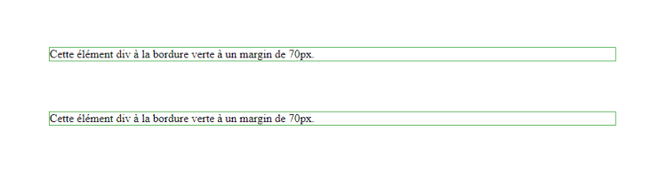

Los márgenes se utilizan para crear un espacio alrededor de los elementos, fuera de cualquier borde definido.

Se utilizan de manera similar a la propiedad padding.

Es una propiedad abreviada que permite manipular las otras propiedades de margin: **[margin-top](https://developer.mozilla.org/fr/docs/Web/CSS/margin-top), [margin-right](https://developer.mozilla.org/fr/docs/Web/CSS/margin-right), [margin-bottom](https://developer.mozilla.org/fr/docs/Web/CSS/margin-bottom) y [margin-left](https://developer.mozilla.org/fr/docs/Web/CSS/margin-left).**

Se puede representar esta definición mediante:

---

**EJEMPLO**

```css
/* margin : margin-top margin-right margin-bottom et margin-left */

.container {
  margin: 25px 25px 25px 25px;
}

/* 👇 esto es lo mismo que poner esto de abajo en caso de aplicar la misma medida para los 4 lados, si no pues pondríamos diferentes medidas para los cuatro lados como en el ejemplo de arriba yendo en el sentido de las agujas del reloj: arriba, derecha, abajo e izquierda  */
```

Si margin tiene un solo valor, .container { margin:25px; } corresponde al valor del margen de los cuatro lados.

<br>

---

**EJEMPLO**

Cada una de las propiedades margin-top, margin-right, margin-bottom, margin-left pueden ser utilizadas de forma independiente.

```css
.container {
  margin-top: 25px;
  margin-right: 25px;
  margin-bottom: 25px;
  margin-left: 25px;
}
```

<br>

---

---

<br>

<br>

---

### **Desbordamiento de una caja**

---

<br>

_**La propiedad overflow permite controlar cómo el contenido se desborda de un elemento:**_

- _overflow:_ hidden oculta el contenido, por lo que será truncado.

- _overflow:_ scroll muestra las barras de desplazamiento, lo que permite desplazarse dentro del elemento para mostrar el contenido.

<br>

Por defecto, la propiedad es overflow: visible

lo que implica que el contenido (si se sale de los límites de su contenedor) no se recortará.

<br>

---

---

<br>

<br>

---

### **Observación: Centrar horizontalmente un elemnto de tipo bloc e Inline**

---

<br>

Utilizando la propiedad de ancho "width", junto con la propiedad y valor "margin: auto", se puede centrar horizontalmente el contenido de un elemento de bloque.

Los elementos de tipo "inline" solo ocupan el espacio necesario para mostrar su contenido dentro de su elemento padre.

Se puede centrar este tipo de elementos aplicando "text-align: center" al elemento padre (contenedor que contiene a su hijo) de tipo "block" que contiene el elemento "inline" en cuestión.

Esto tendrá el efecto de centrar todos los elementos "inline" en ese elemento "block".

<br>

---

---

<br>
<br>

---

## **Espaciando el contenido**

---

<br>

Utilicemos las propiedades CSS de gestión del espacio para dar espacio al contenido de la página.

Para ello, agreguemos márgenes alrededor de los elementos del menú de navegación, luego entre el menú y el cuerpo, y finalmente entre el pie de página y el cuerpo:

<br>

---

**EJEMPLO**

```css
nav {
  background-color: lightgrey;
  margin-bottom: 10px;
}

nav li {
  display: inline;
  margin: 10px;
}

footer {
  text-align: center;
  background-color: #607d8b;
  color: white;
  margin-top: 20px;
}
```

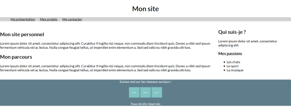

---

Es posible agregar un borde a la derecha de la parte principal de la página para crear una separación vertical con la parte `<`aside>.

<br>

**EJEMPLO**

```css
main {
  display: inline-block;
  width: 74%;
  border-right: solid 1px lightgrey;
}
```

<br>

---

Ahora podemos agregar márgenes internos para que el contenido esté más separado del borde de su elemento. Por ejemplo, en el menú de navegación, en los artículos y en el pie de página:

<br>

**EJEMPLO**

```css
nav {
  padding: 10px;
  background-color: lightgrey;
  margin-bottom: 10px;
}

article {
  padding: 20px;
}

footer {
  text-align: center;
  background-color: #607d8b;
  color: white;
  margin-top: 20px;
  padding: 10px;
}
```

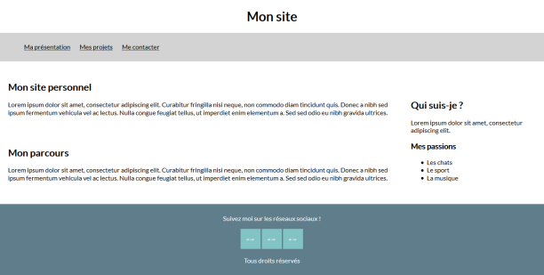

<br>

---

---

<br>
<br>

---

## **A recordar**

---

<br>

- **Existen propiedades CSS dedicadas a la gestión del espacio alrededor de los elementos, como margin y padding especializadas en la gestión de márgenes, o height y width para gestionar las dimensiones de un elemento.**

- **También hemos visto la propiedad display que gestiona la colocación de los elementos unos en relación a otros.**

<br>

---

---

<br>
<br>

---

### **Consejo: Fijarnos en el modelo de caja (F12)**

---

<br>

Para observar fácilmente las diferentes cajas que componen sus elementos HTML, simplemente haga clic derecho en "inspeccionar o pulsar F12 o ctrl + shift + c" para abrir el inspector de código nativo del navegador.

En la pestaña de estilo, encontrará una representación del elemento que acaba de inspeccionar y las diferentes capas que lo componen.

<br>

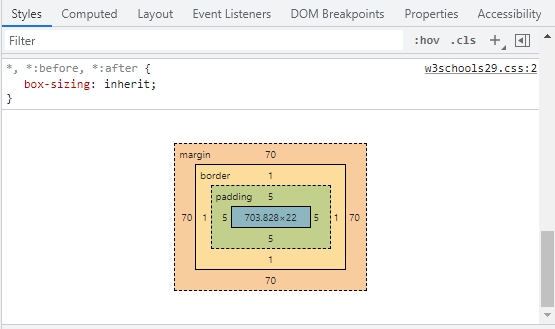


<br>

---

---