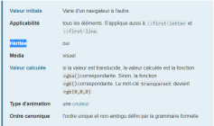
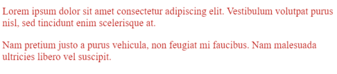
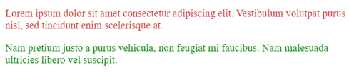

# **Herencia**

<br>

## **_Objetivos:_**

- Entender el funcionamiento de la herencia

---

---

<br>

---

## **Contexto**

---

<br>

Los elementos pueden recibir estilo sin haber sido específicamente declarado en los estilos.

De hecho, el estilo puede propagarse desde un elemento padre a sus hijos.

<br>

---

---

<br>
<br>

---

## **Herencia de estilos**

---

<br>

Algunos estilos pueden transmitirse de elementos padres a elementos hijos: esto se llama herencia de estilos CSS.

Por ejemplo, el color del texto, la fuente o el alineamiento son propiedades que se transmitirán de padres a hijos.

Esto significa que si el padre tiene un color de texto verde, los hijos que contiene también se mostrarán en verde, a menos que reescribamos el estilo del hijo.

Sin embargo, no todas las propiedades CSS son hereditarias: de hecho, las reglas sobre cajas (como padding y margin) no se transmitirán a los hijos y solo se aplicarán al padre seleccionado.

---

Para saber si una propiedad puede o no ser heredada, consulte la **[documentación](https://developer.mozilla.org/fr/docs/Web/CSS/Reference)** de dicha propiedad.

En cada caso, se indica sistemáticamente si la propiedad puede o no ser heredada.

Si tomamos como ejemplo la **[documentación de la propiedad color](https://developer.mozilla.org/fr/docs/Web/CSS/color)**, veremos que esta puede ser heredada.

<br>



<br>

---

Si aplicamos la propiedad de cambio de color de texto en el `<div>` padre que contiene los párrafos <p>, esta propiedad se transmitirá a los hijos.

**EJEMPLO**

```html
<div>
  <p>
    Lorem ipsum dolor sit amet consectetur adipiscing elit. Vestibulum volutpat
    purus nisl, sed tincidunt enim scelerisque at.
  </p>

  <p>
    Nam pretium justo a purus vehicula, non feugiat mi faucibus. Nam malesuada
    ultricies libero vel suscipit.
  </p>
</div>
```

<br>

```css
div {
  color: #c01b15;
}
```

<br>



<br>

---

<br>

Siempre es posible sobrescribir esta propiedad, pero se deberá ser más específico:

**EJEMPLO**

```html
<div>
  <p>
    Lorem ipsum dolor sit amet consectetur adipiscing elit. Vestibulum volutpat
    purus nisl, sed tincidunt enim scelerisque at.
  </p>

  <p class="green-text">
    Nam pretium justo a purus vehicula, non feugiat mi faucibus. Nam malesuada
    ultricies libero vel suscipit.
  </p>
</div>
```

<br>

```css
div {
  color: #c01b15;
}

.green-text {
  color: green;
}
```

<br>



<br>

---

---

<br>
<br>

---

## **A recordar**

---

<br>

- **Ciertas propiedades CSS aplicadas a los padres puedes, por herencia, aplicarse a los hijos, sin embargo, no todas las propiedades son hereditarias.**

<br>

---

---