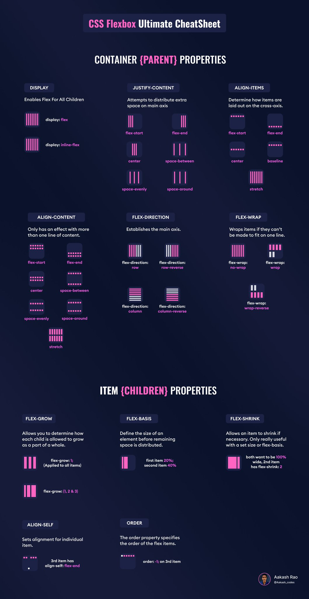

# **Contexto**

---

 

Vamos a descubrir las técnicas de diseño y posicionamiento de los elementos HTML gracias a diferentes propiedades CSS.

Será posible seleccionar elementos contenidos en una página web y controlar su ubicación, ya sea en relación a otros elementos de la página, en relación a su padre o incluso a la ventana del navegador.

Las técnicas de diseño que se abordarán aquí son las propiedades Flexbox, position, z-index y float.

 

 

---

---
