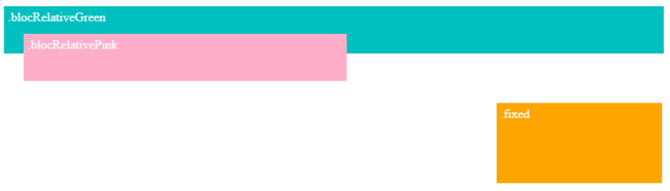

# **Position**

<br>

## **_Objetivos:_**

- Controlar el posicionamiento de los elementos HTML con la propiedad position

---

---

<br>

---

## **Contexto**

---

<br>

La propiedad "position" define el modo de posicionamiento de un elemento en una página.

Los elementos se posicionan por defecto en función de su orden de escritura en el archivo HTML, pero gracias a esta propiedad, podemos posicionar un elemento con respecto a un lugar específico en la página, utilizando las propiedades top, left, bottom y right.

Los posibles valores para la propiedad "position" son:

- static

- relative

- fixed

- absolute

<br>

---

---

<br>
<br>

---

## **static**

---

<br>

Este es el valor predeterminado: los elementos se posicionan uno tras otro siguiendo su orden de escritura en el documento HTML.

<br>

---

**EJEMPLO**

```css
.box {
  position: static;
}
```

<br>

---

---

<br>
<br>

---

## **Relative**

---

<br>

Al agregar propiedades, en particular las propiedades top, left, bottom o right, se puede ajustar la posición del elemento en relación con su posición inicial, determinada por los otros elementos que lo rodean.

<br>

---

**EJEMPLO**

```html
<div class="blocRelativeGreen">blocRelativeGreen</div>

<div class="blocRelativePink">blocRelativePink</div>
```

```css
.blocRelativeGreen {
  position: relative;
  height: 50px;
  background: #00bfbf;
  color: white;
  padding: 5px;
}

.blocRelativePink {
  position: relative;
  top: -25px;
  left: 25px;
  width: 400px;
  height: 50px;
  background: #ffaec9;
  color: white;
  padding: 5px;
}
```


<br>

---

---

<br>
<br>

---

## **Fixed**

---

<br>

Un elemento posicionado en fixed se coloca en relación al referencial de la ventana del navegador.

Al igual que con el valor relative, podemos usar las propiedades top, left, bottom y right.

<br>

---

**EJEMPLO**

```html
<div class="blocRelativeGreen">blocRelativeGreen</div>

<div class="blocRelativePink">blocRelativePink</div>

<div class="blocFixed">fixed</div>
```

```css
.blocFixed {
  position: fixed;
  bottom: 10px;
  right: 10px;
  width: 200px;
  height: 100px;
  background-color: orange;
  color: white;
  padding: 5px;
}
```



<br>

---

---

<br>
<br>

---

### **Observación**

---

<br>

Un elemento posicionado como "fixed" permanece siempre en la misma posición, incluso si la página se desplaza o si se redimensiona la ventana del navegador.

<br>


<br>

---

---

<br>
<br>

---

## **Absolute**

---

<br>

Un elemento posicionado con position: **absolute se posicionará por defecto en relación al elemento raíz, la etiqueta `<body>`.**

El punto de referencia para las propiedades top, left, bottom y right será así la esquina superior izquierda de la página de su navegador.


<br>

Si un elemento se posiciona con position: absolute y se encuentra dentro de un bloque principal que tiene una posición distinta a static, entonces el bloque principal se convierte en el elemento de referencia.


<br>

Un elemento posicionado con position: absolute será eliminado del flujo normal de la página.

Es como si ya no estuviera presente.

Su espacio inicial será ocupado por los elementos siguientes.

Un elemento posicionado con position: absolute podrá colocarse encima de otros elementos.

Ejemplo de un bloque en posición: absolute ubicado dentro de un bloque padre que tiene una posición diferente de static.

El bloque padre se convierte en el bloque de referencia.

<br>

---

**EJEMPLO**

```html
<div class="blocRelative">
  blocRelative

  <div class="blocAbsolute">blocAbsolute</div>
</div>
```

```css
.blocRelative {
  position: relative;
  width: 600px;
  height: 400px;
  background: #00bfbf;
  color: white;
  padding: 5px;
}

.blocAbsolute {
  position: absolute;
  bottom: 120px;
  right: 10px;
  width: 300px;
  height: 200px;
  background: #ffaec9;
  color: white;
  padding: 5px;
}
```


<br>

---

---

<br>
<br>

---

## **A recordar**

---

<br>

- **El posicionamiento absoluto permite colocar un elemento donde se desee en la página teniendo en cuenta su padre.**

- **El posicionamiento fijo es equivalente al posicionamiento absoluto, pero el elemento en cuestión siempre permanecerá visible en el mismo lugar, incluso si se desplaza más abajo en la página.**

- **El posicionamiento relativo permite mover un elemento en relación a su posición inicial.**

<br>

---

---

<br>
<br>

---

### **Complemento**

---

<br>

**[Documentación MDN sobre POSITION](https://developer.mozilla.org/fr/docs/Web/CSS/position)**

<br>

---

---
