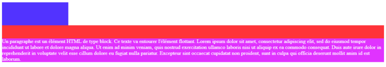

# **Propiedad Float**

<br>

## **_Objetivos:_**

- Posicionar elementos gracias a la propiedad Float

- Controlar el comportamiento de los elementos alrededor de un flotador con la propiedad clear

---

---

<br>

---

## **Contexto**

---

<br>

La propiedad CSS float permite sacar un elemento del flujo normal de la página y "flotar" contra un borde de su contenedor principal o contra otro elemento flotante.

Un uso bien conocido de la propiedad float es para hacer flotar una imagen a la derecha o a la izquierda de un texto y rodearla con texto.

La propiedad float es otra propiedad que afectará a la disposición en la página y debe manejarse con cuidado para evitar comportamientos no deseados.

Tenemos varias opciones para la propiedad float:

- **none:** Valor por defecto, el elemento no es un elemento flotante.

- **left:** El elemento se colocará en el borde izquierdo de su elemento principal o se desplazará hacia la izquierda hasta alcanzar otro elemento que tenga float: left.

- **right:** El elemento se colocará en el borde derecho de su elemento principal o se desplazará hacia la derecha hasta alcanzar otro elemento que tenga float: right.

<br>

---

**EJEMPLO**

```html
<div class="Parent">
  

  <p>
    Lucas ipsum dolor sit amet ben wookiee hutt calamari jango mon jinn wampa
    coruscant wicket. Yoda wedge dantooine boba kessel hutt mustafar antilles.
    Binks coruscant hutt leia yavin. Darth darth jinn skywalker. Calrissian
    aayla mon darth kenobi naboo solo darth. Endor c-3p0 owen dooku darth mace
    kessel hutt droid. Jabba darth gamorrean skywalker.
  </p>
</div>
```

```css
.parent {
  width: 300px;
  border: 1px solid red;
  padding: 25px;
}

.float {
  float: left;
}
```

<br>

---

**EJEMPLO**

La propiedad `clear` nos permite resolver el problema de no querer que un elemento se posicione al lado de un elemento "flotante":

- **clear: none:** es el valor predeterminado. No hay restricciones, los elementos se posicionarán al lado de elementos flotantes si los hay.

- **clear: left:** evita que un elemento se coloque al lado de elementos con float: left.

- **clear: right:** evita que un elemento se coloque al lado de elementos con float: right.

- **clear: both:** evita que un elemento se coloque al lado de elementos con float: left o float: right.

```html
<div class="floatBlue"></div>
<div></div>
```

```css
.floatBlue {
  width: 200px;
  height: 70px;
  float: left;
  background-color: #5233ff;
}

div {
  height: 40px;
  background-color: #ff3339;
  clear: left;
}
```

Resultado:



El elemento div con la propiedad clear: left no se puede colocar junto a un elemento flotante, como el bloque floatBlue, y se mueve debajo de él.

<br>

---

---

<br>
<br>

---

## **A recordar**

---

<br>

Para posicionar un bloque en relación al contenido principal, se utiliza:

- **float: left para ubicarlo a la izquierda**

- **float: right para ubicarlo a la derecha**

Para evitar que un elemento se coloque después de un elemento flotante, se utiliza:

- **clear: left para evitar colocarlo al lado de un elemento con float: left**

- **clear: right para evitar colocarlo al lado de un elemento con float: right**

- **clear: both para ambos.**

<br>

---

---

<br>
<br>

---

## **A recordar**

---

<br>

**[Documentación MDN sobre Float](https://developer.mozilla.org/fr/docs/Web/CSS/float)**

**[Documentación MDN sobre clear](https://developer.mozilla.org/fr/docs/Web/CSS/clear)**

<br>

---

---
