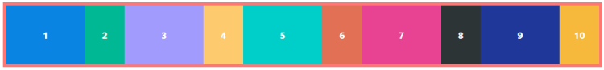

# **Flexbox**

<br>

## **_Objetivos:_**

- Posicionar los elementos gracias a flexbox

---

---

<br>

---

## **Contexto**

---

<br>

Para facilitar el posicionamiento de bloques HTML, han aparecido nuevas posibilidades a lo largo de los años.

Entre ellas, flexbox nos permite organizar nuestro contenido de manera muy sencilla.

Flexbox, o "modelo de caja flexible", es un sistema de posicionamiento que tiene como objetivo facilitar y optimizar la disposición, el alineamiento y la distribución entre los elementos.

Cuando usamos flexbox, ya no se habla de los conceptos inline, block o float.

<br>

---

---

<br>
<br>

---

## **Propiedades del contenedor Flex (Contenedor Padre)**

---

<br>

Para definir un elemento contenedor como contenedor flexible, simplemente se necesita establecer la propiedad display en "flex".

<br>

---

**EJEMPLO**

```css
#container {
  display: flex;
  background-color: blue;
}
```

<br>

---

**EJEMPLO**

Los elementos hijos de un contenedor flexible se llaman "items" y por defecto se alinearán horizontalmente.

Solo los hijos directos del contenedor Flex se convierten en elementos Flex.

Los otros descendientes, los hijos de los hijos, no serán Flex y no se verán afectados por el contenedor Flex.

```html
<div id="container">
  <div class="item1">1</div>
  <div class="item2">2</div>
  <div class="item3">3</div>
</div>
```


<br>

---

---

<br>
<br>

---

## **Flex-direction**

---

<br>

Según el eje principal definido en el contenedor mediante la propiedad flex-direction, los elementos se mostrarán horizontalmente (de izquierda a derecha o viceversa), o verticalmente (de arriba a abajo o viceversa) según su valor:

- **row**: de izquierda a derecha

- **row-reverse**: de derecha a izquierda

- **column**: de arriba a abajo

- **column-reverse**: de abajo a arriba


<br>

---

```css
#container {
  display: flex;
  flex-direction: column;
}
```


La valor por defecto de flex-direction es "row": el comportamiento de un contenedor flex es mostrar todos sus hijos uno al lado del otro en una misma línea.

<br>

---

---

<br>
<br>

---

## **Justify content**

---

<br>

**Siguiendo el eje principal definido por flex-direction,** la propiedad justify-content permite gestionar la alineación de los items en el contenedor flexible en este eje principal.

<br>

---

**EJEMPLO**

```css
.container {
  justify-content: space-around;
}

/*  flex-start | flex-end | center | space-between | space-around | space-evenly */
```

<br>

La propiedad justify-content permite gestionar la alineación de los elementos en el contenedor flexible a lo largo del eje principal, siguiendo la dirección definida por la propiedad flex-direction:

- **flex-start:** los elementos se alinearán en relación al inicio del eje principal (a la izquierda si el eje es horizontal, arriba si es vertical, a la derecha si el eje es horizontal en reversa y abajo si es vertical en reversa).

- **flex-end:** los elementos se alinearán en relación al final del eje principal (contrario a flex-start).

- **center:** se alinearán al centro en el eje principal.

- **space-between:** se repartirán en el eje principal: el primer elemento se ubicará al inicio de la línea y el último al final.

- **space-around:** los elementos se reparten a lo largo del eje principal con un espacio igual alrededor de ellos (pero, cuidado, no habrá el mismo espacio con los dos bordes extremos).

- **space-evenly:** los elementos se reparten a lo largo del eje principal con un espacio igual entre ellos (mismo espacio con los dos bordes extremos).

Cabe destacar que Flex utiliza las nociones de "inicio" y "fin" de un eje: no se habla de "izquierda" o "derecha". Algunos idiomas se leen de derecha a izquierda, como el árabe, y cada vez más diseños web y navegadores se adaptan para escribir código fácilmente compatible con idiomas LTR (de izquierda a derecha) y RTL (de derecha a izquierda).

<br>

---

**EJEMPLO**

Aquí está el mismo estilo aplicado después de la selección utilizando el selector descendente, todos los descendientes `<p>` de `<div>` están coloreados:

```html
<ul class="container">
  <li class="item">n°1</li>
  <li class="item">n°2</li>
  <li class="item">n°3</li>
  <li class="item">n°4</li>
</ul>
```

```css
.container {
  list-style: none;
  display: flex;
  justify-content: flex-start;
}
```

Resultado de flex-start:


---

Resultado de flex-end:


---

Resultado de flex-center:


---

Resultado de space-between:


---

Resultado de space-around:


---

Resultado de space-evenly:


<br>

---

---

<br>
<br>

---

## **Flex-wrap**

---

<br>

Por defecto, los items permanecerán en una sola línea, aunque el contenedor padre se reduzca de tamaño y no tienen suficiente espacio para ser mostrados todos los items.

La propiedad flex-wrap permite modificar este comportamiento y podremos escoger si los items se desplazan o saltan de linea o se quedan quietos.

<br>

---

**EJEMPLO**

```css
#container {
  flex-wrap: wrap;
  /* flex-wrap: nowrap | wrap | wrap-reverse; */
}
```

- **nowrap:** valor por defecto, los elementos se colocarán en una misma línea aunque esto implique que tengan que reducirse.

- **wrap:** si los elementos no tienen suficiente espacio en ancho para mostrarse sin reducirse, los elementos que sobresalgan se colocarán en la siguiente línea.

- **wrap-reverse:** comportamiento similar al de "wrap", pero los elementos se mostrarán de abajo hacia arriba.

<br>

---

**EJEMPLO**

```html
<ul class="container">
  <li class="item">n°1</li>
  <li class="item">n°2</li>
  <li class="item">n°3</li>
  <li class="item">n°4</li>
  <li class="item">n°5</li>
  <li class="item">n°6</li>
  <li class="item">n°7</li>
  <li class="item">n°8</li>
</ul>
```

```css
.container {
    list-style: none;
    display: flex;
    flex-wrap: nowrap;

}

.item {
    background: black;
    width: 100px;
    height: 100px;
    margin: 10px;
    color: white;
    text-align: center;
    line-height: 100px;
```

Resultado de: no-wrap


---

Podemos ver que los elementos son cuadrados (100 px por 100 px) en su definición, pero la ventana es demasiado pequeña para mostrar los 8 hijos a 100 px de ancho: flex automáticamente los redimensionará para mostrarlos en la misma línea.

Resultado de: wrap


---

Resultado de: wrap-reverse


<br>

---

---

<br>
<br>

---

### **Observación: Aplicar mismo estilo a varios**

---

<br>

Existe una propiedad que combina las dos propiedades vistas anteriormente (flex-direction y flex-wrap): flex-flow.

<br>

---

**EJEMPLO**

```css
.container {
  flex-flow: row nowrap;
}
```

<br>

---

---

<br>
<br>

---

## **Align-items**

---

<br>

Acabamos de ver la alineación de los elementos a lo largo del eje principal, ahora será interesante ver la alineación a lo largo de una línea en el segundo eje (eje transversal).

Para hacer esto, usaremos la propiedad align-items.

<br>

---

**EJEMPLO**

```css
.container {
  align-items: center;
}

/* align-items: stretch | flex-start | flex-end | center | baseline; */
```

- **stretch:** Los elementos se estirarán para ocupar todo el espacio disponible en el contenedor flexible.

- **flex-start:** Los elementos se colocarán al inicio del eje transversal.

- **flex-end:** Los elementos se colocarán al final del eje transversal.

- **center:** Los elementos se alinearán en el centro del eje transversal.

- **baseline:** Los elementos se alinearán en función de su línea de base.

<br>

---

**EJEMPLO**

```html
<ul class="container">
  <li class="item">n°1</li>
</ul>
```

```css
body {
  background: #ddd;
  height: 200px;
}

.container {
  list-style: none;
  display: flex;
  justify-content: center;
  margin: 0;
  padding: 0;
  height: 300px;
  align-items: baseline;
  flex-wrap: wrap;
}

.item {
  background: #ff3361;
  width: 100px;
  height: 100px;
  color: white;
  text-align: center;
  line-height: 100px;
}

.item2 {
  font-size: 2em;
  background: #ff3361;
}
```

Resultado de: flex-start


---

Resultado de: flex-end


---

Resultado de: center


---

Resultado de: Baseline

```html
<ul class="container">
  <li class="item">n°1</li>
  <li class="item item2">n°2</li>
</ul>
```


---

Resultado de: stretch

```html
<ul class="container">
  <li class="item">1<br />2</li>
  <li class="item">3</li>
  <li class="item">4<br />5</li>
  <li class="item">6</li>
</ul>
```

<br>

```css
.container {
  padding: 0;
  margin: 0;
  list-style: none;
  display: flex;
}

li {
  background: #ff3361;
}

.item {
  padding: 5px;
  width: 100px;
  margin: 5px;
  line-height: 50px;
  color: white;
  font-weight: bold;
  font-size: 2em;
  text-align: center;
}
```


<br>

---

---

<br>
<br>

---

## **Align-content**

---

<br>

Como acabamos de ver, la propiedad align-items permite alinear los elementos de una línea en el eje transversal.

También existe una propiedad para gestionar el alineamiento de las líneas a lo largo del eje transversal.

Los posibles valores son los mismos que los de la propiedad justify-content.

<br>

---

**EJEMPLO**

```html
<ul class="container">
  <li class="item">1<br />1 bis</li>
  <li class="item">2</li>
  <li class="item">3</li>
  <li class="item">4</li>
  <li class="item">5</li>
  <li class="item">6</li>
  <li class="item">7</li>
</ul>
```

<br>

```css
.container {
  padding: 0;
  margin: 0;
  list-style: none;
  display: flex;
  flex-wrap: wrap;
  align-items: center;
  align-content: flex-end;
  height: 100vh;
}

.item {
  background: orange;
  padding: 5px;
  width: 200px;
  margin: 5px;
  line-height: 50px;
  color: white;
  text-align: center;
}
```

Resultado de: Align-content


<br>

---

---

<br>
<br>

---

## **Propiedades de los items**

---

<br>

Hemos visto cómo actuar en el contenedor, pero también podemos actuar en el contenido gracias a otra propiedad.

<br>

---

---

<br>
<br>

---

## **Order**

---

<br>

Dentro de un contenedor flexible, los elementos se muestran por defecto en el orden en que aparecen en el archivo HTML.

Existe una forma de modificar este comportamiento en CSS mediante la propiedad order.

<br>

---

**EJEMPLO**

```html
<ul class="container">
  <li class="item one">1</li>
  <li class="item two">2</li>
  <li class="item three">3</li>
</ul>
```

<br>

```css
.container {
  padding: 0;

  margin: 0;

  list-style: none;

  display: flex;

  flex-wrap: wrap;

  align-items: center;

  align-content: flex-start;

  height: 100vh;
}

.item {
  background: orange;
  padding: 5px;
  width: 200px;
  margin: 5px;
  line-height: 50px;
  color: white;
  text-align: center;
}

.one {
  order: 2;
}

.two {
  order: 0;
}

.three {
  order: 1;
}
```

Resultado:


<br>

---

---

<br>
<br>

---

## **Tamaño de hijos**

---

<br>

La propiedad flex en un hijo de un contenedor flexible permite ajustar el tamaño del hijo de manera dinámica, similar a la unidad %.

Esta propiedad es el atajo de tres propiedades que se pueden definir de manera individual, en el siguiente orden:

- **flex-grow**: permite definir la capacidad del elemento para expandirse según sea necesario para llenar el contenedor flexible, acepta un valor numérico positivo.

- **flex-shrink**: permite definir la capacidad del elemento para encogerse según sea necesario para dejar espacio para que se muestren otros elementos en el contenedor flexible, acepta un valor numérico positivo.

- **flex-basis**: permite indicar un tamaño predeterminado para el elemento antes de que el espacio restante en el contenedor flexible se redistribuya, el valor auto indicará al navegador que tome el valor de ancho por defecto, acepta un tamaño expresado en cualquier unidad compatible con width o height (px, pt, %, em, ...).

Por ejemplo, consideremos un contenedor flexible de 1000 px de ancho con dos hijos, cuyos tamaños deseados son respectivamente 1/3 y 2/3 del contenedor flexible.

<br>

---

**EJEMPLO**

```css
.parent {
  display: flex;
  width: 1000px;
}

.enfant1 {
  flex: 1;
}

.enfant2 {
  flex: 2;
}

/* enfant1 et enfant2 vont automatiquement s'élargir pour couvrir l'espace disponible dans le conteneur flexible ".parent"

/* enfant2 prendra deux fois plus de place que enfant1, ce qui revient à leur donner 1/3 et 2/3 de l'espace disponible.
```


Para repartir equitativamente el sitio disponible, hace falta poner el mismo valor en los dos hijos.

```css
.parent {
  display: flex;
  width: 1000px;
}

.enfant1 {
  flex: 1;
}

.enfant2 {
  flex: 1;
}

/* Les deux enfants se partageront l'espace disponible
```


<br>

Flex-shrink, permite manejar la distribución del espacio en un contenedor flexible si no hay suficiente espacio para mostrar todos los elementos sin deformarlos.

Se definen 10 hijos de 200 px de ancho para un contenedor de 1000 px de ancho, flex-wrap no está activado, por lo que Flexbox mantendrá todos los elementos en la misma línea.

Los 10 hijos tienen alternativamente un valor de flex-shrink de 1 y 2.

<br>

---

**EJEMPLO**

```css
.enfant1 {
  flex-shrink: 1;
  background: #0984e3;
}

.enfant2 {
  flex-shrink: 2;
  background: #00b894;
}

.enfant3 {
  flex-shrink: 1;
  background: #a29bfe;
}

.enfant4 {
  flex-shrink: 2;
  background: #fdcb6e;
}

.enfant5 {
  flex-shrink: 1;
  background: #00cec9;
}

.enfant6 {
  flex-shrink: 2;
  background: #e17055;
}

.enfant7 {
  flex-shrink: 1;
  background: #e84393;
}

.enfant8 {
  flex-shrink: 2;
  background: #2d3436;
}

.enfant9 {
  flex-shrink: 1;
  background: #1e3799;
}

.enfant10 {
  flex-shrink: 2;
  background: #f6b93b;
}
```

<br>

El resultado muestra que uno de cada dos elementos se ha deformado más para dejar espacio a los elementos para los que se ha indicado el flex-shrink más bajo.



<br>

---

La propiedad flex-basis especifica la longitud inicial de un elemento flexible.

En nuestro caso, el hijo 1 tendrá un tamaño inicial de 200px.

**EJEMPLO**

```css
.parent {
  display: flex;
  width: 1000px;
}

.enfant1 {
  flex-basis: 200px;
}

.enfant2 {
  flex: 2;
}
```


- Usuario: no entiendo flex basis

- ChatGPT-4: ¡Claro, te puedo ayudar a entender flex-basis! 

En el contexto de flexbox, `flex-basis` es una propiedad CSS que se utiliza para establecer la longitud inicial de un elemento flexible antes de que se distribuya el espacio sobrante entre los elementos flexibles en un contenedor. Esencialmente, `flex-basis` define el tamaño predeterminado de un elemento flexible antes de que se ajuste a cualquier distribución de espacio restante en el contenedor.

La propiedad `flex-basis` se puede establecer en cualquier unidad de medida de longitud, como píxeles (px), porcentaje (%), em o rem. Además, la propiedad `flex-basis` puede aceptar los valores `auto`, `content`, `fit-content` o `max-content`.

Por ejemplo, si tienes un contenedor flexible que mide 1000px y dos elementos dentro de él, uno con una `flex-basis` de 200px y el otro con una `flex-basis` de 300px, se distribuirá el espacio sobrante de manera que el primer elemento ocupe 200/500 del espacio sobrante (aproximadamente el 40%) y el segundo elemento ocupe 300/500 del espacio sobrante (aproximadamente el 60%). 

Espero que esto te ayude a entender mejor la propiedad `flex-basis` en flexbox. ¡No dudes en preguntar si tienes alguna otra duda!

- Usuario: no he entendido una mierda

- ChatGPT-4: Lo siento por la confusión. Trataré de explicarlo de manera más clara.

La propiedad `flex-basis` se usa para establecer la medida inicial de un elemento flexible. Es decir, cuando el contenedor flexible tiene espacio disponible, cada elemento flexible ocupa su tamaño base especificado por `flex-basis`. Por ejemplo, si un elemento tiene `flex-basis: 200px` y hay suficiente espacio en el contenedor flexible, el elemento tendrá una anchura de 200 píxeles.

Sin embargo, cuando no hay suficiente espacio en el contenedor flexible para acomodar todos los elementos con sus tamaños base especificados, el navegador ignora `flex-basis` y distribuye el espacio restante entre los elementos según la configuración de `flex-grow` y `flex-shrink`.

Por lo tanto, en resumen, `flex-basis` se usa para establecer el tamaño inicial de un elemento flexible, pero no garantiza que el elemento mantenga ese tamaño en todas las situaciones. Espero que esto sea más claro.

- Usuario: pero es que es inservible, al igual que das una medida a un contenedor... en vez de dar medida con basis puedes dar una medida con width y ya esta ... no le encuentro el uso

- ChatGPT-4: Es cierto que en algunos casos se puede utilizar la propiedad `width` en lugar de `flex-basis`, sin embargo, `flex-basis` tiene una utilidad importante en el diseño de diseños flexibles.

La propiedad `flex-basis` se utiliza para definir la longitud base de un elemento flexible antes de que se distribuya el espacio sobrante entre los elementos flexibles. Esto significa que, en contraposición a `width`, que establece la longitud fija del elemento, `flex-basis` permite que el elemento tenga una longitud flexible que puede adaptarse a diferentes tamaños de contenedor. 

Además, la propiedad `flex-basis` se puede combinar con otras propiedades flexibles, como `flex-grow` y `flex-shrink`, para crear diseños flexibles y responsivos que se adapten a diferentes tamaños de pantalla o de dispositivo. 

En resumen, la propiedad `flex-basis` es útil en el diseño de diseños flexibles porque permite establecer una longitud base flexible para los elementos y trabajar en combinación con otras propiedades flexibles para crear diseños responsivos.

- Usuario: vale ya lo he entendido, flex basis es como width pero que permite que se anche automáticamente, como que lo vuelve flexible cuando uno no quiere que tenga espacio vació en su contenedor, verdad?

- ChatGPT-4: ¡Exacto! Flex-basis es una propiedad que define la longitud inicial de un elemento flexible, pero lo hace de una manera flexible, es decir, permite que el elemento se expanda o contraiga según sea necesario para llenar el espacio disponible. En cierta manera, es similar a la propiedad de ancho (width), pero con la diferencia de que flex-basis se ajusta automáticamente si es necesario para evitar que se produzcan espacios vacíos en el contenedor. De esta manera, se puede asegurar que los elementos de un contenedor flexible se ajusten automáticamente a su contenido sin la necesidad de especificar una anchura fija.

- Usuario: y puedo usar en el mismo contenedor flex-basis grow y shrink al mismo tiempo?

- ChatGPT-4: ¡Sí, puedes usar flex-basis, flex-grow y flex-shrink en el mismo contenedor! De hecho, son propiedades que a menudo se usan juntas en un mismo elemento flexible. 

Flex-basis establece el tamaño inicial del elemento, mientras que flex-grow y flex-shrink controlan cómo el elemento crece o se encoge para adaptarse a su contenedor flexible. 

Por ejemplo, puedes definir un elemento con flex-basis: 100px, flex-grow: 1 y flex-shrink: 1. Esto significa que el elemento tendrá un tamaño inicial de 100 píxeles, pero se ajustará automáticamente para llenar el espacio disponible si es necesario. También se encogerá si el espacio disponible se reduce.

<br>

---

---

<br>
<br>

---

## **A recordar**

---

<br>

Para declarar un contenido flexible, se debe agregar la regla CSS "display: flex".

Hay varias opciones disponibles para manipular la visualización del contenido:

- **"flex-direction":** para definir la dirección en la que se colocan los elementos.

- **"flex-wrap":** para definir si los elementos pueden ser colocados en línea o no.

- **"justify-content":** para definir el espacio entre los elementos.

- **"align-items":** para definir la alineación de los elementos.

- **"align-content":** para definir el espacio entre y alrededor de los elementos.

- **"order":** para definir el orden de visualización de los elementos.

<br>

---

---

<br>
<br>

---

### **Complemento**

---

<br>

**[Documentación MDN sobre Flexbox](https://developer.mozilla.org/fr/docs/Web/CSS/CSS_Box_Alignment/Box_Alignment_in_Flexbox)**

<br>

---

---
