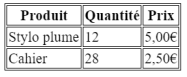
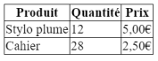
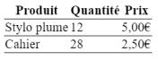
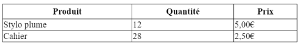
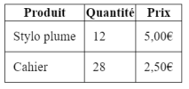
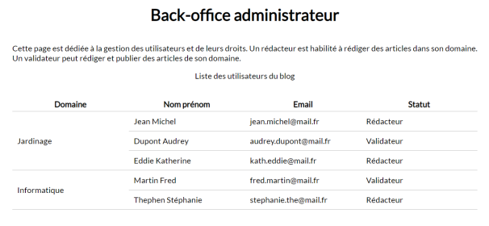
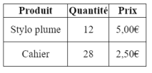
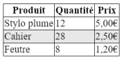

# **Estilo de las Tablas**

<br>

## **_Objetivos:_**

- SSaber aplicar un estilo a una tabla

---

---

<br>

---

## **Contexto**

---

<br>

Para modificar el aspecto de una tabla (por ejemplo, para agregar bordes), se recomienda usar reglas CSS.

<br>

---

---

<br>
<br>

---

## **Los Bordes**

---

<br>

Podemos agregar y modificar los bordes de una tabla gracias a la propiedad CSS border.

Esta debe ir seguida de una dimensión en píxeles, un estilo (punteado, rayado, sólido...) y un color.

Luego es posible aplicar el estilo definido en los elementos `<table>`, `<th>` y `<td>` para personalizar los bordes de la tabla.

---

**EJEMPLO: Syntaxis**

```html
<table>
  <thead>
    <th>Produit</th>
    <th>Quantité</th>
    <th>Prix</th>
  </thead>

  <tbody>
    <tr>
      <td>Stylo plume</td>
      <td>12</td>
      <td>5,00€</td>
    </tr>

    <tr>
      <td>Cahier</td>
      <td>28</td>
      <td>2,50€</td>
    </tr>
  </tbody>
</table>

<style>
  table,
  th,
  td {
    border: 1px solid black;
  }
</style>
```

<br>



<br>

---

**EJEMPLO**

Esta propiedad puede ir acompañada de "border-collapse", que puede tomar los valores "collapse" o "separate".

Cuando se aplica al elemento `<table>`, permite modificar la forma en que se gestionan las bordes: cada elemento tendrá un borde propio y separado de los demás elementos, o cada elemento compartirá las bordes vecinas.

```css
table {
  border-collapse: collapse;
}

table,
th,
td {
  border: 1px solid black;
}
```

<br>



```
Tabla que muestra bordes colapsados y no separados
```

<br>

---

**EJEMPLO**

Es posible definir únicamente los bordes entre las líneas mediante la propiedad CSS border-bottom, la cual se utilizará de la misma manera que la propiedad border.

```css
table {
  border-collapse: collapse;
}

table,
th,
td {
  border-bottom: 1px solid black;
}
```

<br>



```
Tabla con borde solo en bottom
```

<br>

---

**EJEMPLO**

```css
th,
td {
  border-bottom: solid 1px #bcbcbc;
}
```

<br>


```
Tabla general con bordes
```

<br>

---

---

<br>
<br>

---

## **Dimensiones y espaciados**

---

<br>

Las propiedades width y height permiten definir la altura y el ancho de una celda (en porcentajes o píxeles).

Para aumentar el espacio entre los datos y los bordes, se debe utilizar la propiedad que controla el relleno (que define el espacio interno alrededor de un elemento).

---

**EJEMPLO: Syntaxis**

```css
table {
  width: 100%;
}
th {
  height: 25px;
}
```

<br>



```
Tabla con dimensiones aplicadas
```

si añadimos padding alrededor de los datos:

```css
td {
  padding: 10px;
}
```

<br>



```
Tabla con padding aplicado
```

<br>

---

**EJEMPLO**

```css
table {
  border-collapse: collapse;
  width: 100%;
}
th {
  width: 25%;
  padding: 5px;
}
td {
  padding: 10px;
}
```

<br>



```
Tabla general con padding
```

<br>

---

---

<br>
<br>

---

## **Alineamiento**

---

<br>

Es posible modificar la alineación del texto dentro de cada celda especificando, en el elemento `<th>` o `<td>`, la propiedad text-align.

Esta propiedad puede tener los valores left, right o center.

---

**EJEMPLO: Syntaxis**

```css
td {
  padding: 10px;
  text-align: center;
}
```

<br>



```
Tabla con texto alineado
```

<br>

---

---

<br>
<br>

---

### **Atención**

---

<br>

Es posible encontrar, todavía en proyectos antiguos, diseños en forma de tabla heredados de antiguas versiones de HTML.

Hoy en día, esto es considerado una mala práctica y se prefiere usar CSS, lo que nos permitirá mantener el código de nuestras páginas mucho más fácilmente.

Puede encontrar la lista de elementos actualizados que ya no admiten ciertos atributos en el siguiente **[enlace](https://developer.mozilla.org/fr/docs/Web/HTML/Element/table)**.

<br>

---

---

<br>
<br>

---

### **Complemento: ir más allá**

---

<br>

Es posible aplicar otras propiedades CSS, por ejemplo para modificar el color de fondo de las filas, gracias a la propiedad background-color.

Es posible definir reglas de estilo para que cada otra fila tenga un color diferente.

Para hacerlo, seleccionamos las filas `<tr>` pares:

<br>

---

**EJEMPLO**

```css
tr:nth-child(even) {
  background-color: #e8e8e8;
}
```

<br>




<br>

---

---

<br>
<br>

---

## **A recordar**

---

<br>

Hemos visto cómo personalizar una tabla y sus componentes con CSS:

- **Cambiar el color de fondo de las celdas: background-color**

- **Modificar los bordes: border**

- **Aumentar el espacio alrededor de los datos: padding**

<br>

---

---
