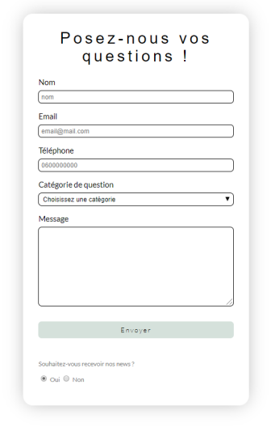

# **Introducción a los formularios**

<br>

## **_Objetivos:_**

- Saber para que sirven los formularios

---

---

<br>

---

## **Contexto**

---

<br>

Un formulario es un elemento HTML que permite interactuar con el usuario.

<br>

---

---

<br>

<br>

---

## **EJEMPLO: Formulario de contacto sin Interacción**

---

<br>

El siguiente código HTML muestra una página de contacto, pero no tiene campos interactivos para ingresar datos.

El objetivo de un formulario es agregar esta posibilidad a la página.

```html
<!DOCTYPE html>

<html>
  <head>
    <title>Mon formulaire de contact</title>

    <meta charset="utf-8" />

    <link
      href="https://fonts.googleapis.com/css?family=Lato:400,100,300"
      rel="stylesheet"
      type="text/css"
    />
  </head>

  <body>
    <div class="contact-wrapper">
      <div class="form-horizontal">
        <h1 class="section-header">Posez-nous vos questions !</h1>

        <p>Nom</p>

        <p>Email</p>

        <p>Téléphone</p>

        <p>Catégorie de question</p>

        <p>Message</p>

        <div class="send-button">Envoyer</div>

        <div class="advert-wrapper">
          <p>Souhaitez-vous recevoir nos news ?</p>
        </div>
      </div>
    </div>
  </body>

  <style>
    body {
      margin: 0;
      padding: 0;
    }

    .form-horizontal {
      display: flex;
      flex-direction: column;
      padding: 2rem;
      -webkit-box-shadow: 0px 0px 36px -7px rgba(171, 171, 171, 1);
      -moz-box-shadow: 0px 0px 36px -7px rgba(171, 171, 171, 1);
      box-shadow: 0px 0px 36px -7px rgba(171, 171, 171, 1);
      border-radius: 20px;
      margin-bottom: 2rem;
    }

    .contact-wrapper {
      display: flex;
      flex-direction: column;
      align-items: center;
      margin-top: 2rem;
    }

    input,
    textarea,
    select {
      margin-bottom: 1rem;
      border-radius: 7px;
      padding: 0.3rem;
      border: solid 1px;
    }

    textarea {
      max-width: 400px;
      letter-spacing: 1px;
    }

    input:focus,
    textarea:focus,
    select:focus,
    button:focus {
      outline: none;
      -webkit-box-shadow: 0px 0px 11px -7px #bac4bf;
      -moz-box-shadow: 0px 0px 11px -7px #bac4bf;
      box-shadow: 0px 0px 11px -7px #bac4bf;
      border: solid 1px #d5e1db;
    }

    label {
      margin-bottom: 0.5rem;
    }

    .section-header {
      text-align: center;
      margin: 0 auto;
      font: 300 2rem "Oswald", sans-serif;
      letter-spacing: 6px;
    }

    .send-button {
      margin-top: 15px;
      height: 34px;
      width: 400px;
      background-color: #d5e1db;
      border: none;
      border-radius: 7px;
      font: 300 14px "Lato", sans-serif;
      letter-spacing: 2px;
      display: flex;
      text-align: center;
      flex-direction: column;
      justify-content: center;
    }

    .form-horizontal{
      max-width: 400px;
      font-family: "Lato";
      font-weight: 400;
    }

    .send-button:hover {
      cursor: pointer;
      color: white;
      background-color: #bac4bf;
    }

    .advert-wrapper {
      color: grey;
      font-size: 0.8rem;
      margin-top: 2rem;
    }
  </style>
</html>
```

<br>


```
Formulario de contacto no interactivo
```

<br>

---

**EJEMPLO: Formulario de contacto con interacción**

```html
<!DOCTYPE html>

<html>
  <head>
    <title>Mon formulaire de contact</title>
    <meta charset="utf-8" />
    <link
      href="https://fonts.googleapis.com/css?family=Lato:400,100,300"
      rel="stylesheet"
      type="text/css"
    />
  </head>

  <body>
    <div class="contact-wrapper">
      <form class="form-horizontal" method="post" action="contact.php">
        <h1 class="section-header">Posez-nous vos questions !</h1>
        <label for="name">Nom</label>
        <input type="text" id="name" placeholder="nom" name="name" required />
        <label for="email">Email</label>
        <input
          type="email"
          id="email"
          placeholder="email@mail.com"
          name="email"
          required
        />

        <label for="phone">Téléphone</label>
        <input type="tel" id="phone" placeholder="0600000000" name="phone" />
        <label for="category">Catégorie de question</label>
        <select id="category" name="category">
          <option value="default">Choisissez une catégorie</option>
          <option value="help">Aide</option>
          <option value="pro-contact">Contact professionnel</option>
        </select>

        <label for="message">Message</label>
        <textarea rows="10" id="message" name="message" required></textarea>
        <button class="send-button" id="submit" type="submit">Envoyer</button>
        <div class="advert-wrapper">
          <p>Souhaitez-vous recevoir nos news ?</p>
          <input
            type="radio"
            id="yes"
            name="news-question"
            value="yes"
            checked
          />
          <label for="yes">Oui</label>
          <input type="radio" id="no" name="news-question" value="no" />
          <label for="no">Non</label>
        </div>
      </form>
    </div>
  </body>

  <style>
    body {
      margin: 0;
      padding: 0;
    }

    form {
      display: flex;
      flex-direction: column;
      padding: 2rem;
      -webkit-box-shadow: 0px 0px 36px -7px rgba(171, 171, 171, 1);
      -moz-box-shadow: 0px 0px 36px -7px rgba(171, 171, 171, 1);
      box-shadow: 0px 0px 36px -7px rgba(171, 171, 171, 1);
      border-radius: 20px;
      margin-bottom: 2rem;
    }

    .contact-wrapper {
      display: flex;
      flex-direction: column;
      align-items: center;
      margin-top: 2rem;
    }

    input,
    textarea,
    select {
      margin-bottom: 1rem;
      border-radius: 7px;
      padding: 0.3rem;
      border: solid 1px;
    }

    textarea {
      max-width: 400px;
      letter-spacing: 1px;
    }

    input:focus,
    textarea:focus,
    select:focus,
    button:focus {
      outline: none;
      -webkit-box-shadow: 0px 0px 11px -7px #bac4bf;
      -moz-box-shadow: 0px 0px 11px -7px #bac4bf;
      box-shadow: 0px 0px 11px -7px #bac4bf;
      border: solid 1px #d5e1db;
    }

    label {
      margin-bottom: 0.5rem;
    }

    .section-header {
      text-align: center;
      margin: 0 auto;
      margin-bottom: 50px;
      font: 300 2rem "Oswald", sans-serif;
      letter-spacing: 6px;
      margin-bottom: 25px;
    }

    .form-horizontal {
      max-width: 400px;
      font-family: "Lato";
      font-weight: 400;
    }

    .send-button {
      margin-top: 15px;
      height: 34px;
      width: 400px;
      background-color: #d5e1db;
      border: none;
      border-radius: 7px;
      font: 300 14px "Lato", sans-serif;
      letter-spacing: 2px;
    }

    .send-button:hover {
      cursor: pointer;
      color: white;
      background-color: #bac4bf;
    }

    .advert-wrapper {
      color: grey;
      font-size: 0.8rem;
      margin-top: 2rem;
    }
  </style>
</html>
```

<br>



```
Formulario final interactivo
```

<br>

---

---

<br>
<br>

---

### **Observación: Buenas practicas**

---

<br>

Existen buenas prácticas, como las de esta guía: 

**[Buenas prácticas de diseño](https://newflux.fr/2017/10/22/30-bonnes-pratiques-astuces-vos-formulaires/)**

- **La experiencia del usuario y el respeto a la accesibilidad son claves para un formulario funcional.**

- **Diseñar un formulario también implica pensar en los nombres de los campos, los mensajes de error y confirmación.**

- **La forma de presentar los datos debe ser simple para que la navegación sea lo más fluida posible.**

<br>

---

---

<br>
<br>

---

## **A recordar**

---

<br>

- **El formulario es un elemento HTML que permite a los usuarios interactuar con un sitio web.**

- **El HTML por sí solo no permite controlar todo el procesamiento de la información.**

<br>

---

---
