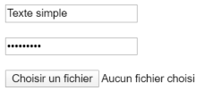
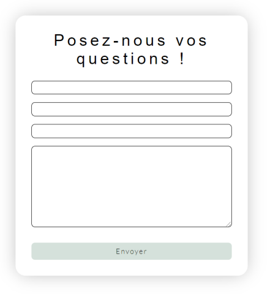

# **Campos de formularios**

<br>

## **_Objetivos:_**

- Saber usar los principales campos de un formulario, con el fin de construir uno

---

---

<br>

---

## **Contexto**

---

<br>

Para permitir que el usuario ingrese datos o realice elecciones, agregaremos diferentes tipos de campos al formulario, como por ejemplo, áreas de texto para ingresar un nombre o un apellido.

<br>

---

---

<br>

<br>

---

## **Input**

---

<br>

---

**EJEMPLO: Syntaxis**

Para agregar campos en un formulario, se utiliza la etiqueta auto-cerrante `<input>`, con los atributos name="", id="" y type="".

Es importante agregar un atributo name="" y un atributo id="" diferentes para cada campo, para que recuperar fácilmente los datos.

En un formulario, el atributo name="" se utiliza para hacer referencia a los elementos en JavaScript o después del envío para hacer referencia a los datos del formulario.

Este atributo identifica lo que se envía al servidor y facilita el procesamiento de los datos.

El atributo type toma diferentes valores según el tipo de campo que queramos mostrar en el formulario:

- **type="text" para mostrar un campo de entrada de texto en una sola línea**.

- **type="password" para un campo de tipo contraseña (permite ocultar el texto ingresado en el campo con puntos)**.
  ¡Atención, esto no significa que la contraseña esté protegida! Simplemente es ilegible en la pantalla del usuario\*\*.

- **type="file" permite que el usuario agregue un archivo desde un formulario**.
  Cuando el usuario hace clic, aparece un cuadro de diálogo que le permite seleccionar un archivo desde su explorador. El atributo accept="" permite fijar el tipo de archivo que se puede seleccionar\*\*.

```html
<input type="text" id="simpleText" name="simpleText" />

<input type="password" id="monPassword" name="monPassword" />

<input
  type="file"
  id="monFichier"
  name="monFichier"
  accept="image/png, image/jpeg"
/>
```

<br>



```formulario de:

- Texto

- Password

- File
```

<br>

---

---

<br>
<br>

---

### **Complemento: Otros campos**

---

<br>

Existen muchas otras posibilidades, desde el selector de fecha hasta el selector de color.

HTML ofrece nativamente una amplia variedad de opciones para cubrir una amplia gama de necesidades:

puedes encontrar todas las opciones **[en MDN](https://developer.mozilla.org/fr/docs/Web/HTML/Element/Input)**.

<br>

---

---

<br>
<br>

---

## **Validación de entrada**

---

<br>

Algunos tipos permiten realizar una validación nativa del lado del cliente en los datos ingresados en el campo por el usuario:

- **type="tel" permite verificar que el usuario ingrese un número de teléfono válido,**

- **type="email" permite verificar que el usuario ingrese una dirección de correo electrónico que contenga una @.**

Si el usuario envía el formulario y los tipos de campo no son válidos, aparecerá un mensaje de error.

<br>

---

**EJEMPLO**

```html
<input type="tel" id="telField" name="telField" />

<input type="email" id="emailField" name="emailField" />
```


<br>

---

---

<br>
<br>

---

## **textarea**

---

<br>

Para mostrar un campo de texto en varias líneas, la etiqueta `<textarea>` permite establecer el número de columnas y filas con los atributos cols="" y rows="".

<br>

---

**EJEMPLO**

```html
<textarea
  rows="nombre de lignes"
  cols="nombre de colonnes"
  id="monChampParagraphe"
  name="monChampParagraphe"
></textarea>
```


<br>

---

---

<br>
<br>

---

### **Formulario de contacto: EJEMPLO**

---

**EJEMPLO**

```html
<input type="text" id="name" name="name" />
<input type="email" id="email" name="email" />
<input type="tel" id="phone" name="phone" />

/.../

<textarea rows="10" id="message" name="message"></textarea>
<input type="text" id="name" name="name" />
```



<br>

---

---

<br>
<br>

---

## **A recordar**

---

<br>

- **Un formulario está compuesto por un conjunto de campos.**

- **Para cada tipo de campo, existe una etiqueta dedicada o un tipo particular para definir en la etiqueta `<input>`.**

- **"textarea" es una etiqueta input particular que permite ofrecer un campo de texto largo.**

<br>

---

---
