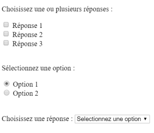
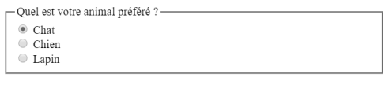

# **Elección de formulario**

<br>

## **_Objetivos:_**

- Saber usar los campos de tipo "elección"

---

---

<br>

---

## **Contexto**

---

<br>

Algunos tipos de campos permiten guiar al usuario para hacer diferentes tipos de selecciones en un formulario a través de elementos como listas desplegables, casillas de verificación, etc.

<br>

---

---

<br>

<br>

---

## **La elección**

---

<br>

---

Es posible pedirle a un usuario que haga selecciones mediante el uso de elementos checkbox, radio o select:

- **`<input type="checkbox">` permite al usuario hacer selecciones múltiples a través de casillas de verificación.**

- **`<input type="radio">` solicita al usuario que haga una selección única entre un número limitado de opciones. Para definir un grupo de botones de radio, se les da el mismo nombre a través del atributo [name](https://developer.mozilla.org/fr/docs/Web/HTML/Element/Input#attr-name).**

- **`<select>` permite al usuario elegir entre una lista de elementos definidos por los elementos secundarios de opción (es posible configurar este elemento para hacer selecciones múltiples mediante el atributo múltiple).**

Es necesario asignar un valor a los elementos HTML anteriores a través del atributo value = "". Esto permitirá conocer el valor asociado al campo durante el procesamiento de datos.

**EJEMPLO**

```html
<p>Choisissez une ou plusieurs réponses :</p>

<div>
  <input type="checkbox" id="rep1" name="rep1" checked />

  <label for="rep1">Réponse 1</label>
</div>

<div>
  <input type="checkbox" id="rep2" name="rep2" />

  <label for="rep2">Réponse 2</label>
</div>

<div>
  <input type="checkbox" id="rep3" name="rep3" />

  <label for="rep3">Réponse 3</label>
</div>

<p>Sélectionnez une option :</p>

<div>
  <input type="radio" id="opt1" name="option-radio" value="opt1" checked />

  <label for="opt1">Option 1</label>
</div>

<div>
  <input type="radio" id="opt2" name="option-radio" value="opt2" />

  <label for="opt2">Option 2</label>
</div>

<label for="reponse-selector">Choisissez une réponse :</label>

<select name="reponse-selector" id="reponse-selector">
  <option value="">Selectionnez une réponse</option>

  <option value="rep1">Réponse 1</option>
  <option value="rep2">Réponse 2</option>
  <option value="rep3">Réponse 3</option>
  <option value="rep4">Réponse 4</option>
</select>
```

<br>



```
Elección de formulario
```

<br>

---

**EJEMPLO: Formulario de contacto**

```html
<label for="category">Catégorie de question</label>

<select id="category" name="category">
  <option value="default">Choisissez une catégorie</option>

  <option value="help">Aide</option>

  <option value="pro-contact">Contact professionnel</option>
</select>

/.../

<div class="advert-wrapper">
  <p>Souhaitez-vous recevoir nos news ?</p>

  <input type="radio" id="yes" name="news-question" value="yes" checked />

  <label for="yes">Oui</label>

  <input type="radio" id="no" name="news-question" value="no" />

  <label for="no">Non</label>
</div>
```


<br>

---

---

<br>
<br>

---

### **Observación**

---

<br>

Es posible agrupar varios campos en un mismo bloque utilizando la etiqueta `<fieldset>`, que contendrá los campos a agrupar.

La etiqueta `<legend>` permite representar una leyenda para este bloque de elementos.

<br>

**EJEMPLO**

```html
<fieldset>
  <legend>Quel est votre animal préféré ?</legend>

  <input type="radio" id="cat" name="animal" />
  <label for="cat">Chat</label><br />

  <input type="radio" id="dog" name="animal" />
  <label for="dog">Chien</label><br />

  <input type="radio" id="rabbit" name="animal" />
  <label for="rabbit">Lapin</label>
</fieldset>
```



<br>

---

---

<br>
<br>

---

## **A recordar**

---

<br>

Algunos elementos de formulario permiten al usuario elegir entre varias opciones:

- **`<input type="checkbox">`**

- **`<input type="radio">`**

- **`<select>`** y **`<option>`**

El atributo value="" se utiliza para asociar un valor al procesar los datos cuando el usuario selecciona el campo.

`<fieldset>` y `<legend>` se utilizan para agrupar campos.

<br>

---

---
