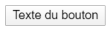
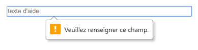
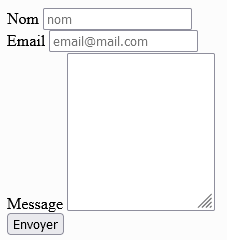

# **Envió de formulario**

<br>

## **_Objetivos:_**

- Saber enviar la información del formulario al servidor

---

---

<br>

---

## **Contexto**

---

<br>

Una vez que se ha completado el formulario, es necesario enviar la información al servidor para su procesamiento.

<br>

---

---

<br>

<br>

---

## **button**

---

<br>

---

La presentación de un formulario es posible gracias a la etiqueta `<button`>.

Esto mostrará al usuario un botón que deberá tener el atributo type="submit" para ser considerado el elemento desencadenante de la presentación de los datos al servidor.

El `<button`>, al igual que todos los elementos que componen nuestro formulario, debe estar dentro de las etiquetas `<form></form`> para activar la presentación de los datos.

**EJEMPLO**

```html
<button type="submit">Texte du bouton</button>
```

<br>



<br>

---

---

<br>
<br>

---

### **Recordatorio**

---

<br>

Asociado a una buena configuración del formulario (usando los atributos method y action), permitirá al usuario enviar el formulario. Luego, la información contenida en los diferentes campos podrá ser procesada.

<br>

---

---

<br>
<br>

---

## **La validación front**

---

<br>

El hecho de definir precisamente los atributos tipo de los campos de formulario permite tener una primera validación de los datos durante la presentación del formulario.

En este punto, podríamos agregar validaciones adicionales del lado del cliente utilizando código JavaScript.

<br>

---

---

<br>
<br>

---

## **Required**

---

<br>

En HTML, para hacer que un campo sea obligatorio, agregamos el atributo "required" a la etiqueta del campo.

De esta manera, el usuario no podrá enviar el formulario sin completarlo y aparecerá un mensaje de error.

<br>

---

**EJEMPLO**

```html
<input
  type="text"
  id="identifiant"
  placeholder="texte d'aide"
  name="nom du champ"
  required
/>
```



```
Atributo required que obliga al usuario a completar ese campo, sino no envia formulario
```

<br>

---

**EJEMPLO: Formulario de contacto**

```html
<label for="name">Nom</label>

<input type="text" id="name" placeholder="nom" name="name" required />

<br />

<label for="email">Email</label>

<input
  type="email"
  id="email"
  placeholder="email@mail.com"
  name="email"
  required
/>

<br />

<label for="message">Message</label>

<textarea rows="10" id="message" name="message" required></textarea>

<br />

<button class="send-button" id="submit" type="submit">Envoyer</button>
```




<br>

---

---

<br>
<br>

---

### **Observación**

---

<br>

Si hacemos clic en el botón después de haber llenado el formulario de manera válida, no sucederá nada, ya que en este punto solo hemos creado nuestro formulario en el lado del cliente.

En la práctica, si hubiéramos creado una página de contacto.php en el lado del servidor, los datos se enviarían a esta página, que se encargaría de procesar los datos que le enviamos.

<br>

---

---

<br>
<br>

---

### **Atención!: Nunca confiar en la información enviada por el usuario via nuestros formularios**

---

<br>

**Los formularios representan un peligro para la seguridad de un sitio.** Es un punto de entrada al sistema con el cual un usuario puede interactuar.

Es esencial verificar la integridad de los datos, tanto en el lado del cliente como en el lado del servidor.

Un usuario malintencionado podría intentar aprovechar este punto de entrada para ejecutar código en el servidor o corromper los datos.

<br>

---

---

<br>
<br>

---

## **A recordar**

---

<br>

- **Para enviar los datos de un formulario y permitir su procesamiento, es necesario agregar una forma de enviarlo: `<button type="submit">Enviar</button>`.**

- **El atributo "required" permite hacer obligatoria la cumplimentación de un campo.**

- **Los datos del formulario se validan en parte al momento de su envío gracias a los tipos de campos configurados; es necesario agregar código tanto en el lado del cliente como en el del servidor para completar esta validación.**

<br>

---

---
