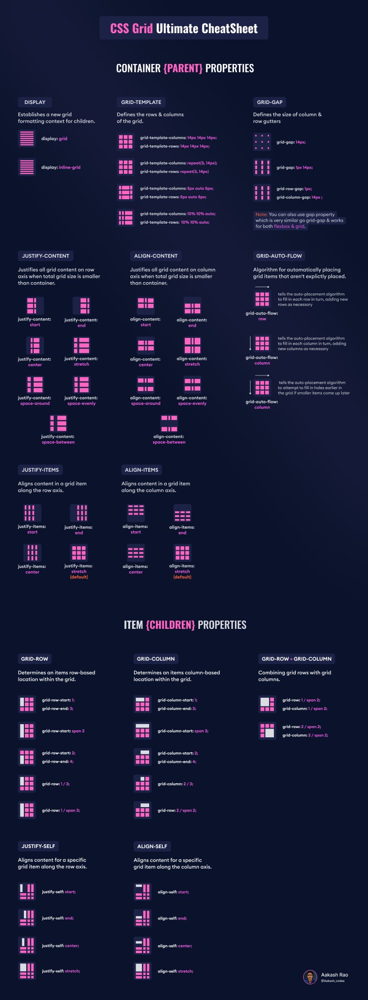

# **Contexto**

---

 

CSS propone varias herramientas para gestionar la disposición de los elementos en la página.

Ya hemos visto float y flexbox, que funcionan en una dimensión a la vez.

CSS Grid es una especificación CSS relativamente reciente que permite gestionar el posicionamiento de los elementos en dos dimensiones, en filas y columnas.

 

 

---

---
